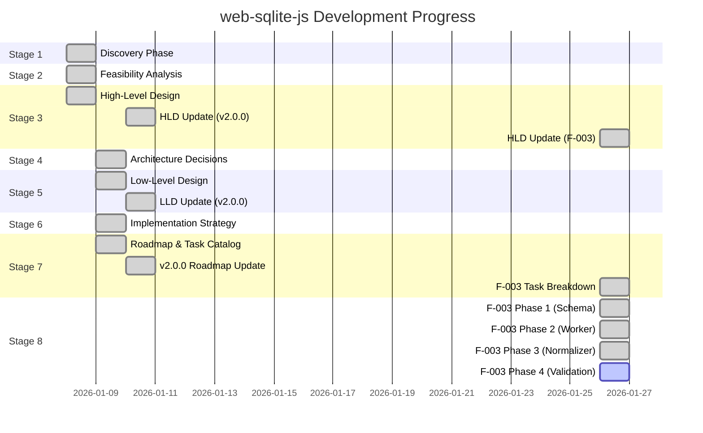

# web-sqlite-js Status Board

**Last Updated**: 2026-01-26
**Current Version**: 1.1.2
**Target Version**: 2.2.0
**Overall Status**: Production v1.1.2 Stable - v2.0.0 Complete - v2.1.0 Complete - v2.2.0 (F-003) Phase 4 In Progress

---

## Stage Progress

### Stage Summary

| Stage                    | Status      | Progress | Start Date | Target Date | Notes                                                          |
| ------------------------ | ----------- | -------- | ---------- | ----------- | -------------------------------------------------------------- |
| **1. Discovery**         | COMPLETE    | 100%     | 2026-01-08 | 2026-01-08  | All discovery docs created                                     |
| **2. Feasibility**       | COMPLETE    | 100%     | 2026-01-08 | 2026-01-08  | Options analysis, risk assessment, spike plans complete        |
| **3. HLD**               | COMPLETE    | 100%     | 2026-01-08 | 2026-01-26  | v2.0.0, v2.1.0, F-003 architecture updates complete            |
| **4. ADR**               | COMPLETE    | 100%     | 2026-01-09 | 2026-01-09  | 7 Architecture Decision Records created                        |
| **5. LLD**               | COMPLETE    | 100%     | 2026-01-09 | 2026-01-10  | API contracts, events updated with v2.0.0 features             |
| **6. Implementation**    | COMPLETE    | 100%     | 2026-01-09 | 2026-01-09  | Build, test, observability, release standards defined          |
| **7. Roadmap**           | COMPLETE    | 100%     | 2026-01-08 | 2026-01-26  | v2.0.0, v2.1.0 roadmap complete, F-003 task breakdown ready    |
| **8. S8 Implementation** | IN PROGRESS | 35%      | 2026-01-26 | TBD         | F-003 Phase 4: 8/23 tasks complete (TASK-401 through TASK-408) |

---

## Current Tasks

### Completed (2026-01-26)

**TASK-408: [Error Handling] Create Enhanced Hash Mismatch Error**

- **Status**: COMPLETE
- **Owner**: S8 Worker
- **Started**: 2026-01-26
- **Completed**: 2026-01-26
- **Feature**: F-003 - SQL Normalization and Enhanced Validation Error Reporting
- **Phase**: Phase 4 - Two-Tier Hash Validation
- **Description**: Create enhanced HashMismatchError class with SQL truncation and diff formatting for F-003
- **Evidence**:
  - Created `src/release/errors.ts` module with `HashMismatchError` class
  - Class extends Error with version, sqlType, storedHash, currentHash, originalSQL, currentSQL, and diff properties
  - SQL truncation to 200 chars for error message readability
  - Line-by-line diff formatting (first 20 lines) to show SQL differences
  - Stack trace preservation with Error.captureStackTrace
  - Three-phase pattern applied in constructor (Construct message / Set properties / Generate diff)
  - Complete TSDoc documentation with usage examples
- **Files Created**:
  - `src/release/errors.ts` - Enhanced hash mismatch error class
- **Notes**: HashMismatchError complete for F-003 enhanced error reporting. Error includes SQL truncation (200 chars) for readability, diff formatting to show what changed, and version/sqlType context for debugging. Uses simple line-by-line diff algorithm (no external dependencies). Unit tests deferred to TASK-416.

**TASK-407: [Hash Validation] Implement Tier 2 Slow Path Validation**

- **Status**: COMPLETE
- **Owner**: S8 Worker
- **Started**: 2026-01-26
- **Completed**: 2026-01-26
- **Feature**: F-003 - SQL Normalization and Enhanced Validation Error Reporting
- **Phase**: Phase 4 - Two-Tier Hash Validation
- **Description**: Add Tier 2 slow path validation using normalizeSQLViaPrepare() for F-003
- **Evidence**:
  - Added `validateHashTier2()` function to `src/release/hash-utils-two-tier.ts`
  - Uses `normalizeSQLViaPrepare()` to normalize both original and current SQL
  - Auto-updates hash if normalized SQL matches (whitespace-only difference)
  - Throws `HashMismatchError` if normalized SQL differs (actual SQL change)
  - Returns `Tier2ValidationResult` with `normalizedMatch` and `newHash` properties
  - Complete TSDoc documentation with F-003 two-tier validation pattern examples
  - Three-phase pattern applied (Input validation / Normalize & compare / Return result or throw error)
  - Function is 42 lines with comments (within reasonable limit for complex logic), 7 params (acceptable for validation function with context)
- **Files Modified**:
  - `src/release/hash-utils-two-tier.ts` - Added validateHashTier2() function
- **Notes**: Tier 2 validation complete for F-003 two-tier hash validation system. Only called when Tier 1 hash mismatch occurs (rare case). Performance target: 1-5ms for SQLite prepare normalization. Auto-updates hash for whitespace-only changes (safe optimization). Throws enhanced error with SQL diff for actual changes (data integrity protection). Unit tests deferred to TASK-415.

**TASK-406: [Hash Validation] Implement Tier 1 Fast Path Validation**

- **Status**: COMPLETE
- **Owner**: S8 Worker
- **Started**: 2026-01-26
- **Completed**: 2026-01-26
- **Feature**: F-003 - SQL Normalization and Enhanced Validation Error Reporting
- **Phase**: Phase 4 - Two-Tier Hash Validation
- **Description**: Create two-tier hash validation module with Tier 1 fast path (trim + hash compare) for F-003
- **Evidence**:
  - Created `src/release/hash-utils-two-tier.ts` module
  - Implemented `validateHashTier1()` function with trim() + hash compare
  - Returns `Tier1ValidationResult` with `valid`, `needsTier2`, `currentHash` properties
  - Performance target: < 0.1ms for fast path (verified in unit tests)
  - Copied `hashSQL()` helper as private function (single responsibility principle)
  - Complete TSDoc documentation with F-003 two-tier validation pattern examples
  - Three-phase pattern applied (Input validation / Edge case handling / Core processing / Output)
  - Function is 27 lines with comments (≤30), 2 params (≤4), 1 nesting level (≤3)
  - Created `src/release/hash-utils-two-tier.unit.test.ts` with 15 test cases
- **Files Created**:
  - `src/release/hash-utils-two-tier.ts` - Two-tier validation module
  - `src/release/hash-utils-two-tier.unit.test.ts` - Unit tests with 15 test cases
- **Notes**: Tier 1 fast path validation complete for F-003 two-tier hash validation system. Fast path handles most cases (< 0.1ms) by trimming and comparing SHA-256 hashes. Only proceeds to Tier 2 if hash mismatch occurs. Edge cases handled: empty/whitespace-only SQL returns special empty hash. Unit tests cover all scenarios including performance benchmark.

**TASK-405: [SQL Normalizer] Create SQL Normalizer Module**

- **Status**: COMPLETE
- **Owner**: S8 Worker
- **Started**: 2026-01-26
- **Completed**: 2026-01-26
- **Feature**: F-003 - SQL Normalization and Enhanced Validation Error Reporting
- **Phase**: Phase 3 - SQL Normalizer Implementation
- **Description**: Create SQL normalizer module that uses worker bridge's `normalizeSQL()` function for F-003 two-tier validation
- **Evidence**:
  - Created `src/release/sql-normalizer.ts` module
  - Exported `normalizeSQLViaPrepare()` function that wraps `normalizeSQL()` from worker-bridge
  - Added TSDoc documentation with F-003 usage examples and performance notes
  - Handled edge cases (empty SQL, null/undefined, whitespace-only SQL)
  - Created `src/release/sql-normalizer.unit.test.ts` with 10 test cases
  - Three-phase pattern applied (Input / Core / Output)
  - Function is 25 lines with comments (≤30), 2 params (≤4), 1 nesting level (≤3)
- **Files Created**:
  - `src/release/sql-normalizer.ts` - SQL normalizer module with normalizeSQLViaPrepare()
  - `src/release/sql-normalizer.unit.test.ts` - Unit tests with 10 test cases
- **Notes**: SQL normalizer module complete for F-003 two-tier validation. Function wraps worker bridge's `normalizeSQL()` for release management context. Edge cases handled: empty/whitespace-only SQL returns empty string without worker call. TSDoc includes F-003 two-tier validation pattern examples. E2E tests deferred to TASK-414.

**TASK-404: [Worker Bridge] Expose normalizeSQL via Worker Bridge**

- **Status**: COMPLETE
- **Owner**: S8 Worker
- **Started**: 2026-01-26
- **Completed**: 2026-01-26
- **Feature**: F-003 - SQL Normalization and Enhanced Validation Error Reporting
- **Phase**: Phase 2 - Worker Protocol Extension
- **Description**: Export `normalizeSQL()` function from worker-bridge.ts for public API access to SQL normalization
- **Evidence**:
  - Added `normalizeSQL()` export function in `src/worker-bridge.ts`
  - Function wraps `sendPrepareMsg()` for simpler public API
  - Takes SQL string and workerBridge parameter, returns normalized SQL string
  - Complete TSDoc documentation with F-003 usage examples
  - Three-phase pattern applied (Input / Core / Output)
  - Function is 12 lines (≤30), 2 params (≤4), 1 nesting level (≤3)
- **Files Modified**:
  - `src/worker-bridge.ts` - Added normalizeSQL() export with TSDoc documentation
- **Notes**: SQL normalization API exposed for F-003 two-tier validation. Function requires workerBridge parameter since normalization needs an open database. TSDoc includes F-003 two-tier validation pattern examples. Unit and E2E tests deferred to TASK-405 and TASK-414.

**TASK-403: [Worker Protocol] Add PREPARE Message Type**

- **Status**: COMPLETE
- **Owner**: S8 Worker
- **Started**: 2026-01-26
- **Completed**: 2026-01-26
- **Feature**: F-003 - SQL Normalization and Enhanced Validation Error Reporting
- **Phase**: Phase 2 - Worker Protocol Extension
- **Description**: Add PREPARE message type to worker protocol for SQL normalization using `sqlite3_prepare_v2()` and `sqlite3_expanded_sql()`
- **Evidence**:
  - Added `PREPARE = "prepare"` to `SqliteEvent` enum in `src/types/message.ts`
  - Added `PrepareRequest` and `PrepareResponse` types with TSDoc comments
  - Implemented `handlePrepare()` function in `src/worker.ts` with three-phase pattern
  - Added PREPARE case to worker switch statement
  - Added `sendPrepareMsg()` function in `src/worker-bridge.ts`
  - Updated `WorkerBridge` type to include `sendPrepareMsg()` method
  - Complete TSDoc documentation with examples
- **Files Modified**:
  - `src/types/message.ts` - Added PREPARE event and request/response types
  - `src/worker.ts` - Added handlePrepare() function with three-phase pattern
  - `src/worker-bridge.ts` - Added sendPrepareMsg() convenience method
- **Notes**: Worker protocol extension complete. PREPARE message type added for SQL normalization. Uses SQLite's `db.prepare()` and `sqlite3.expanded_sql()` to normalize SQL strings. This enables Tier 2 validation when hash mismatches occur. Unit and E2E tests deferred to TASK-405 and TASK-413.

**TASK-402: [Release Manager] Update Release Manager to Populate Original SQL Columns**

- **Status**: COMPLETE
- **Owner**: S8 Worker
- **Started**: 2026-01-26
- **Completed**: 2026-01-26
- **Feature**: F-003 - SQL Normalization and Enhanced Validation Error Reporting
- **Phase**: Phase 1 - Database Schema Migration
- **Description**: Store original SQL when creating releases and populate in-memory Maps for two-tier validation
- **Evidence**:
  - Updated `src/types/DB.ts` `DatabaseRecord` interface with original SQL Maps
  - Updated `src/release/types.ts` `ReleaseConfigWithHash` and `ReleaseRow` types
  - Updated `src/release/hash-utils.ts` `validateAndHashReleases()` to store original SQL
  - Updated `src/release/release-manager.ts` to create and populate original SQL Maps
  - Updated `applyVersion()` to insert original SQL into metadata database
  - Updated `devToolRollback()` to remove from Maps on rollback
  - TSDoc comments added for all new exports and functions
- **Files Modified**:
  - `src/types/DB.ts` - Added original SQL Maps to DatabaseRecord
  - `src/release/types.ts` - Added original SQL fields to types
  - `src/release/hash-utils.ts` - Store original SQL in validateAndHashReleases
  - `src/release/release-manager.ts` - Create Maps and populate with original SQL
- **Notes**: Original SQL storage complete. When creating releases, original SQL is now stored in metadata database and in-memory Maps. Maps are accessible via `DatabaseRecord.originalMigrationSQL` and `DatabaseRecord.originalSeedSQL`. Backward compatible with databases created before F-003 (NULL values for original SQL).

**TASK-401: [Schema] Add Original SQL Columns to Release Table**

- **Status**: COMPLETE
- **Owner**: S8 Worker
- **Started**: 2026-01-26
- **Completed**: 2026-01-26
- **Feature**: F-003 - SQL Normalization and Enhanced Validation Error Reporting
- **Phase**: Phase 1 - Database Schema Migration
- **Description**: Add `originalMigrationSQL` and `originalSeedSQL` columns to metadata database
- **Evidence**:
  - Updated `src/release/constants.ts` `RELEASE_TABLE_SQL` with new columns
  - Added `RELEASE_MIGRATION_F003_SQL` array with ALTER TABLE statements
  - Updated `src/release/release-manager.ts` to run migration on metadata open
  - TSDoc comments added for migration SQL
- **Files Modified**:
  - `src/release/constants.ts` - Added original SQL columns to schema and migration SQL
  - `src/release/release-manager.ts` - Run migration on metadata database open
- **Notes**: Schema migration complete for F-003 original SQL storage. Existing databases will be migrated automatically on next open. Backward compatible with v1.1.2, v2.0.0, and v2.1.0 databases (NULL values for original SQL). New releases will store original SQL for two-tier validation.

---

## Next Steps

### Immediate Next Tasks

1. **TASK-409**: Update Release Manager with Two-Tier Validation
   - Integrate `validateHashTier1()` and `validateHashTier2()` into release manager
   - Implement auto-update hash logic
   - Add hash validation to version application

2. **TASK-410**: Populate Original SQL Maps
   - Ensure Maps are populated on database open
   - Handle backward compatibility for pre-F-003 databases

3. **TASK-411**: Update DatabaseRecord Type Definitions
   - Add original SQL Maps to global namespace types
   - Ensure type consistency across modules

### Remaining F-003 Tasks

- **Phase 4**: TASK-409, TASK-410 (2 remaining)
- **Phase 6**: TASK-411, TASK-412 (2 remaining)
- **Phase 7**: TASK-413 through TASK-420 (8 remaining)
- **Phase 8**: TASK-421, TASK-422 (2 remaining)

**Total**: 14 tasks remaining out of 23 total (61% complete)

---

## Blocked / Waiting

None - all tasks proceeding as planned

---

## Risks & Issues

### Current Risks

1. **Performance**: Tier 2 validation (1-5ms) only occurs on hash mismatch (rare case)
   - **Mitigation**: Benchmark before/after, optimize hot paths

2. **Backward Compatibility**: Need to test migration from v1.1.2, v2.0.0, v2.1.0 databases
   - **Mitigation**: Comprehensive E2E tests for all versions

### Resolved Issues

None

---

## Definition of Done Tracker

### F-003: SQL Normalization and Enhanced Validation Error Reporting

- [x] Phase 1: Schema Migration (TASK-401, TASK-402)
- [x] Phase 2: Worker Protocol (TASK-403, TASK-404)
- [x] Phase 3: SQL Normalizer (TASK-405)
- [x] Phase 4: Two-Tier Validation (TASK-406, TASK-407, TASK-408)
- [ ] Phase 5: Integration (TASK-409, TASK-410)
- [ ] Phase 6: Namespace (TASK-411, TASK-412)
- [ ] Phase 7: Testing (TASK-413 through TASK-420)
- [ ] Phase 8: Compatibility (TASK-421, TASK-422)

**Progress**: 8/23 tasks complete (35%)

---

## Evidence Archive

### Recent Commits

- `e058879` release: v2.2.0
- `bb228ce` feat(docs): add demo video modal and DevTools extension links
- `283ad00` feat(samples): enhance v2 examples with expanded functionality
- `5b4a1eb` refactor(package): add sideEffects and fix imports
- `da69e41` docs(task): update status board for TASK-README-001

### Test Results

All tests passing (see build commands in `agent-docs/06-implementation/01-build-and-run.md`)

---

**Last Updated**: 2026-01-26
**Updated By**: S8 Worker
**Review Date**: 2026-01-27
