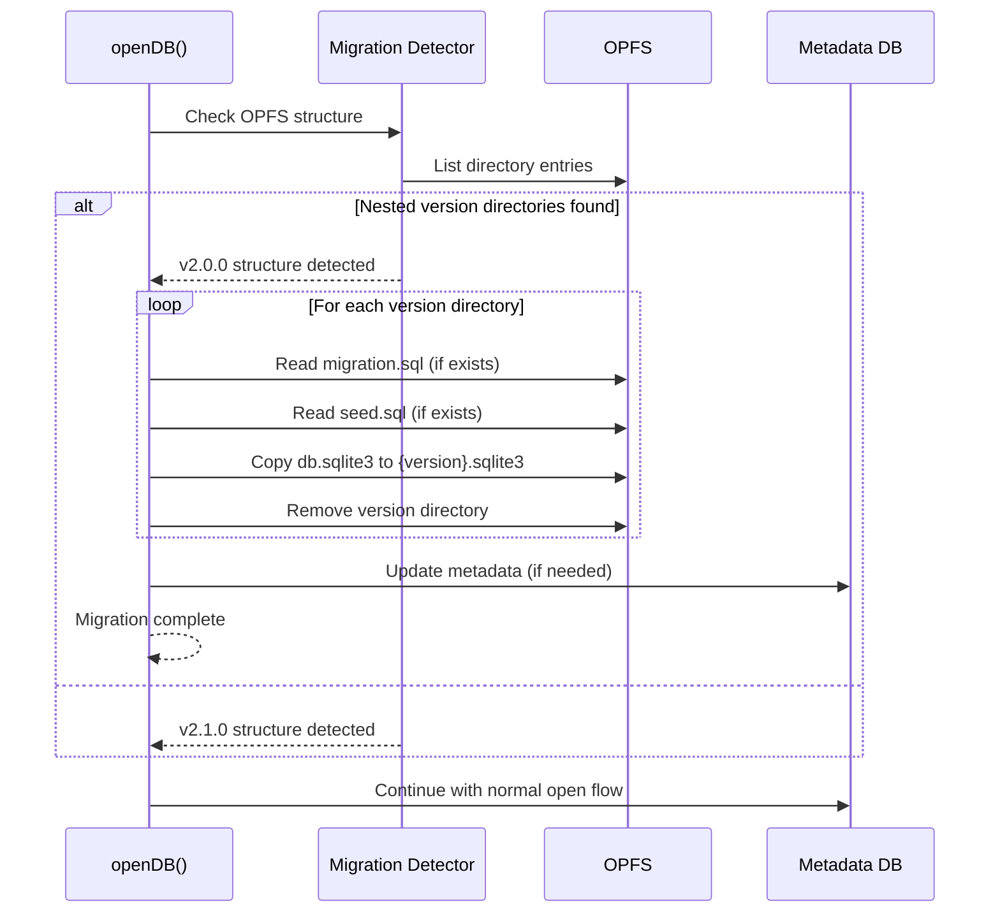
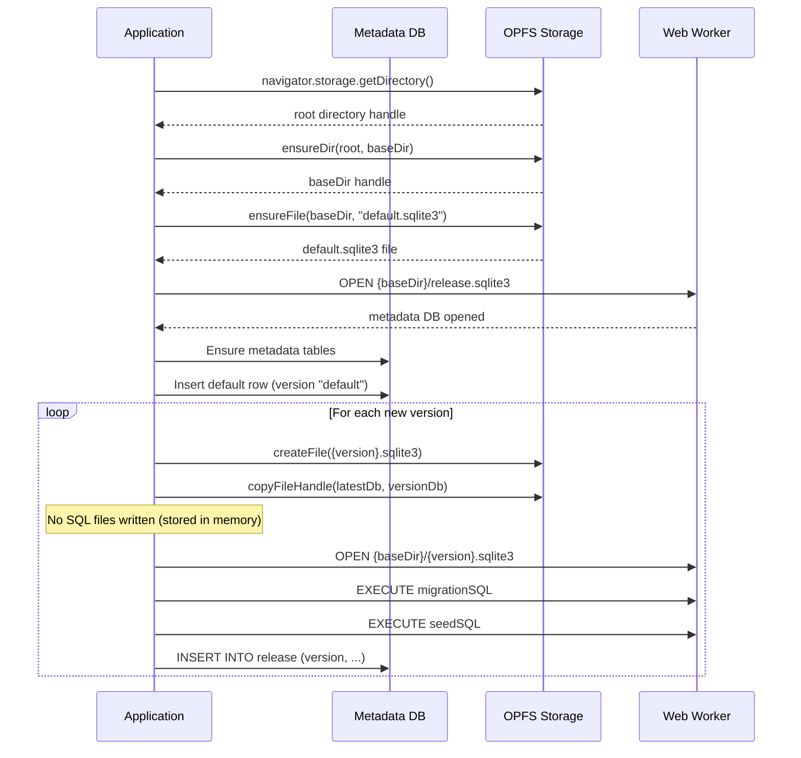
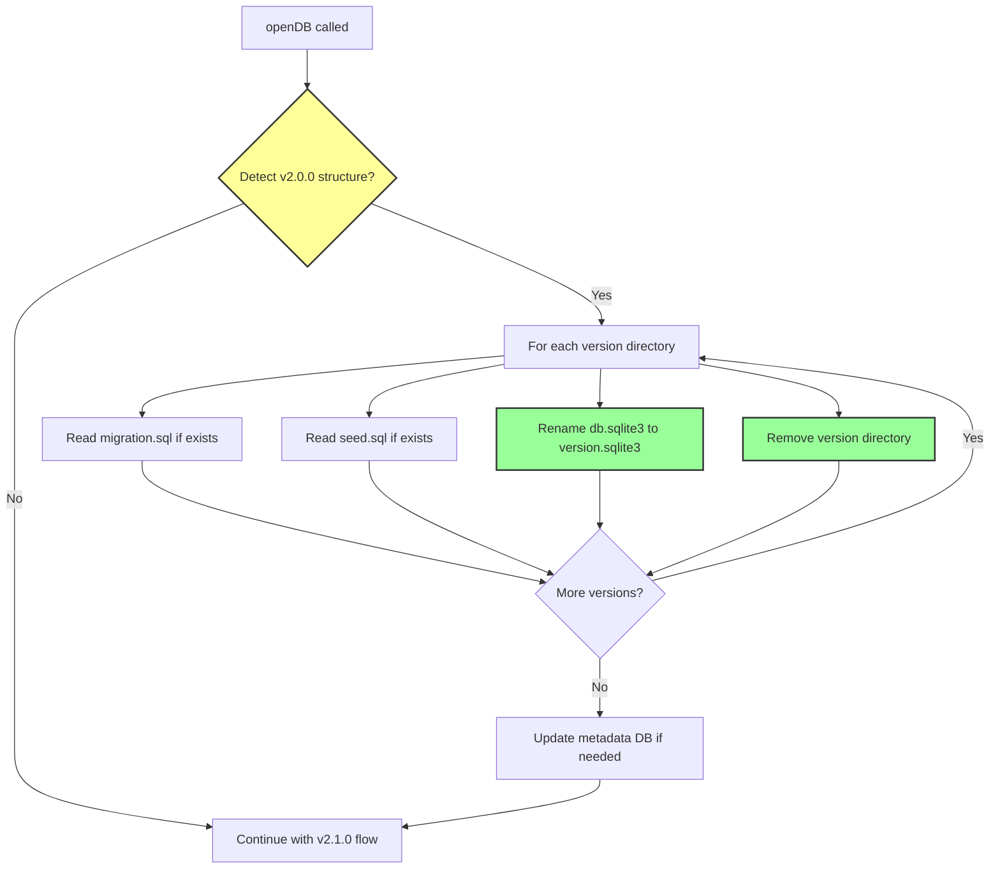

# v2.1.0 Document Update Plan

> **Feature**: F-002 - Flat OPFS Structure and In-Memory Release Configs
> **Created**: 2026-01-12
> **Author**: S1 Iteration Lead

---

## Overview

This document outlines all architecture and design documents that need to be updated for v2.1.0 implementation. The flat OPFS structure and in-memory release configs require changes across S1-S6 documents.

---

## Summary of Changes

| Stage                  | Documents to Update | Impact Level | Count  |
| ---------------------- | ------------------- | ------------ | ------ |
| **S1: Discovery**      | 1                   | Low          | 1      |
| **S2: Feasibility**    | 2                   | Medium       | 2      |
| **S3: Architecture**   | 3                   | High         | 3      |
| **S4: ADR**            | 3                   | High         | 3      |
| **S5: Design**         | 5                   | Critical     | 5      |
| **S6: Implementation** | 3                   | Medium       | 3      |
| **Total**              |                     |              | **17** |

---

## S1: Discovery (1 document)

### 1. Status Board

**File**: `agent-docs/00-control/01-status.md`

**Updates Needed**:

- Add v2.1.0 section to track F-002 progress
- Add task breakdown for flat structure implementation
- Update version tracking

**Changes**:

```markdown
## v2.1.0 - Flat OPFS Structure (F-002)

### Status: Discovery Complete

| Task                         | Status         | Notes                                                                |
| ---------------------------- | -------------- | -------------------------------------------------------------------- |
| F-002 Feature Document       | ✅ Complete    | agent-docs/01-discovery/features/F-002-v2.1.0-flat-opfs-structure.md |
| Architecture Impact Analysis | 🔄 In Progress |                                                                      |
| API Contract Updates         | ⏳ Pending     |                                                                      |
| Implementation Tasks         | ⏳ Pending     |                                                                      |
```

---

## S2: Feasibility (2 documents)

### 1. Risk Assessment

**File**: `agent-docs/02-feasibility/02-risk-assessment.md`

**New Risks to Add**:

| Risk                                                     | Impact | Likelihood | Mitigation                                              |
| -------------------------------------------------------- | ------ | ---------- | ------------------------------------------------------- |
| **Auto-migration data loss**                             | High   | Low        | Atomic migration with rollback, backup before migration |
| **Hash validation breaks after migration**               | High   | Low        | Test migration with hash validation, preserve hashes    |
| **Performance regression from Map lookup**               | Low    | Low        | Map lookup is O(1), benchmark before release            |
| **Users manually inspect OPFS structure**                | Medium | Medium     | Documentation updates, migration log entries            |
| **Breaking change for tools expecting v2.0.0 structure** | Medium | Medium     | Auto-migration handles most cases, deprecation period   |

**Updates Needed**:

- Add v2.1.0 section with new risks
- Update overall risk assessment for the project

### 2. Spike Plan

**File**: `agent-docs/02-feasibility/03-spike-plan.md`

**New Spike Needed**:

```markdown
## S-006: v2.1.0 Auto-Migration Validation

**Purpose**: Validate that v2.0.0 → v2.1.0 auto-migration works correctly

**Questions**:

1. Can we reliably detect v2.0.0 structure?
2. Does migration preserve all data and hashes?
3. What happens if migration is interrupted?
4. How long does migration take for large databases?

**Approach**:

- Create v2.0.0 database with multiple versions
- Trigger auto-migration
- Verify data integrity
- Test hash validation after migration
- Performance benchmarking

**Estimated Effort**: 2-3 hours
```

---

## S3: Architecture (3 documents)

### 1. High-Level Design (HLD)

**File**: `agent-docs/03-architecture/01-hld.md`

**Section 6: Code Structure Strategy**

**Current** (lines 217-240):

```text
/src
  /release                # Domain: Release versioning logic
    /constants.ts         # SQL constants, version regex
    /types.ts             # Release domain types
    /opfs-utils.ts        # OPFS file operations (adapter)
    /hash-utils.ts        # Release validation (domain)
    /lock-utils.ts        # Metadata locking (domain)
    /version-utils.ts     # Version comparison (domain)
    /release-manager.ts   # Release orchestration (application)
```

**Updated**:

```text
/src
  /release                # Domain: Release versioning logic
    /constants.ts         # SQL constants, version regex
    /types.ts             # Release domain types
    /opfs-utils.ts        # OPFS file operations (flat structure v2.1.0)
    /hash-utils.ts        # Release validation (domain)
    /lock-utils.ts        # Metadata locking (domain)
    /version-utils.ts     # Version comparison (domain)
    /migration-utils.ts   # [NEW v2.1.0] Auto-migration from v2.0.0
    /release-manager.ts   # Release orchestration (application)
```

**Section 7: Component Diagram** (lines 301-349)

**Add new component**:

```mermaid
graph TB
    subgraph "Main Thread"
        Migration[Migration Utils]  # NEW v2.1.0
        # ... existing components
    end

    Migration -->|detects v2.0.0| OPFS
    Migration -->|converts to flat| OPFS
```

### 2. Data Flow

**File**: `agent-docs/03-architecture/02-dataflow.md`

**New Section to Add**: Auto-Migration Flow



### 3. Deployment

**File**: `agent-docs/03-architecture/03-deployment.md`

**Updates Needed**:

- Add migration considerations for v2.1.0 deployment
- Document OPFS structure change implications
- Add rollback considerations for v2.1.0

---

## S4: ADR (3 documents)

### 1. ADR-0002: OPFS for Persistent Storage

**File**: `agent-docs/04-adr/0002-opfs-persistent-storage.md`

**Section: Consequences - OPFS Directory Structure**

**Current** (needs replacement):

```
demo.sqlite3/
  0.0.0/
    db.sqlite3
    migration.sql
    seed.sql
```

**Updated**:

```
demo.sqlite3/
  release.sqlite3
  default.sqlite3
  0.0.0.sqlite3
  0.0.1.sqlite3
  0.0.2.dev.sqlite3
```

**Add new section**: v2.1.0 Migration

```markdown
## v2.1.0 Migration

**Context**: v2.0.0 used nested version directories which added unnecessary complexity

**Decision**: Migrate to flat file structure with version-based naming

**Consequences**:

- Simpler directory structure
- SQL files removed from OPFS (now in memory)
- Auto-migration detects and converts v2.0.0 structure
```

### 2. ADR-0004: Release Versioning System

**File**: `agent-docs/04-adr/0004-release-versioning-system.md`

**Section: Implementation Evidence** (lines 239-311)

**Current OPFS Directory Structure** (lines 263-279):

```markdown
**OPFS Directory Structure**:
```

demo.sqlite3/
release.sqlite3 # Metadata database
default.sqlite3 # Initial empty database (version "default")
0.0.1/
db.sqlite3 # Versioned database snapshot
migration.sql # Migration SQL (for inspection)
seed.sql # Seed SQL (for inspection)
0.0.2/
db.sqlite3
migration.sql
seed.sql

```

```

**Updated**:

```markdown
**OPFS Directory Structure** (v2.1.0):
```

demo.sqlite3/
release.sqlite3 # Metadata database
default.sqlite3 # Initial empty database (version "default")
0.0.1.sqlite3 # Versioned database (flat naming)
0.0.2.sqlite3 # Versioned database (flat naming)
0.0.3.dev.sqlite3 # Dev version with suffix

```

**Note**: Migration and seed SQL are now stored in `window.__web_sqlite.databases[name].migrationSQL` and `seedSQL` Maps.
```

**Add new section**: v2.1.0 Changes

```markdown
## v2.1.0 Changes

**Flat File Structure**: Removed nested version directories for simplicity

**In-Memory SQL**: Migration and seed SQL stored in `Map<string, string>` in global namespace

**Auto-Migration**: Automatic detection and conversion from v2.0.0 structure

**Dev Version Suffix**: Dev versions use `.dev.sqlite3` suffix for identification
```

### 3. New ADR: ADR-0008

**File**: `agent-docs/04-adr/0008-auto-migration-strategy.md` (NEW)

**Template**:

```markdown
# ADR-0008: Auto-Migration Strategy for v2.1.0

## Status

Proposed

## Context

- v2.0.0 used nested version directories with SQL files
- v2.1.0 simplifies to flat file structure with in-memory SQL
- Existing users have data in v2.0.0 format

## Decision

Implement automatic migration from v2.0.0 to v2.1.0 on database open

## Consequences

- Transparent to users
- Data preservation guaranteed
- Hash validation maintained
```

---

## S5: Design (5 documents) - CRITICAL

### 1. API Contracts

**File**: `agent-docs/05-design/01-contracts/01-api.md`

**Section: Module: Global Namespace (v2.0.0)** (lines 773-916)

**Current Type** (lines 776-808):

```typescript
declare global {
  interface Window {
    __web_sqlite: {
      readonly databases: Record<string, DBInterface>;
      onDatabaseChange(
        callback: (event: DatabaseChangeEvent) => void,
      ): () => void;
    };
  }
}
```

**Updated Type**:

```typescript
declare global {
  interface Window {
    __web_sqlite: {
      /**
       * Map of currently opened database instances with release configs
       * Key: normalized database name (e.g., "myapp.sqlite3")
       * Value: Database record with migration/seed SQL maps and DB instance
       * @readonly
       */
      readonly databases: Record<
        string,
        {
          /**
           * Migration SQL indexed by version
           * Example: new Map([['0.0.1', 'ALTER TABLE users ADD COLUMN age INTEGER;']])
           */
          migrationSQL: Map<string, string>;

          /**
           * Seed SQL indexed by version (optional)
           * Example: new Map([['0.0.1', 'UPDATE users SET age = 25;']])
           */
          seedSQL: Map<string, string>;

          /**
           * Database interface instance
           */
          db: DBInterface;
        }
      >;

      onDatabaseChange(
        callback: (event: DatabaseChangeEvent) => void,
      ): () => void;
    };
  }
}
```

**Update Usage Examples** (lines 851-883):

```typescript
// Access database from anywhere (no imports needed!)
const dbRecord = window.__web_sqlite.databases["myapp.sqlite3"];

// Get migration SQL for specific version
const migration = dbRecord.migrationSQL.get("0.0.1");
console.log(migration); // "ALTER TABLE users ADD COLUMN age INTEGER;"

// Access database instance
const users = await dbRecord.db.query("SELECT * FROM users");
```

### 2. Database Schema

**File**: `agent-docs/05-design/02-schema/01-database.md`

**Section 3: OPFS File Structure** (lines 256-355)

**Current** (lines 260-277):

```markdown

```

OPFS Root
└── {baseDir}/ # Base directory (e.g., "demo.sqlite3", "myapp.sqlite3")
├── release.sqlite3 # Metadata database
├── default.sqlite3 # Initial empty database (version "default")
├── 1.0.0/ # Version 1.0.0 directory
│ ├── db.sqlite3 # Versioned database snapshot
│ ├── migration.sql # Migration SQL (for inspection)
│ └── seed.sql # Seed SQL (for inspection)
├── 1.0.1/ # Version 1.0.1 directory
│ ├── db.sqlite3
│ ├── migration.sql
│ └── seed.sql
└── 1.0.2/ # Dev version directory (mode = "dev")
├── db.sqlite3
├── migration.sql
└── seed.sql

```

```

**Updated** (v2.1.0):

```markdown

```

OPFS Root
└── {baseDir}/ # Base directory (e.g., "demo.sqlite3", "myapp.sqlite3")
├── release.sqlite3 # Metadata database (unchanged)
├── default.sqlite3 # Initial empty database (unchanged)
├── 1.0.0.sqlite3 # Version 1.0.0 database (flat)
├── 1.0.1.sqlite3 # Version 1.0.1 database (flat)
└── 1.0.2.dev.sqlite3 # Dev version with suffix (flat)

```

**Note**: Migration and seed SQL are now stored in `window.__web_sqlite.databases[name].migrationSQL` and `seedSQL` Maps.
```

**File Descriptions** (lines 280-315):

**Remove**:

- Remove `{version}/migration.sql` section
- Remove `{version}/seed.sql` section

**Add**:

```markdown
#### `{version}.sqlite3` (Release Version)

- **Purpose**: Versioned database snapshot
- **Schema**: User-defined (evolves via migrations)
- **Location**: `{baseDir}/{version}.sqlite3`
- **Size**: Depends on user data (can be MB to GB)

#### `{version}.dev.sqlite3` (Dev Version)

- **Purpose**: Dev version database snapshot
- **Schema**: User-defined (evolves via migrations)
- **Location**: `{baseDir}/{version}.dev.sqlite3`
- **Size**: Depends on user data (can be MB to GB)
- **Distinction**: `.dev.sqlite3` suffix identifies dev versions
```

**File Creation Flow** (lines 317-354):

**Update** to remove SQL file writing:



### 3. Migration Strategy

**File**: `agent-docs/05-design/02-schema/02-migrations.md`

**Section 3: Migration Application Flow** (lines 110-207)

**High-Level Flow** (lines 115-149):

**Update** flowchart to remove SQL file writing:

```mermaid
flowchart TD
    A[openDB called] --> B{Releases Config?}
    B -->|No| C[Use existing metadata]
    B -->|Yes| D[Validate release configs]
    D --> E[Compute SHA-256 hashes]

    C --> F[Load metadata database]
    E --> F

    F --> G{New versions available?}
    G -->|No| H[Open latest version]
    G -->|Yes| I[Acquire metadata lock]

    I --> J[For each new version]
    J --> K[Create {version}.sqlite3 file]
    K --> L[Copy latest database]
    Note over L: No SQL files written
    L --> O[Open new database in worker]
    O --> P[BEGIN transaction]
    P --> Q[EXECUTE migrationSQL]
    Q --> R{seedSQL exists?}
    R -->|Yes| S[EXECUTE seedSQL]
    R -->|No| T[Skip seedSQL]
    S --> U[COMMIT transaction]
    T --> U
    Q -->|Error| V[ROLLBACK transaction]
    V --> W[Remove version file]
    W --> X[Throw error]
    U --> Y[Insert metadata row]
    Y --> Z{More versions?}
    Z -->|Yes| J
    Z -->|No| AA[Release metadata lock]
    AA --> H
```

**Add new section**: v2.1.0 Auto-Migration



### 4. Release Management Module

**File**: `agent-docs/05-design/03-modules/release-management.md`

**Section 3: Public Interface - applyVersion function** (lines 160-269)

**Current Code** (lines 215-268):

```typescript
const applyVersion = async (
  config: ReleaseConfigWithHash,
  mode: "release" | "dev",
): Promise<void> => {
  const versionDir = await baseDir.getDirectoryHandle(config.version, {
    create: true,
  });
  const destDbHandle = await versionDir.getFileHandle("db.sqlite3", {
    create: true,
  });

  await copyFileHandle(latestDbHandle, destDbHandle);
  await writeTextFile(versionDir, "migration.sql", config.migrationSQL);
  if (config.normalizedSeedSQL) {
    await writeTextFile(versionDir, "seed.sql", config.normalizedSeedSQL);
  }
  // ... rest of function
};
```

**Updated Code** (v2.1.0):

```typescript
const applyVersion = async (
  config: ReleaseConfigWithHash,
  mode: "release" | "dev",
): Promise<void> => {
  // Flat file naming: {version}.sqlite3 or {version}.dev.sqlite3
  const versionFilename =
    mode === "dev"
      ? `${config.version}.dev.sqlite3`
      : `${config.version}.sqlite3`;

  const destDbHandle = await baseDir.getFileHandle(versionFilename, {
    create: true,
  });

  await copyFileHandle(latestDbHandle, destDbHandle);
  // No SQL files written - stored in memory instead

  // Store SQL in global namespace
  const dbRecord = window.__web_sqlite.databases[normalizedFilename];
  dbRecord.migrationSQL.set(config.version, config.migrationSQL);
  if (config.normalizedSeedSQL) {
    dbRecord.seedSQL.set(config.version, config.normalizedSeedSQL);
  }

  // ... rest of function
};
```

**Add new function**: `migrateFromV2_0_0`

```typescript
/**
 * Migrate v2.0.0 nested structure to v2.1.0 flat structure
 */
const migrateFromV2_0_0 = async (
  baseDir: FileSystemDirectoryHandle,
): Promise<void> => {
  const entries: string[] = [];
  for await (const entry of baseDir.values()) {
    entries.push(entry.name);
  }

  // Detect v2.0.0 structure (version directories with db.sqlite3)
  const versionDirs = entries.filter((name) => name.match(/^\d+\.\d+\.\d+$/));

  if (versionDirs.length === 0) {
    return; // Not v2.0.0 structure
  }

  for (const version of versionDirs) {
    const versionDir = await baseDir.getDirectoryHandle(version);
    const dbHandle = await versionDir.getFileHandle("db.sqlite3");

    // Determine if dev version from metadata
    const metaRows = await metaQuery<ReleaseRow>(
      "SELECT mode FROM release WHERE version = ?",
      [version],
    );
    const mode = metaRows[0]?.mode || "release";
    const versionFilename =
      mode === "dev" ? `${version}.dev.sqlite3` : `${version}.sqlite3`;

    // Copy to flat structure
    const destHandle = await baseDir.getFileHandle(versionFilename, {
      create: true,
    });
    await copyFileHandle(dbHandle, destHandle);

    // Read SQL files if they exist
    try {
      const migrationFile = await versionDir.getFileHandle("migration.sql");
      const migrationFileObj = await migrationFile.getFile();
      const migrationSQL = await migrationFileObj.text();
      // Store in memory...
    } catch {
      // File doesn't exist, skip
    }

    // Remove version directory
    await baseDir.removeEntry(version, { recursive: true });
  }
};
```

### 5. Core Module

**File**: `agent-docs/05-design/03-modules/core.md`

**Updates Needed**:

- Update DBInterface initialization to populate migration/seed SQL Maps
- Update `close()` to clean up Maps

---

## S6: Implementation (3 documents)

### 1. Test Plan

**File**: `agent-docs/06-implementation/02-test-plan.md`

**Add new E2E test suite**:

```markdown
### E2E Test Suite: v2.1.0 Flat Structure

**File**: `tests/e2e/v2.1.0-flat-structure.e2e.test.ts`

**Test Cases**:

1. **Auto-migration from v2.0.0**
   - Create v2.0.0 structure with nested directories
   - Trigger openDB
   - Verify flat structure created
   - Verify SQL files removed
   - Verify data integrity

2. **Flat file naming**
   - Create release version
   - Verify `{version}.sqlite3` created
   - Create dev version
   - Verify `{version}.dev.sqlite3` created

3. **In-memory SQL Maps**
   - Open database with releases
   - Verify `migrationSQL` Map populated
   - Verify `seedSQL` Map populated
   - Access SQL by version

4. **Hash validation with in-memory SQL**
   - Create release with hashes
   - Verify hash validation works
   - Attempt to modify SQL
   - Verify hash mismatch error

5. **Global namespace type changes**
   - Access `databases[name].db`
   - Access `databases[name].migrationSQL`
   - Access `databases[name].seedSQL`
```

### 2. Release and Rollback Guide

**File**: `agent-docs/06-implementation/04-release-and-rollback.md`

**Add new section**: v2.1.0 Migration Guide

````markdown
## v2.1.0 Migration Guide

### For Users Upgrading from v2.0.0

**Automatic Migration**: v2.1.0 automatically detects and migrates v2.0.0 structure

**What to expect**:

1. First open may take longer (migration runs once)
2. All data is preserved
3. SQL files removed from OPFS (now in memory)
4. No manual intervention required

**Verification**:

```typescript
// Check that structure is flat
const root = await navigator.storage.getDirectory();
const dir = await root.getDirectoryHandle("myapp");
for await (const entry of dir.values()) {
  console.log(entry.name); // Should see: release.sqlite3, default.sqlite3, 1.0.0.sqlite3, etc.
}

// Access SQL from global namespace
const migration =
  window.__web_sqlite.databases["myapp.sqlite3"].migrationSQL.get("1.0.0");
```
````

```

### 3. Build and Run Guide
**File**: `agent-docs/06-implementation/01-build-and-run.md`

**Updates Needed**:
- Add TypeScript compilation note for new `Map<string, string>` types
- Update build instructions if needed

---

## Implementation Order

### Phase 1: Documentation Updates (S3, S4, S5)
1. Update S3 Architecture documents (3 files)
2. Update S4 ADRs (2 existing + 1 new)
3. Update S5 Design documents (5 files)

### Phase 2: Test Strategy (S6)
1. Update S6 Test Plan with v2.1.0 tests
2. Update S6 Release Guide with migration info

### Phase 3: Implementation
1. Implement auto-migration logic
2. Update release-manager.ts for flat structure
3. Update global namespace types
4. Add E2E tests

---

## Validation Checklist

Before marking documentation updates complete:

- [ ] All 17 documents identified and updated
- [ ] All code examples updated with new syntax
- [ ] All diagrams updated with v2.1.0 structure
- [ ] All Mermaid flowcharts updated
- [ ] All type definitions updated
- [ ] All file paths updated
- [ ] Navigation links verified
- [ ] Cross-references updated
- [ ] ADR-0008 created for auto-migration
- [ ] Status board updated with v2.1.0 section

---

## Navigation

**Related Documents**:
- [F-002 Feature Document](./F-002-v2.1.0-flat-opfs-structure.md) - Feature specification
- [00 Spec Index](../../00-control/00-spec.md) - Main spec index

**Back to**: [Discovery Index](../)
```
