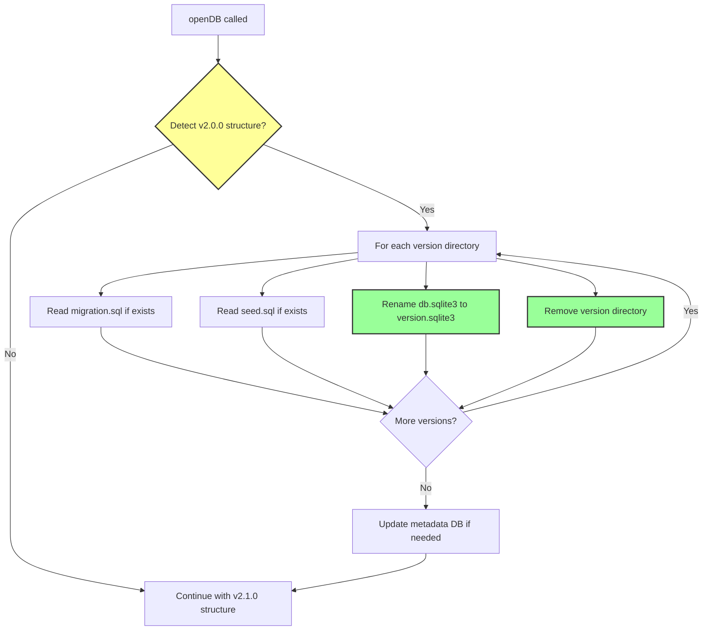
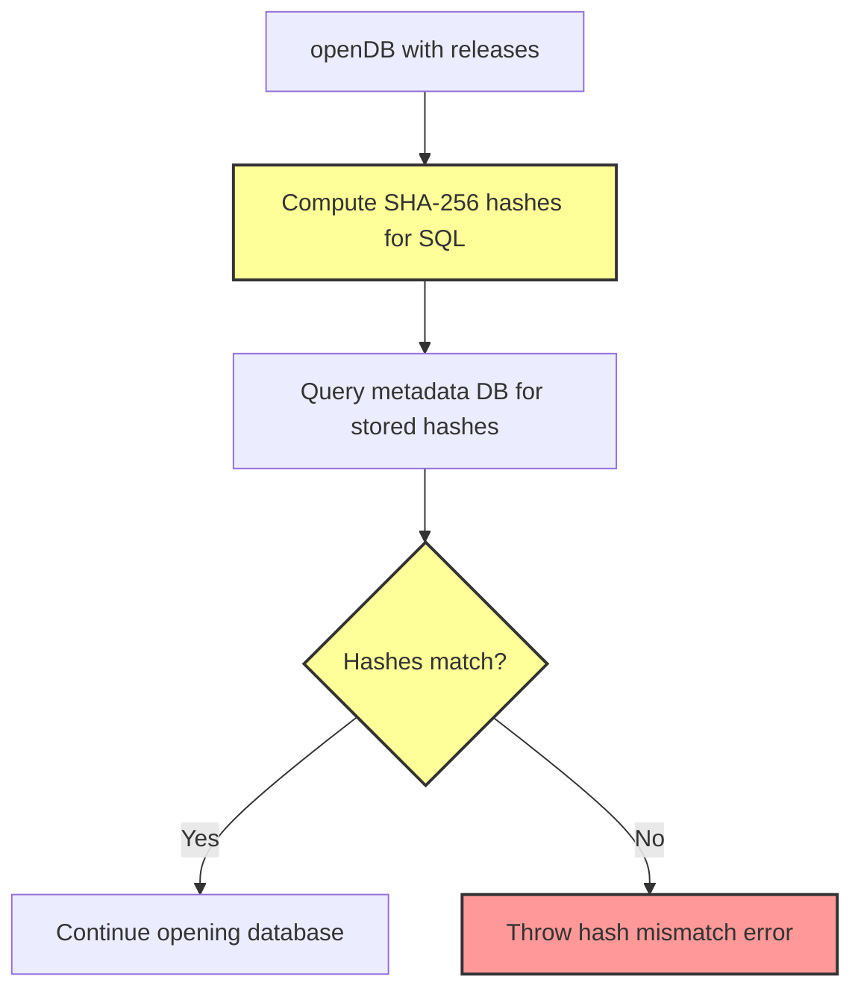

# F-002: v2.1.0 - Flat OPFS Structure and In-Memory Release Configs

> **Feature ID**: F-002
> **Target Version**: 2.1.0
> **Status**: Discovery
> **Created**: 2026-01-12
> **Author**: Iteration Lead (S1)

---

## 1) Feature Summary

**Purpose**: Simplify the OPFS file structure by flattening nested version directories and storing migration/seed SQL in memory instead of separate files.

**Core Features**:

1. **Flat OPFS Structure** - Remove nested version directories, use direct file naming (e.g., `0.0.1.sqlite3`)
2. **In-Memory Release Configs** - Store migration/seed SQL in `window.__web_sqlite` using `Map<string, string>` structure
3. **Dev Version Suffix Notation** - Distinguish dev versions with `.dev.sqlite3` suffix
4. **Auto-Migration** - Automatically detect and migrate v2.0.0 structure to v2.1.0 on database open
5. **Retain Hash Validation** - Keep SHA-256 hash validation for release integrity

---

## 2) User Stories

### Story 1: Simplified OPFS File Structure

**As a developer**, I want a cleaner OPFS directory structure so that:

- I can easily identify database versions by filename
- The OPFS structure is more intuitive and friendly
- Unnecessary nested directories are eliminated

**Acceptance Criteria**:

- Old structure: `demo.sqlite3/0.0.0/db.sqlite3`, `migration.sql`, `seed.sql`
- New structure: `demo.sqlite3/0.0.0.sqlite3`, `0.0.1.sqlite3`, `0.0.2.dev.sqlite3`
- No nested version directories
- No separate `migration.sql` and `seed.sql` files in OPFS

### Story 2: In-Memory Release Configs

**As a developer**, I want to access migration/seed SQL from `window.__web_sqlite` so that:

- I can inspect release SQL without reading from OPFS
- The SQL is readily available in memory for quick access
- The structure is more intuitive with versioned maps

**Acceptance Criteria**:

- `window.__web_sqlite.databases['myapp.sqlite3']` contains:
  - `migrationSQL: Map<string, string>` - version → SQL mapping
  - `seedSQL: Map<string, string>` - version → SQL mapping
  - `db: DBInterface` - database instance
- Example: `migrationSQL.get('0.0.1')` returns the migration SQL for version 0.0.1

### Story 3: Dev Version Suffix Notation

**As a developer**, I want to distinguish dev versions from release versions by filename so that:

- I can quickly identify which versions are dev versions in DevTools
- The file naming is consistent and predictable

**Acceptance Criteria**:

- Release versions: `0.0.1.sqlite3`, `0.0.2.sqlite3`
- Dev versions: `0.0.3.dev.sqlite3`, `0.0.4.dev.sqlite3`

### Story 4: Automatic Migration from v2.0.0

**As a user upgrading from v2.0.0**, I want my data to automatically migrate to the new structure so that:

- I don't lose any data during the upgrade
- The migration happens transparently on first database open
- I don't need to manually export/import data

**Acceptance Criteria**:

- Old structure is automatically detected on `openDB()`
- Version directories are flattened to direct files
- SQL files are read and stored in memory
- Migration happens transparently without user intervention

---

## 3) Functional Requirements

### FR-001: Flat OPFS File Structure

**Current Structure (v2.0.0)**:

```
demo.sqlite3/
  release.sqlite3              # Metadata database
  default.sqlite3              # Initial empty database
  0.0.0/                       # Version directory
    db.sqlite3                 # Database snapshot
    migration.sql              # Migration SQL file
    seed.sql                   # Seed SQL file
  0.0.1/
    db.sqlite3
    migration.sql
    seed.sql
```

**New Structure (v2.1.0)**:

```
demo.sqlite3/
  release.sqlite3              # Metadata database (unchanged)
  default.sqlite3              # Initial empty database (unchanged)
  0.0.0.sqlite3                # Version database (flat)
  0.0.1.sqlite3                # Version database (flat)
  0.0.2.dev.sqlite3           # Dev version with suffix
```

**Requirements**:

- FR-001.1: Remove nested version directories (e.g., `0.0.0/`)
- FR-001.2: Rename `db.sqlite3` files to `{version}.sqlite3` (e.g., `0.0.0.sqlite3`)
- FR-001.3: Use `.dev.sqlite3` suffix for dev versions (e.g., `0.0.2.dev.sqlite3`)
- FR-001.4: Remove `migration.sql` and `seed.sql` files from OPFS
- FR-001.5: Keep `release.sqlite3` and `default.sqlite3` unchanged

### FR-002: In-Memory Release Config Storage

**Requirements**:

- FR-002.1: Store migration SQL in `Map<string, string>` keyed by version
- FR-002.2: Store seed SQL in `Map<string, string>` keyed by version
- FR-002.3: Store maps in `window.__web_sqlite.databases` per database
- FR-002.4: Maps are populated on `openDB()` from release configs
- FR-002.5: Maps are read-only (external updates not allowed)

**Type Definition**:

```typescript
declare global {
  interface Window {
    __web_sqlite: {
      /**
       * Map of currently opened database instances with release configs
       * Key: normalized database name (e.g., "myapp.sqlite3")
       * Value: Database record with migration/seed SQL maps and DB instance
       * @readonly
       */
      readonly databases: Record<
        string,
        {
          /**
           * Migration SQL indexed by version
           * Example: new Map([['0.0.1', 'ALTER TABLE users ADD COLUMN age INTEGER;']])
           */
          migrationSQL: Map<string, string>;

          /**
           * Seed SQL indexed by version (optional, may be undefined for versions without seed)
           * Example: new Map([['0.0.1', 'UPDATE users SET age = 25 WHERE age IS NULL;']])
           */
          seedSQL: Map<string, string>;

          /**
           * Database interface instance
           */
          db: DBInterface;
        }
      >;

      /**
       * Subscribe to database open/close events
       * @param callback - Called when a database is opened or closed
       * @returns Unsubscribe function
       */
      onDatabaseChange(
        callback: (event: DatabaseChangeEvent) => void,
      ): () => void;
    };
  }
}
```

**Usage Example**:

```typescript
// Open database with releases
const db = await openDB("myapp", {
  releases: [
    {
      version: "0.0.1",
      migrationSQL: "CREATE TABLE users (id INTEGER PRIMARY KEY, name TEXT);",
      seedSQL: "INSERT INTO users (name) VALUES ('Alice');",
    },
    {
      version: "0.0.2",
      migrationSQL: "ALTER TABLE users ADD COLUMN age INTEGER;",
    },
  ],
});

// Access release configs from global namespace
const dbRecord = window.__web_sqlite.databases["myapp.sqlite3"];

// Get migration SQL for specific version
const migration = dbRecord.migrationSQL.get("0.0.1");
console.log(migration); // "CREATE TABLE users (id INTEGER PRIMARY KEY, name TEXT);"

// Get seed SQL for specific version
const seed = dbRecord.seedSQL.get("0.0.1");
console.log(seed); // "INSERT INTO users (name) VALUES ('Alice');"

// Iterate through all versions
for (const [version, sql] of dbRecord.migrationSQL) {
  console.log(`Version ${version}: ${sql}`);
}

// Access database instance
await dbRecord.db.query("SELECT * FROM users");
```

### FR-003: Automatic Migration from v2.0.0 Structure

**Requirements**:

- FR-003.1: Detect v2.0.0 structure (nested version directories)
- FR-003.2: Automatically migrate to v2.1.0 structure on `openDB()`
- FR-003.3: Read `migration.sql` and `seed.sql` files before removal
- FR-003.4: Store SQL content in memory maps
- FR-003.5: Rename `db.sqlite3` to `{version}.sqlite3` format
- FR-003.6: Handle dev vs release versions correctly
- FR-003.7: Update metadata database to reflect new structure

**Migration Flow**:



### FR-004: Retain Hash Validation

**Requirements**:

- FR-004.1: Keep SHA-256 hash computation for migration/seed SQL
- FR-004.2: Store hashes in metadata database (`release.sqlite3`)
- FR-004.3: Validate in-memory SQL against stored hashes on `openDB()`
- FR-004.4: Throw error if hash mismatch detected
- FR-004.5: Hash validation works for both v2.0.0 migrated and v2.1.0 new databases

**Hash Validation Flow**:



---

## 4) Non-Functional Requirements

### NFR-001: Performance

- NFR-001.1: Flat structure lookup < 1ms (same as before)
- NFR-001.2: In-memory SQL access < 0.01ms per version
- NFR-001.3: Auto-migration overhead < 500ms for typical databases
- NFR-001.4: Hash validation < 1ms per SQL string

### NFR-002: Compatibility

- NFR-002.1: Auto-migration from v2.0.0 is transparent to users
- NFR-002.2: Existing v2.0.0 data is fully preserved
- NFR-002.3: API remains backward compatible (only global namespace type changes)
- NFR-002.4: Hash validation logic unchanged

### NFR-003: Reliability

- NFR-003.1: Auto-migration is atomic (all-or-nothing)
- NFR-003.2: Migration failures roll back to v2.0.0 structure
- NFR-003.3: Hash validation prevents corrupted data
- NFR-003.4: SQL files are read before deletion in migration

### NFR-004: Maintainability

- NFR-004.1: Simplified structure reduces code complexity
- NFR-004.2: Fewer file operations reduce potential bugs
- NFR-004.3: In-memory SQL is easier to debug and inspect

---

## 5) Architecture Impact

### Changes to Existing Architecture

**OPFS Structure** (Agent Docs: `05-design/02-schema/01-database.md`):

- **Impact**: High - Complete restructuring of version storage
- **Changes**:
  - Remove nested version directories
  - Flatten to direct `{version}.sqlite3` files
  - Remove `migration.sql` and `seed.sql` file storage

**Global Namespace API** (Agent Docs: `05-design/01-contracts/01-api.md`):

- **Impact**: High - Type signature change for `databases` record
- **Changes**:
  - Change `Record<string, DBInterface>` to `Record<string, {migrationSQL: Map<string, string>, seedSQL: Map<string, string>, db: DBInterface}>`
  - Add `Map<string, string>` types for release configs

**Release Management** (Agent Docs: `05-design/03-modules/release-management.md`):

- **Impact**: High - File operation changes, auto-migration logic
- **Changes**:
  - Remove SQL file writing to OPFS
  - Add auto-migration detection and conversion
  - Update version file naming logic

**ADR-0004: Release Versioning System** (Agent Docs: `04-adr/0004-release-versioning-system.md`):

- **Impact**: High - OPFS structure and SQL storage changes
- **Changes**:
  - Update OPFS directory structure diagrams
  - Update release storage documentation
  - Add auto-migration notes

### New Components

1. **Migration Detector**: Detects v2.0.0 vs v2.1.0 structure
2. **Auto-Migrator**: Converts v2.0.0 structure to v2.1.0
3. **In-Memory Config Store**: Populates `Map<string, string>` for SQL storage

---

## 6) Dependencies

### Internal Dependencies

- **Release Manager** (`src/release/release-manager.ts`): File operation changes
- **OPFS Utils** (`src/release/opfs-utils.ts`): Path resolution updates
- **Hash Utils** (`src/release/hash-utils.ts`): No changes (retained)
- **Global Namespace** (`src/global/initialize-namespace.ts`): Type updates

### External Dependencies

- **None** - All features use standard Web APIs

### Cross-Feature Dependencies

- **Auto-Migration** → **Release Manager**: Migration triggered on openDB
- **In-Memory SQL** → **Global Namespace**: Populated on database open
- **Hash Validation** → **In-Memory SQL**: Validates against stored hashes

---

## 7) Risks and Mitigations

| Risk                                                 | Impact | Likelihood | Mitigation                                              |
| ---------------------------------------------------- | ------ | ---------- | ------------------------------------------------------- |
| Auto-migration failure causes data loss              | High   | Low        | Atomic migration with rollback, backup before migration |
| Hash validation breaks after migration               | High   | Low        | Test migration with hash validation, preserve hashes    |
| Performance regression from Map lookup               | Low    | Low        | Map lookup is O(1), benchmark before release            |
| Users manually inspect OPFS structure                | Medium | Medium     | Documentation updates, migration log entries            |
| Breaking change for tools expecting v2.0.0 structure | Medium | Medium     | Auto-migration handles most cases, deprecation period   |

---

## 8) Complete Type Definitions

```typescript
/**
 * web-sqlite-js v2.1.0 Global Namespace
 * Provides direct access to opened database instances with release configs
 */
declare global {
  interface Window {
    /**
     * web-sqlite-js global namespace
     * Provides direct access to opened database instances with release SQL
     */
    __web_sqlite: {
      /**
       * Map of currently opened database instances with release configs
       * Key: normalized database name (e.g., "myapp.sqlite3")
       * Value: Database record with migration/seed SQL maps and DB instance
       * @readonly
       */
      readonly databases: Record<
        string,
        {
          /**
           * Migration SQL indexed by version
           * Example: new Map([['0.0.1', 'ALTER TABLE users ADD COLUMN age INTEGER;']])
           */
          migrationSQL: Map<string, string>;

          /**
           * Seed SQL indexed by version (optional, may be undefined for versions without seed)
           * Example: new Map([['0.0.1', 'UPDATE users SET age = 25 WHERE age IS NULL;']])
           */
          seedSQL: Map<string, string>;

          /**
           * Database interface instance
           */
          db: DBInterface;
        }
      >;

      /**
       * Subscribe to database open/close events
       * @param callback - Called when a database is opened or closed
       * @returns Unsubscribe function
       */
      onDatabaseChange(
        callback: (event: DatabaseChangeEvent) => void,
      ): () => void;
    };
  }
}

/**
 * Database interface (unchanged from v2.0.0)
 */
interface DBInterface {
  exec(sql: string, params?: SQLParams): Promise<ExecResult>;
  query<T = unknown>(sql: string, params?: SQLParams): Promise<T[]>;
  transaction<T>(
    fn: (tx: Pick<DBInterface, "exec" | "query">) => Promise<T>,
  ): Promise<T>;
  close(): Promise<void>;
  onLog(callback: (log: LogEntry) => void): () => void;
  devTool: DevTool;
}

/**
 * Release configuration (unchanged from v2.0.0)
 */
interface ReleaseConfig {
  version: string;
  migrationSQL: string;
  seedSQL?: string | null;
}
```

---

## 9) Success Criteria

### Functional Acceptance

- **SC1**: OPFS structure is flat (no nested version directories)
- **SC2**: Release versions use `{version}.sqlite3` naming
- **SC3**: Dev versions use `{version}.dev.sqlite3` naming
- **SC4**: No `migration.sql` or `seed.sql` files in OPFS
- **SC5**: `migrationSQL` and `seedSQL` are `Map<string, string>` in global namespace
- **SC6**: Auto-migration from v2.0.0 works transparently
- **SC7**: Hash validation still works with in-memory SQL
- **SC8**: All existing v2.0.0 data is preserved during migration

### Technical Acceptance

- **SC9**: E2E tests pass for flat structure
- **SC10**: E2E tests pass for auto-migration
- **SC11**: E2E tests pass for in-memory SQL access
- **SC12**: Existing v2.0.0 tests pass (after auto-migration)
- **SC13**: TypeScript types compile without errors
- **SC14**: Hash validation tests pass

### Documentation Acceptance

- **SC15**: OPFS structure documentation updated
- **SC16**: API documentation updated with new types
- **SC17**: Migration guide from v2.0.0 to v2.1.0 provided
- **SC18**: ADR-0004 updated with new structure

---

## 10) Implementation Notes

### Suggested Implementation Order

1. **Phase 1**: File Structure Changes (foundational)
   - Update `opfs-utils.ts` for flat file paths
   - Modify `release-manager.ts` to use flat naming
   - Add dev version suffix logic

2. **Phase 2**: In-Memory SQL Storage
   - Update global namespace types
   - Populate `Map<string, string>` on `openDB()`
   - Remove SQL file writing to OPFS

3. **Phase 3**: Auto-Migration
   - Add v2.0.0 structure detection
   - Implement migration logic
   - Add migration tests

4. **Phase 4**: Hash Validation
   - Ensure hash validation works with in-memory SQL
   - Test hash validation after auto-migration

### Files to Modify

**Modified Files**:

- `src/types/global.ts` - Update global namespace types
- `src/release/opfs-utils.ts` - Flat file path resolution
- `src/release/release-manager.ts` - Remove SQL file writing, add migration logic
- `src/release/hash-utils.ts` - No changes (hash validation retained)
- `src/main.ts` - Populate in-memory SQL maps
- `src/worker.ts` - No changes (worker unaffected)

**Test Files**:

- `tests/e2e/release.e2e.test.ts` - Update for flat structure
- `tests/e2e/auto-migration.e2e.test.ts` - New tests for auto-migration
- `tests/e2e/in-memory-sql.e2e.test.ts` - New tests for SQL maps

---

## 11) Breaking Changes

### API Breaking Changes

- **Global Namespace Type Change**:
  - Before: `Record<string, DBInterface>`
  - After: `Record<string, {migrationSQL: Map<string, string>, seedSQL: Map<string, string>, db: DBInterface}>`
  - Impact: Code accessing `window.__web_sqlite.databases[name]` directly needs update

### Migration Path

```typescript
// v2.0.0 access pattern
const db = window.__web_sqlite.databases["myapp.sqlite3"];
await db.query("SELECT * FROM users");

// v2.1.0 access pattern
const dbRecord = window.__web_sqlite.databases["myapp.sqlite3"];
await dbRecord.db.query("SELECT * FROM users");

// Or access release configs
const migration = dbRecord.migrationSQL.get("0.0.1");
```

---

## Navigation

**Back to**: [Discovery Index](../) - All discovery documents

**Related Documents**:

- [02 Requirements](../02-requirements.md) - MVP requirements and backlog
- [01 API Contracts](../../05-design/01-contracts/01-api.md) - Public API specifications
- [ADR-0004: Release Versioning](../../04-adr/0004-release-versioning-system.md) - Release system design

**Next Steps**:

1. **S3 (System Architect)**: Review and validate architecture impact
2. **S5 (Contract Designer)**: Define detailed API contracts for new structure
3. **S7 (Task Manager)**: Break down into implementation tasks
