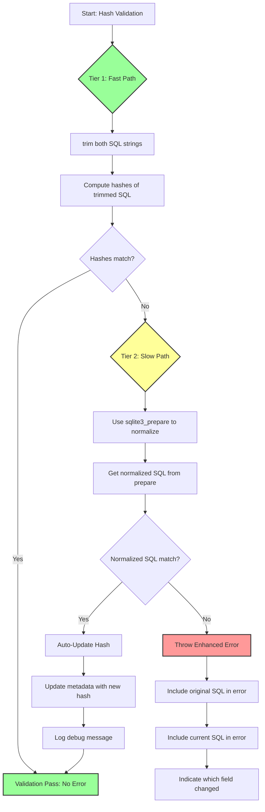

# F-003: SQL Normalization and Enhanced Validation Error Reporting

> **Feature ID**: F-003
> **Target Version**: TBD
> **Status**: Discovery
> **Created**: 2026-01-26
> **Author**: Iteration Lead (S1)

---

## 1) Feature Summary

**Purpose**: Enhance SQL validation with a two-tier approach for performance optimization: fast trim-based comparison, falling back to SQLite `prepare` normalization only when needed.

**Core Features**:

1. **Two-Tier Validation** - Fast `trim()` + hash compare (Tier 1), then `prepare()` normalization (Tier 2) only on mismatch
2. **Auto-Update for Whitespace-Only Differences** - If normalized SQL matches, update hash and metadata automatically
3. **Enhanced Error Messages** - Show both original and current SQL when validation fails
4. **Persistent Original SQL Storage** - Store `originalMigrationSQL` and `originalSeedSQL` in metadata database
5. **Global Namespace Integration** - Expose original SQL in `window.__web_sqlite` registry

---

## 2) User Stories

### Story 1: Whitespace-Only SQL Changes Should Not Break

**As a developer**, I want whitespace-only changes in migration SQL to be automatically accepted so that:

- Code formatting tools (Prettier, ESLint) can reformat SQL without breaking validation
- Trailing whitespace differences don't cause hash mismatch errors
- Adding/removing comments in SQL doesn't require manual hash updates

**Acceptance Criteria**:

- Hash mismatch triggers SQL normalization via `sqlite3_prepare()`
- If normalized SQL matches, hash is auto-updated in metadata
- No error thrown for whitespace-only differences
- Metadata database updated with new hash

### Story 2: Actual SQL Changes Should Show Clear Diff

**As a developer**, I want to see exactly what changed in migration SQL when validation fails so that:

- I can understand the difference between original and modified SQL
- I know whether it's migration or seed SQL that changed
- I can decide to revert or create a new version

**Acceptance Criteria**:

- Error message includes both original SQL and current SQL
- Error message indicates which field changed (migration vs seed)
- Error message includes version number
- SQL is truncated if too long (first 200 chars with `...`)

### Story 3: Original SQL Access for Debugging

**As a developer**, I want to access the original SQL from global namespace so that:

- I can compare current SQL against what was originally deployed
- DevTools can show both original and current SQL
- I can export SQL for audit purposes

**Acceptance Criteria**:

- `window.__web_sqlite.databases[name].originalMigrationSQL` contains Map<version, SQL>
- `window.__web_sqlite.databases[name].originalSeedSQL` contains Map<version, SQL>
- Maps are read-only from external access
- SQL persists across page reloads (stored in metadata DB)

---

## 3) Functional Requirements

### FR-001: Two-Tier SQL Validation (Performance Optimized)

**Purpose**: Validate SQL hashes with a fast path for common cases, falling back to expensive normalization only when needed

**Requirements**:

**Tier 1 - Fast Path (Low Performance Cost)**:

- FR-001.1: `trim()` whitespace from both original SQL and current SQL
- FR-001.2: Compute SHA-256 hash of trimmed SQL
- FR-001.3: Compare hashes with stored metadata hash
- FR-001.4: If hashes match, validation passes (no error, no normalization needed)

**Tier 2 - Slow Path (Higher Performance Cost)**:

- FR-001.5: Only invoked when Tier 1 hash mismatch occurs
- FR-001.6: Use SQLite's `prepare()` function to normalize both SQL strings
- FR-001.7: Compare the normalized SQL output from `prepare`
- FR-001.8: If normalized SQL matches, auto-update hash in metadata
- FR-001.9: If normalized SQL differs, throw enhanced error with SQL diff
- FR-001.10: Normalization applies to both `migrationSQL` and `seedSQL`

**Validation Flow Diagram**:



**Performance Characteristics**:

| Tier   | Operation                 | Cost    | Frequency               |
| ------ | ------------------------- | ------- | ----------------------- |
| Tier 1 | `trim()` + SHA-256        | < 0.1ms | Always (fast path)      |
| Tier 2 | `prepare()` normalization | 1-5ms   | Only on mismatch (rare) |

**Implementation Notes**:

```typescript
// Tier 1: Fast path - trim + hash compare
const trimmedOriginal = originalSQL.trim();
const trimmedCurrent = currentSQL.trim();
const hashOriginal = await hashSQL(trimmedOriginal);
const hashCurrent = await hashSQL(trimmedCurrent);

if (hashCurrent === storedHash) {
  // Fast pass - no need for expensive normalization
  return { valid: true };
}

// Tier 2: Slow path - only when hash mismatch
const normalizedOriginal = await normalizeSQLViaPrepare(trimmedOriginal);
const normalizedCurrent = await normalizeSQLViaPrepare(trimmedCurrent);

if (normalizedOriginal === normalizedCurrent) {
  // Whitespace/formatting only - auto-update
  await updateHash(version, hashCurrent, sqlType);
  logger.debug(
    `Auto-updated ${sqlType} hash for ${version} (whitespace-only change)`,
  );
  return { valid: true, autoUpdated: true };
} else {
  // Actual SQL change - throw error with diff
  throw new HashMismatchError({
    version,
    sqlType,
    originalSQL: truncate(trimmedCurrent, 200),
    currentSQL: truncate(trimmedOriginal, 200),
  });
}

// SQLite's prepare function normalizes SQL by:
// - Removing extra whitespace
// - Standardizing keyword casing
// - Removing comments
// - Optimizing the SQL structure

async function normalizeSQLViaPrepare(sql: string): Promise<string> {
  // Use sqlite3_prepare_v2() to get normalized SQL
  const stmt = sqlite3_prepare_v2(db, sql);
  return sqlite3_expanded_sql(stmt); // Returns normalized SQL
}
```

### FR-002: Enhanced Hash Mismatch Error

**Purpose**: Provide detailed error messages showing SQL differences

**Requirements**:

- FR-002.1: Error message includes version number
- FR-002.2: Error message indicates which field changed (migration/seed)
- FR-002.3: Error message shows original SQL (first 200 chars)
- FR-002.4: Error message shows current SQL (first 200 chars)
- FR-002.5: If SQL > 200 chars, truncate with `...` suffix

**Error Format**:

```typescript
// Example Error:
Error: migrationSQL hash mismatch for 1.0.0

The migration SQL has been modified from the original release.

Original SQL (first 200 chars):
CREATE TABLE users ( id INTEGER PRIMARY KEY, name TEXT NOT NULL );

Current SQL (first 200 chars):
CREATE TABLE users ( id INTEGER PRIMARY KEY, name TEXT NOT NULL, email TEXT );

The SQL structure has changed. Please either:
1. Revert to the original SQL, or
2. Create a new version with this migration
```

### FR-003: Auto-Update Hash for Whitespace-Only Differences

**Purpose**: Automatically accept SQL changes that are semantically identical (whitespace/formatting only)

**Requirements**:

- FR-003.1: Auto-update only happens in Tier 2 (after `prepare()` normalization)
- FR-003.2: If normalized SQL matches, update hash in metadata
- FR-003.3: Log a debug message about auto-update
- FR-003.4: No error thrown for whitespace/formatting-only differences
- FR-003.5: Hash update persists across page reloads
- FR-003.6: Store both original SQL and current SQL in metadata for audit trail

### FR-004: Persistent Original SQL Storage

**Purpose**: Store original SQL in metadata database for persistence

**Requirements**:

- FR-004.1: Add `originalMigrationSQL` column to `release` table
- FR-004.2: Add `originalSeedSQL` column to `release` table
- FR-004.3: Store original SQL when creating new release
- FR-004.4: Original SQL persists across page reloads
- FR-004.5: Original SQL is immutable (cannot be changed)

**Schema Changes**:

```sql
-- New columns for existing release table
ALTER TABLE release ADD COLUMN originalMigrationSQL TEXT;
ALTER TABLE release ADD COLUMN originalSeedSQL TEXT;
```

### FR-005: Global Namespace Original SQL Access

**Purpose**: Expose original SQL via `window.__web_sqlite`

**Requirements**:

- FR-005.1: Add `originalMigrationSQL` Map to database record
- FR-005.2: Add `originalSeedSQL` Map to database record
- FR-005.3: Maps are indexed by version string
- FR-005.4: Maps are read-only from external access

**Type Definition**:

```typescript
declare global {
  interface Window {
    __web_sqlite: {
      databases: Record<
        string,
        {
          // Existing fields
          migrationSQL: Map<string, string>;
          seedSQL: Map<string, string>;
          db: DBInterface;

          // New fields
          originalMigrationSQL: Map<string, string>; // version -> original SQL
          originalSeedSQL: Map<string, string>; // version -> original SQL
        }
      >;
    };
  }
}
```

---

## 4) Non-Functional Requirements

### NFR-001: Performance

**Two-Tier Validation Performance**:

- NFR-001.1: **Tier 1 (Fast Path)**: `trim()` + SHA-256 adds < 0.1ms overhead (always executed)
- NFR-001.2: **Tier 2 (Slow Path)**: `prepare()` normalization adds 1-5ms overhead (only on hash mismatch)
- NFR-001.3: Most validations pass via Tier 1 (no normalization needed)
- NFR-001.4: Hash comparison remains O(1)
- NFR-001.5: Original SQL storage adds < 1KB per version (typical SQL size)

### NFR-002: Backward Compatibility

- NFR-002.1: Existing metadata databases without `originalMigrationSQL` work via ALTER TABLE migration
- NFR-002.2: Releases created before this feature continue to validate normally
- NFR-002.3: Error message format is backward compatible (adds detail, doesn't break)

### NFR-003: Reliability

- NFR-003.1: SQL normalization is deterministic (same input → same output)
- NFR-003.2: Auto-update only happens when normalized SQL exactly matches
- NFR-003.3: Original SQL stored cannot be modified after creation

### NFR-004: Security

- NFR-004.1: Original SQL stored in metadata is same-origin protected
- NFR-004.2: No sensitive data exposed beyond what's already in release config

---

## 5) Architecture Impact

### Changes to Existing Architecture

**API Contracts** (Agent Docs: `05-design/01-contracts/01-api.md`):

- **Impact**: Moderate - Enhanced error messages for hash mismatch
- **Changes**:
  - Update `openDB` error documentation for new hash mismatch format
  - Add `originalMigrationSQL` and `originalSeedSQL` to global namespace type

**Error Standards** (Agent Docs: `05-design/01-contracts/03-errors.md`):

- **Impact**: Moderate - New error format for E011/E012
- **Changes**:
  - Update E011 (Migration SQL Hash Mismatch) error format
  - Update E012 (Seed SQL Hash Mismatch) error format
  - Add auto-update behavior documentation

**Database Schema** (Agent Docs: `05-design/02-schema/01-database.md`):

- **Impact**: High - New columns in release table
- **Changes**:
  - Add `originalMigrationSQL TEXT` column
  - Add `originalSeedSQL TEXT` column
  - Add migration script for existing databases

**Release Management Module** (Agent Docs: `05-design/03-modules/release-management.md`):

- **Impact**: High - New SQL normalization logic
- **Changes**:
  - Add SQL normalization function using SQLite `prepare`
  - Update hash validation to check normalized SQL
  - Add auto-update logic for whitespace-only differences
  - Store original SQL in metadata

**Global Namespace** (Agent Docs: `03-architecture/01-hld.md`):

- **Impact**: Low - New fields in database record
- **Changes**:
  - Add `originalMigrationSQL: Map<string, string>` to database record
  - Add `originalSeedSQL: Map<string, string>` to database record

### New Components

1. **SQL Normalizer**: Utility for normalizing SQL via SQLite `prepare`
2. **Hash Comparison with Fallback**: Enhanced hash validation with normalization fallback

---

## 6) Dependencies

### Internal Dependencies

- **Worker** (`src/worker.ts`): Expose SQL `prepare` function via worker protocol
- **Hash Utils** (`src/release/hash-utils.ts`): Add normalization before hash comparison
- **Release Manager** (`src/release/release-manager.ts`): Store original SQL in metadata
- **Global Namespace** (`src/global/initialize-namespace.ts`): Add original SQL Maps

### External Dependencies

- **SQLite WASM**: `sqlite3_prepare_v2()` and `sqlite3_expanded_sql()` functions

### Cross-Feature Dependencies

- **SQL Normalization** → **Worker Bridge**: Need to call `prepare` in worker context
- **Original SQL Storage** → **Release Manager**: Store when creating releases
- **Enhanced Errors** → **Error Standards**: Update error documentation

---

## 7) Risks and Mitigations

| Risk                                                      | Impact | Likelihood | Mitigation                                                         |
| --------------------------------------------------------- | ------ | ---------- | ------------------------------------------------------------------ |
| SQL normalization behavior changes across SQLite versions | High   | Low        | Use consistent SQLite WASM version, document normalization rules   |
| Performance overhead from `prepare` calls                 | Medium | Low        | Only call on hash mismatch (rare case), cache results              |
| Metadata schema migration fails                           | Medium | Low        | Test ALTER TABLE with existing databases, provide rollback         |
| Whitespace normalization is too aggressive                | Medium | Low        | Use SQLite's built-in `prepare` (battle-tested), document behavior |

---

## 8) Complete Type Definitions

```typescript
/**
 * Enhanced database record with original SQL
 */
interface DatabaseRecordWithOriginalSQL {
  /**
   * Migration SQL indexed by version
   */
  migrationSQL: Map<string, string>;

  /**
   * Seed SQL indexed by version
   */
  seedSQL: Map<string, string>;

  /**
   * Original migration SQL (as passed, before normalization)
   * Stored for comparison and error reporting
   */
  originalMigrationSQL: Map<string, string>;

  /**
   * Original seed SQL (as passed, before normalization)
   * Stored for comparison and error reporting
   */
  originalSeedSQL: Map<string, string>;

  /**
   * Database interface instance
   */
  db: DBInterface;
}

/**
 * Enhanced hash mismatch error
 */
class HashMismatchError extends Error {
  version: string;
  sqlType: "migration" | "seed";
  originalSQL: string;
  currentSQL: string;

  constructor(options: {
    version: string;
    sqlType: "migration" | "seed";
    originalSQL: string;
    currentSQL: string;
  }) {
    super(`${sqlType}SQL hash mismatch for ${version}

The ${sqlType} SQL has been modified from the original release.

Original SQL (first 200 chars):
${truncate(options.originalSQL, 200)}

Current SQL (first 200 chars):
${truncate(options.currentSQL, 200)}

The SQL structure has changed. Please either:
1. Revert to the original SQL, or
2. Create a new version with this ${sqlType} SQL`);

    this.version = version;
    this.sqlType = sqlType;
    this.originalSQL = originalSQL;
    this.currentSQL = currentSQL;
  }
}
```

---

## 9) Success Criteria

### Functional Acceptance

- **SC1**: Tier 1 validation passes quickly with `trim()` + hash compare (< 0.1ms)
- **SC2**: Tier 2 validation only invoked on hash mismatch
- **SC3**: Whitespace/formatting-only SQL changes auto-update hash without error
- **SC4**: Actual SQL changes throw error with SQL diff
- **SC5**: Error message shows both original and current SQL
- **SC6**: Error message indicates which field changed (migration/seed)
- **SC7**: Original SQL stored in metadata database
- **SC8**: Original SQL accessible via `window.__web_sqlite`
- **SC9**: SQL normalization uses SQLite's `prepare` function (Tier 2 only)
- **SC10**: Schema migration adds new columns to existing databases

### Technical Acceptance

- **SC11**: E2E tests pass for Tier 1 fast path validation
- **SC12**: E2E tests pass for Tier 2 normalization on hash mismatch
- **SC13**: E2E tests pass for auto-update on whitespace-only changes
- **SC14**: Existing tests pass (backward compatibility)
- **SC15**: TypeScript types compile without errors

### Documentation Acceptance

- **SC16**: Error standards updated with new error format
- **SC17**: API documentation updated for original SQL access
- **SC18**: Database schema documented with new columns
- **SC19**: Two-tier validation approach documented with performance characteristics

---

## 10) Implementation Notes

### Suggested Implementation Order

1. **Phase 1**: Database Schema Migration
   - Add `originalMigrationSQL` and `originalSeedSQL` columns
   - Create migration script for existing databases
   - Update schema documentation

2. **Phase 2**: Two-Tier Validation Implementation
   - Implement Tier 1: `trim()` + hash compare (fast path)
   - Implement Tier 2: `normalizeSQL()` using worker's `prepare` function
   - Add tests for both validation tiers
   - Document normalization rules and performance characteristics

3. **Phase 3**: Enhanced Hash Validation
   - Update hash comparison to use two-tier approach
   - Implement auto-update for whitespace-only differences
   - Add enhanced error messages with SQL diff
   - Add logging for auto-update events

4. **Phase 4**: Original SQL Storage
   - Store original SQL when creating releases
   - Load original SQL from metadata on database open
   - Populate `originalMigrationSQL` and `originalSeedSQL` Maps

5. **Phase 5**: Global Namespace Integration
   - Add `originalMigrationSQL` and `originalSeedSQL` to database record
   - Update global namespace type definitions
   - Add tests for global access

### Files to Modify

**New Files**:

- `src/release/sql-normalizer.ts` - SQL normalization via SQLite `prepare`
- `src/release/hash-utils-two-tier.ts` - Two-tier hash validation (trim + normalize)

**Modified Files**:

- `src/release/release-manager.ts` - Store original SQL, use enhanced validation
- `src/worker.ts` - Expose `prepare` function via worker protocol
- `src/worker-bridge.ts` - Add `prepare` message type
- `src/global/initialize-namespace.ts` - Add original SQL to database record
- `src/types/global.ts` - Update `DatabaseRecord` type
- `src/types/DB.ts` - Update global namespace declarations

**Schema Migration**:

```sql
-- Migration script for existing metadata databases
ALTER TABLE release ADD COLUMN originalMigrationSQL TEXT;
ALTER TABLE release ADD COLUMN originalSeedSQL TEXT;
```

**Test Files**:

- `tests/e2e/tier1-fast-path.e2e.test.ts` - Tier 1 trim + hash validation tests
- `tests/e2e/tier2-normalization.e2e.test.ts` - Tier 2 prepare normalization tests
- `tests/e2e/hash-mismatch-enhanced.e2e.test.ts` - Enhanced error tests with SQL diff
- `tests/e2e/original-sql-storage.e2e.test.ts` - Original SQL storage tests
- `tests/e2e/auto-update-whitespace.e2e.test.ts` - Auto-update for whitespace-only changes

---

## Navigation

**Back to**: [Discovery Index](../) - All discovery documents

**Related Documents**:

- [02 Requirements](../02-requirements.md) - MVP requirements and backlog
- [01 API Contracts](../../05-design/01-contracts/01-api.md) - Public API specifications
- [03 Error Standards](../../05-design/01-contracts/03-errors.md) - Error codes and handling
- [Database Schema](../../05-design/02-schema/01-database.md) - Metadata database structure
- [Release Management Module](../../05-design/03-modules/release-management.md) - Release system implementation
- [ADR-0004: Release Versioning](../../04-adr/0004-release-versioning-system.md) - Versioning architecture

**Next Steps**:

1. **S3 (System Architect)**: Review and validate architecture impact for SQL normalization
2. **S5 (Contract Designer)**: Define detailed contracts for enhanced error format and schema changes
3. **S7 (Task Manager)**: Break down into implementation tasks with dependencies
