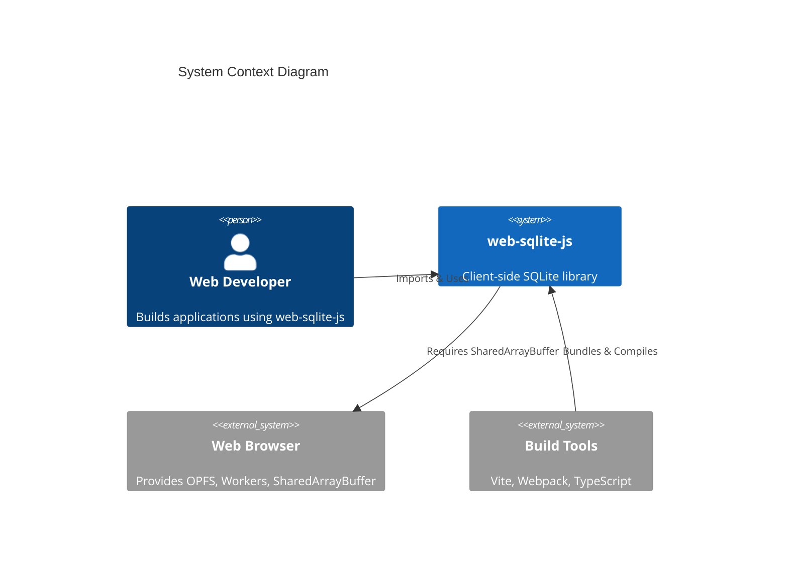
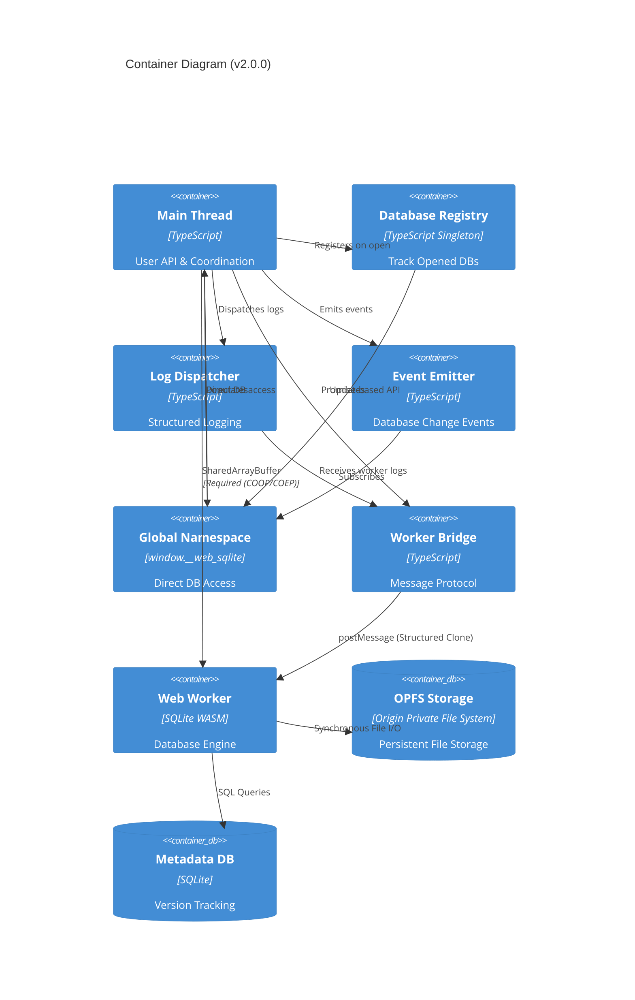
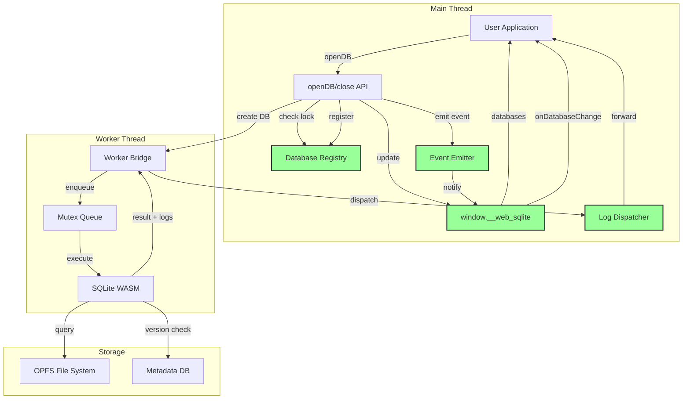
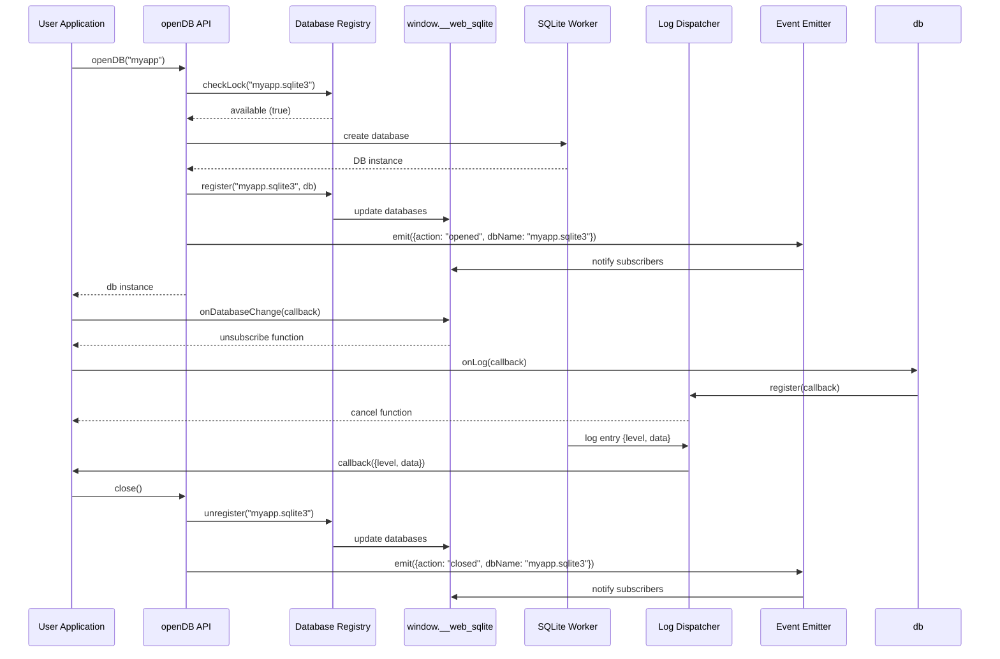

<!--
OUTPUT MAP
agent-docs/03-architecture/01-hld.md

TEMPLATE SOURCE
.claude/templates/agent-docs/03-architecture/01-hld.md
-->

# 01 High-Level Design (HLD) — Structure

## 1) Architecture Style & Principles

-   **Pattern**: Worker-Based Client-Side Architecture (Web Worker + OPFS)
-   **Key Principles**:
    -   **Non-blocking by default**: All database operations execute in a dedicated Web Worker, ensuring the main thread never blocks
    -   **Type safety first**: Full TypeScript API with strict type definitions for all operations
    -   **SharedArrayBuffer required**: Environment must be cross-origin isolated (COOP/COEP); library fails fast otherwise
    -   **Mutex-serialized operations**: Single-threaded SQLite access via mutex queue prevents race conditions
    -   **Versioned persistence**: OPFS-based storage with release management for schema evolution
    -   **Developer experience**: Simple async/await API abstracting worker communication complexity
    -   **Global accessibility** (v2.0.0): Direct database access via `window.__web_sqlite` namespace
    -   **Enhanced observability** (v2.0.0): Structured logging API and database change events

## 2) System Boundary (C4 Context)

-   **Users**: Frontend web developers building offline-first or data-intensive applications
-   **External Systems**: Web Browser APIs (OPFS, Web Workers, SharedArrayBuffer)



**Context Notes**:

-   **Browser Requirements**: Modern browsers (Chrome/Edge/Opera) with OPFS and SharedArrayBuffer support
-   **Deployment Constraints**: Requires COOP/COEP headers for SharedArrayBuffer availability
-   **Build Integration**: Library bundled via Vite, consumed by user applications via npm
-   **Global Access** (v2.0.0): `window.__web_sqlite` namespace provides direct database access from anywhere in the application

## 3) Containers & Tech Stack (C4 Container)

### 3.1 Core Containers

-   **Main Thread**: TypeScript/JavaScript (Reason: User API layer, async coordination, registry management)
-   **Worker Bridge**: TypeScript/JavaScript (Reason: Message passing abstraction, promise management, log forwarding)
-   **Web Worker**: SQLite WASM + JavaScript (Reason: Off-main-thread execution, SQLite engine)
-   **OPFS Storage**: Browser API (Reason: Persistent file-backed storage, survives browser restarts)
-   **Metadata Database**: SQLite (Reason: Version tracking, release history)

### 3.2 v2.0.0 New Components

-   **Database Registry**: TypeScript Singleton (Reason: Track opened database instances, prevent duplicate opens)
-   **Log Dispatcher**: TypeScript (Reason: Forward structured logs to registered callbacks)
-   **Event Emitter**: TypeScript (Reason: Dispatch database open/close events to subscribers)
-   **Global Namespace**: TypeScript (Reason: Initialize `window.__web_sqlite` for direct database access)



**Technology Rationale**:

-   **SQLite WASM**: Industry-standard SQL engine compiled to WebAssembly for near-native performance
-   **Web Worker**: Prevents main thread blocking, enabling responsive UI during database operations
-   **OPFS**: Provides true file-backed storage with synchronous access within worker context
-   **Mutex Queue**: Ensures sequential SQLite operations (SQLite is not thread-safe)
-   **TypeScript**: Full type safety for API contracts and query results
-   **Database Registry** (v2.0.0): Singleton pattern ensures single source of truth for opened databases
-   **Log Dispatcher** (v2.0.0): Observer pattern enables multiple independent log listeners
-   **Event Emitter** (v2.0.0): Pub-sub pattern for database lifecycle events
-   **Global Namespace** (v2.0.0): Browser window object provides cross-module database access

## 4) Data Architecture Strategy

-   **Ownership**:
    -   **Active Database**: Primary application data, owned by user application
    -   **Metadata Database**: Release versioning history, owned by library internals
    -   **Versioned Databases**: Isolated snapshots per release, owned by release manager
    -   **Database Registry** (v2.0.0): Track opened database instances, owned by library internals
-   **Caching**:
    -   **Worker State**: Active SQLite connections maintained in worker memory
    -   **No External Cache**: All data persisted directly to OPFS
    -   **Registry Cache** (v2.0.0): In-memory registry tracks opened databases (cleared on page unload)
-   **Consistency**:
    -   **Strong Consistency**: ACID transactions within single database operations
    -   **Sequential Execution**: Mutex queue ensures no concurrent writes to same database
    -   **Release Isolation**: Each version has isolated database file, preventing cross-version contamination
    -   **Registry Consistency** (v2.0.0): Database name lock prevents duplicate opens

**Data Flow Strategy**:

```
User Application (Main Thread)
    ↓ (async/await API calls)
Database Registry (Lock Check)
    ↓ (pass)
Worker Bridge (Message Protocol)
    ↓ (postMessage with structured clone)
Web Worker (SQLite WASM)
    ↓ (synchronous file operations)
OPFS Storage (Persistent File System)

↑ (Results with log data)
Log Dispatcher
    ↓ (structured logs)
Registered Callbacks (User Code)
```

## 5) Cross-cutting Concerns (Implementation View)

### 5.1 Authentication & Authorization

-   **AuthN**: Not applicable (client-side library, no server authentication)
-   **AuthZ**: Not applicable (browser same-origin policy provides isolation)
-   **Access Control**: OPFS restricts access to same-origin, prevents cross-origin data access

### 5.2 Observability (Enhanced in v2.0.0)

-   **Logs**:
    -   **Debug Mode** (v1.x): Optional SQL execution logging with timing (`debug: true` option)
    -   **Console.debug**: Structured log messages with `{ sql, duration, bind }` format
    -   **Worker Logs**: Console.debug output from worker for initialization and errors
    -   **Structured Logging API** (v2.0.0): `db.onLog(callback)` for programmatic log access
        -   **Log Levels**: `'info' | 'debug' | 'error'`
        -   **Log Entry Format**: `{ level: LogLevel, data: unknown }`
        -   **Multiple Listeners**: Observer pattern allows multiple concurrent callbacks
        -   **Cancel Function**: Each subscription returns unsubscribe function
        -   **Independent from Debug Mode**: Both can work simultaneously
-   **Metrics**:
    -   **Query Timing**: `performance.now()` measurements for each SQL execution
    -   **Changes Tracking**: `db.changes()` returns affected row count
    -   **Last Insert ID**: `last_insert_rowid()` for auto-increment tracking
-   **Events** (v2.0.0):
    -   **Database Change Events**: `window.__web_sqlite.onDatabaseChange(callback)`
    -   **Event Types**: `'opened' | 'closed'`
    -   **Event Data**: `{ action, dbName, databases[] }`
    -   **Subscription Management**: Returns cancel function for cleanup
-   **Global Registry** (v2.0.0):
    -   **Direct Access**: `window.__web_sqlite.databases[dbName]`
    -   **Read-Only**: Registry is externally read-only (internal updates only)
    -   **DevTools Integration**: Enables browser DevTools to inspect active databases
-   **Tracing**: Not implemented (client-side library, no distributed tracing)

### 5.3 Error Handling

-   **Global Strategy**:
    -   **Typed Errors**: Error objects with `name`, `message`, `stack` preserved across worker boundary
    -   **Promise Rejection**: All errors propagated as rejected promises to main thread
    -   **Transaction Rollback**: Automatic ROLLBACK on transaction errors
    -   **Release Validation**: Hash mismatch errors for release integrity violations
    -   **Database Lock Errors** (v2.0.0): Throws when opening already-opened database
-   **Error Types**:
    -   **Initialization Errors**: SharedArrayBuffer unavailable, invalid filename
    -   **SQL Execution Errors**: Syntax errors, constraint violations, table not found
    -   **Release Errors**: Hash mismatches, version conflicts, rollback failures
    -   **OPFS Errors**: File not found, quota exceeded, permission denied
    -   **Registry Errors** (v2.0.0): Database already open, invalid database name
-   **Stack Trace Preservation**: Worker errors reconstructed in main thread with original stack traces
-   **Callback Error Isolation** (v2.0.0): `onLog` callback errors don't break database operations

### 5.4 Concurrency Control

-   **Mutex Queue**: Serializes all database operations (prevents race conditions)
-   **Database Lock Registry** (v2.0.0): Prevents opening same database name twice
    -   **Lock Scope**: Per normalized database name (e.g., "myapp.sqlite3")
    -   **Lock Duration**: From `openDB()` until `close()`
    -   **Lock Release**: Automatic on `close()` or page unload
    -   **Multiple DBs Allowed**: Different database names can be opened simultaneously
-   **Worker Isolation**: All SQLite operations run in single worker thread

### 5.5 Global Namespace (v2.0.0)

-   **Namespace**: `window.__web_sqlite`
-   **Properties**:
    -   `databases`: `Record<string, DBInterface>` - Direct database instance access
    -   `onDatabaseChange(callback)`: Subscribe to open/close events
-   **Non-enumerable**: Namespace property doesn't appear in `Object.keys(window)`
-   **Initialization**: Created on library load (IIFE)
-   **Lifetime**: Cleared on page unload/refresh

## 6) Code Structure Strategy (High-Level File Tree)

**Repo Structure**: Monorepo (single package)

```text
/ (root)
  /src
    /jswasm               # Vendored SQLite WASM module
    /release              # Release versioning system
    /types                # TypeScript type definitions
    /utils                # Utilities (mutex, logger, validation)
    /registry             # [v2.0.0] Database registry singleton
    /logs                 # [v2.0.0] Log dispatcher
    /events               # [v2.0.0] Event emitter
    /global               # [v2.0.0] Global namespace initialization
    main.ts               # Public API entry point (openDB)
    worker-bridge.ts      # Worker communication layer
    worker.ts             # Worker entry point (SQLite operations)
  /tests
    /e2e                  # End-to-end browser tests
  /specs                  # Feature specifications
  /docs                   # Internal specs/ADRs (this folder)
  /vitepress-docs         # Public documentation site
```

**Unit Tests**: Co-located with source files (e.g., `src/utils/mutex/mutex.unit.test.ts`).

**Module Pattern**: Layered architecture with clear separation

```text
/src
  /release                # Domain: Release versioning logic
    /constants.ts         # SQL constants, version regex
    /types.ts             # Release domain types
    /opfs-utils.ts        # OPFS file operations (adapter)
    /hash-utils.ts        # Release validation (domain)
    /lock-utils.ts        # Metadata locking (domain)
    /version-utils.ts     # Version comparison (domain)
    /release-manager.ts   # Release orchestration (application)

  /registry               # [v2.0.0] Domain: Database instance tracking
    /database-registry.ts # Singleton registry (domain)

  /logs                   # [v2.0.0] Domain: Structured logging
    /log-dispatcher.ts    # Log dispatcher (application)

  /events                 # [v2.0.0] Domain: Event management
    /database-event-emitter.ts # Event emitter (application)

  /global                 # [v2.0.0] Infrastructure: Global namespace
    /initialize-namespace.ts   # Initialize window.__web_sqlite (infrastructure)

  /types                  # Interface: Public API contracts
    /DB.ts                # DBInterface, ReleaseConfig, types
    /message.ts           # Worker protocol types

  /utils                  # Infrastructure: Cross-cutting utilities
    /mutex                # Concurrency control
    /logger.ts            # Debug logging

  /validations            # Input validation

  main.ts                 # Interface: Public API
  worker-bridge.ts        # Infrastructure: Worker protocol
  worker.ts               # Infrastructure: Worker implementation
```

**Architectural Layers**:

1. **Interface Layer** (`main.ts`, `types/`): Public API surface, type definitions
2. **Application Layer** (`release/`, `registry/`, `logs/`, `events/`): Business logic for release management, logging, events
3. **Infrastructure Layer** (`worker-bridge.ts`, `worker.ts`, `utils/`, `global/`): Worker communication, OPFS integration, utilities, global namespace

**Key Design Decisions**:

-   **Vendored WASM**: SQLite WASM module bundled in source (`jswasm/`), not external dependency
-   **Worker Protocol**: Message-based communication with request/response pattern via ID mapping
-   **Mutex Queue**: All database operations serialized through single mutex to prevent race conditions
-   **Release Isolation**: Each database version stored in separate OPFS directory for rollback capability
-   **Metadata Separation**: `release.sqlite3` metadata database separate from user data for version tracking
-   **Database Registry** (v2.0.0): Singleton pattern ensures single source of truth for opened databases
-   **Log Dispatcher** (v2.0.0): Observer pattern enables multiple independent log listeners per database
-   **Event Emitter** (v2.0.0): Pub-sub pattern for database lifecycle events across all databases
-   **Global Namespace** (v2.0.0): IIFE initialization on library load creates `window.__web_sqlite`

## 7) Component Diagram (v2.0.0 Architecture)



## 8) v2.0.0 Feature Interaction Sequence



---

## Navigation

**Previous**: [Stage 2: Spike Plan](../02-feasibility/03-spike-plan.md) - Future enhancement investigations

**Next in Series**: [02 Data Flow](./02-dataflow.md) - Data flow and sequence diagrams

**Related Architecture Documents**:

-   [03 Deployment](./03-deployment.md) - Deployment and infrastructure
-   [Back to Spec Index](../00-control/00-spec.md)

**Related Feasibility Documents**:

-   [01 Options Analysis](../02-feasibility/01-options.md) - Selected architecture option

**Related Feature Documents**:

-   [F-001: v2.0.0 Enhanced Logging](../01-discovery/features/F-001-v2-logging-direct-access.md) - Feature specification

**Continue to**: [Stage 4: ADR Index](../04-adr/) - Architecture decision records
