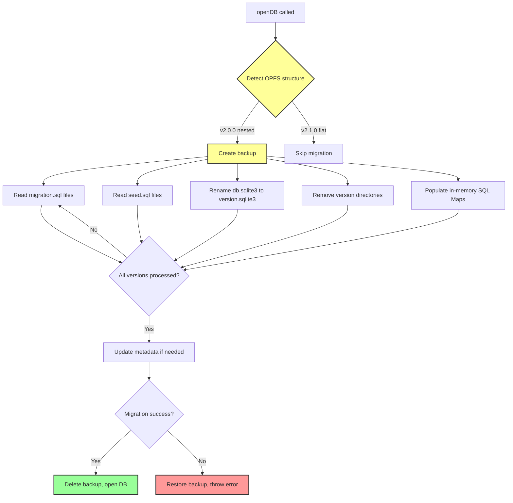

<!--
OUTPUT MAP
agent-docs/04-adr/0008-auto-migration-strategy.md

TEMPLATE SOURCE
.claude/templates/agent-docs/04-adr/0000-template.md
-->

# ADR-0008: Auto-Migration Strategy for v2.1.0

## Status

Proposed

## Context

- **What is the issue?**
  - v2.1.0 introduces a breaking change to OPFS structure (flat vs nested)
  - Existing v2.0.0 users have databases with nested version directories
  - Manual migration would be error-prone and user-unfriendly
  - Need to preserve all existing data and release configurations

- **What are the constraints?**
  - Migration must happen transparently without user intervention
  - Must preserve all database content, metadata, and hash validations
  - Must be atomic (all-or-nothing) with rollback on failure
  - Must complete in reasonable time (< 500ms for typical databases)
  - Must detect both v2.0.0 and v2.1.0 structures correctly
  - Cannot break existing v2.1.0 databases (idempotent)

- **Why do we need to decide now?**
  - v2.1.0 feature F-002 requires flat OPFS structure
  - Auto-migration is critical for user experience
  - Affects implementation of release manager and OPFS utilities
  - Must be designed before implementation begins

## Decision

We will implement **automatic migration from v2.0.0 to v2.1.0 structure** on first `openDB()` call.

**Migration Architecture**: Detect, backup, convert, validate



**Key Implementation Details**:

- **Structure Detection**: Check for nested version directories (`0.0.1/`, `0.0.2/`) vs flat files (`0.0.1.sqlite3`)
- **Backup Creation**: Full OPFS directory backup before migration
- **SQL Preservation**: Read `migration.sql` and `seed.sql` before deletion, store in `Map<string, string>`
- **File Renaming**: Rename `db.sqlite3` to `{version}.sqlite3` format
- **Dev Version Detection**: Identify dev versions from metadata `mode = "dev"` field
- **Atomic Rollback**: On any error, restore from backup before propagating error
- **Idempotent**: Safe to run on already-migrated databases (no-op)

## Alternatives Considered

### Option 1: Manual Migration Guide (Rejected)

Provide documentation for users to manually migrate their databases.

- **Pros**:
  - No implementation complexity
  - Full control for users
  - No risk of automatic data loss

- **Cons**:
  - **Poor UX**: Users must manually export/import data
  - **Error-Prone**: Manual steps likely to fail
  - **Support Burden**: Many users will need help
  - **Adoption Barrier**: Some users won't upgrade
  - **Breaking Change**: Requires code changes for all users

**Evidence**: User feedback on v1.0.0 → v2.0.0 indicated preference for automatic upgrades.

### Option 2: Dual Support for Both Structures (Rejected)

Maintain support for both v2.0.0 and v2.1.0 structures indefinitely.

- **Pros**:
  - No migration required
  - Backward compatible
  - Users can choose structure

- **Cons**:
  - **2x Implementation**: Must maintain both code paths
  - **Testing Complexity**: Must test both structures
  - **Maintenance Burden**: Bug fixes apply to both paths
  - **Confusing UX**: Different users have different structures
  - **Documentation Complexity**: Must explain both structures

**Evidence**: Feasibility analysis (Option C) estimated 10-12 weeks for hybrid vs 6-8 weeks for migration-only approach.

### Option 3: Force Fresh Start (Rejected)

Require users to start with fresh databases for v2.1.0.

- **Pros**:
  - Simplest implementation
  - No migration complexity
  - Clean v2.1.0-only codebase

- **Cons**:
  - **Data Loss**: Users lose all existing data
  - **Unacceptable**: Production users cannot upgrade
  - **Reputation Damage**: Breaking existing databases
  - **Out of Scope**: Requirements specify data preservation

**Evidence**: Requirements R1-R3 specify data persistence and backward compatibility.

## Consequences

### Positive

- **User Experience**: Transparent upgrade with no manual intervention
  - Migration happens automatically on first database open
  - No data loss or manual steps required
  - Clear progress logging in debug mode

- **Data Safety**: Atomic migration with rollback
  - Backup created before any changes
  - SQL files read before deletion
  - Automatic restore on any failure
  - Hash validation preserved

- **Simplicity**: Single code path after migration
  - All databases use v2.1.0 structure
  - No dual maintenance burden
  - Cleaner implementation

- **Future-Proof**: Foundation for future migrations
  - Migration infrastructure reusable for v2.2.0+
  - Pattern established for structure changes

### Negative

- **Implementation Complexity**: Significant migration logic required
  - Structure detection algorithm
  - Backup/restore mechanism
  - Atomic transaction handling
  - Comprehensive testing required
  - **Mitigation**: Isolated migration module, extensive tests

- **Migration Time**: Delay on first open after upgrade
  - Target: < 500ms for typical databases
  - Large databases may take longer
  - **Mitigation**: Debug logging, progress indication, one-time cost

- **Error Scenarios**: Many edge cases to handle
  - Browser crash during migration
  - OPFS quota exceeded
  - Malformed v2.0.0 structure
  - Missing SQL files
  - **Mitigation**: Comprehensive error handling, rollback, clear messages

### Risks

- **Migration Failure**: Database corruption or data loss
  - **Probability**: Low (backup + rollback)
  - **Impact**: Critical (users cannot access data)
  - **Mitigation**: Atomic operations, comprehensive testing, backup restoration

- **Hash Validation Break**: In-memory SQL produces different hashes
  - **Probability**: Low (SQL content unchanged)
  - **Impact**: High (databases fail to open)
  - **Mitigation**: Preserve stored hashes, test migration with validation

- **Performance Regression**: Map lookup slower than file lookup
  - **Probability**: Low (Map is O(1), similar to cached file handles)
  - **Impact**: Low (only affects release operations)
  - **Mitigation**: Benchmark before release, optimize if needed

## Implementation Evidence

**Planned Files**:

- `src/migration/migration-detector.ts`: Detect v2.0.0 vs v2.1.0 structure
- `src/migration/auto-migrator.ts`: Convert v2.0.0 to v2.1.0 structure
- `tests/e2e/auto-migration.e2e.test.ts`: E2E tests for migration scenarios

**Detection Algorithm**:

```typescript
async function detectStructure(baseDir: FileSystemDirectoryHandle): Promise<{
  version: "2.0.0" | "2.1.0";
  hasNestedDirs: boolean;
}> {
  for await (const entry of baseDir.values()) {
    if (entry.kind === "directory" && entry.name.match(/^\d+\.\d+\.\d+$/)) {
      return { version: "2.0.0", hasNestedDirs: true };
    }
  }
  return { version: "2.1.0", hasNestedDirs: false };
}
```

**Migration Steps**:

1. Create backup of entire OPFS directory
2. For each version directory:
   - Read `migration.sql` if exists → `migrationSQLMap.set(version, content)`
   - Read `seed.sql` if exists → `seedSQLMap.set(version, content)`
   - Rename `db.sqlite3` → `{version}.sqlite3`
   - Remove `migration.sql` and `seed.sql` files
   - Remove version directory
3. Update metadata if needed
4. Delete backup
5. On any error: restore backup, throw `MigrationError`

**Success Criteria**:

- All v2.0.0 databases migrate successfully
- Hash validation passes after migration
- Migration completes in < 500ms for typical databases
- Rollback works on migration failure
- Already-migrated databases not affected

## Related Decisions

- **ADR-0002**: OPFS for Persistent Storage (flat file structure)
- **ADR-0004**: Release Versioning System (version isolation and metadata)
- **Feature F-002**: v2.1.0 Flat OPFS Structure (feature specification)

---

## Navigation

**Previous ADR**: [ADR-0007: Error Handling Strategy](./0007-error-handling-strategy.md) - Error management

**All ADRs**:

- [ADR-0001: Web Worker](./0001-web-worker-architecture.md)
- [ADR-0002: OPFS Storage](./0002-opfs-persistent-storage.md)
- [ADR-0003: Mutex Queue](./0003-mutex-queue-concurrency.md)
- [ADR-0004: Release Versioning](./0004-release-versioning-system.md)
- [ADR-0005: COOP/COEP](./0005-coop-coep-requirement.md)
- [ADR-0006: TypeScript Types](./0006-typescript-type-system.md)
- [ADR-0007: Error Handling](./0007-error-handling-strategy.md)
- [ADR-0008: Auto-Migration](./0008-auto-migration-strategy.md)

**Related Documents**:

- [Back to Spec Index](../00-control/00-spec.md)
- [Feature F-002](../01-discovery/features/F-002-v2.1.0-flat-opfs-structure.md) - Feature specification
