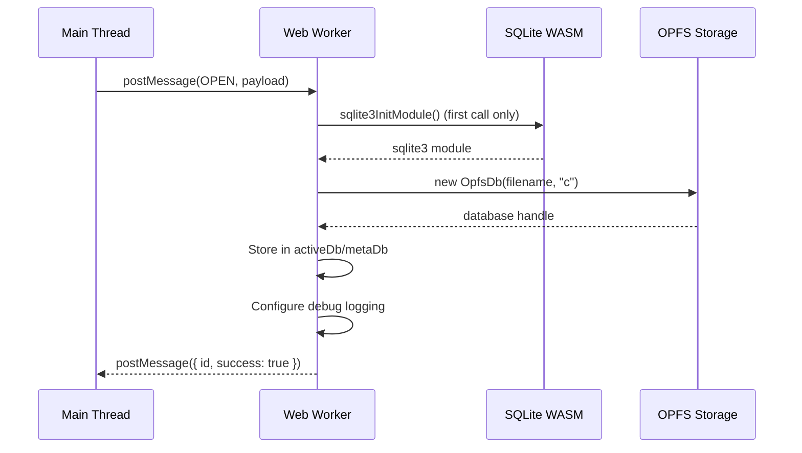
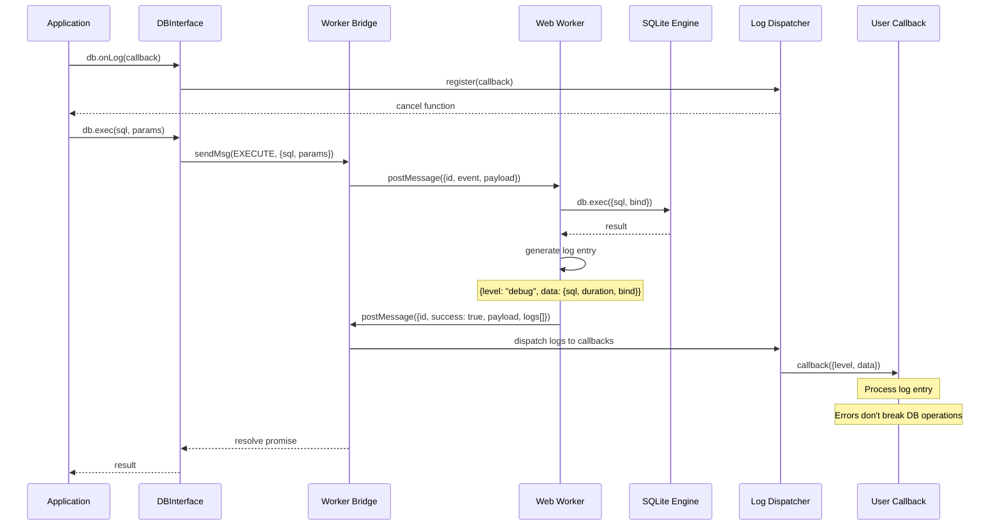
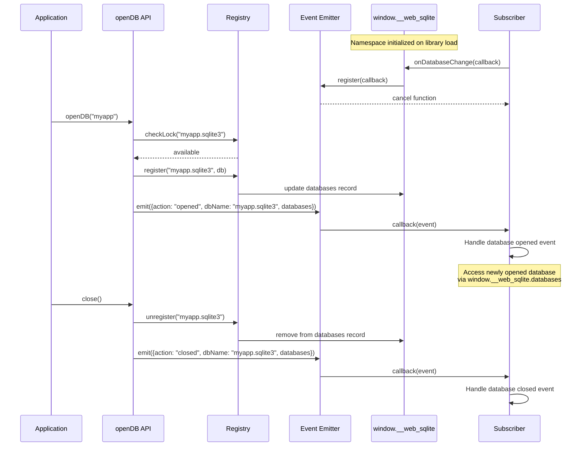
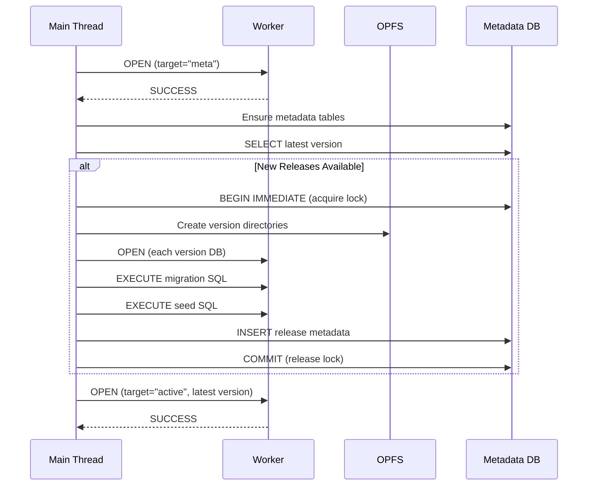
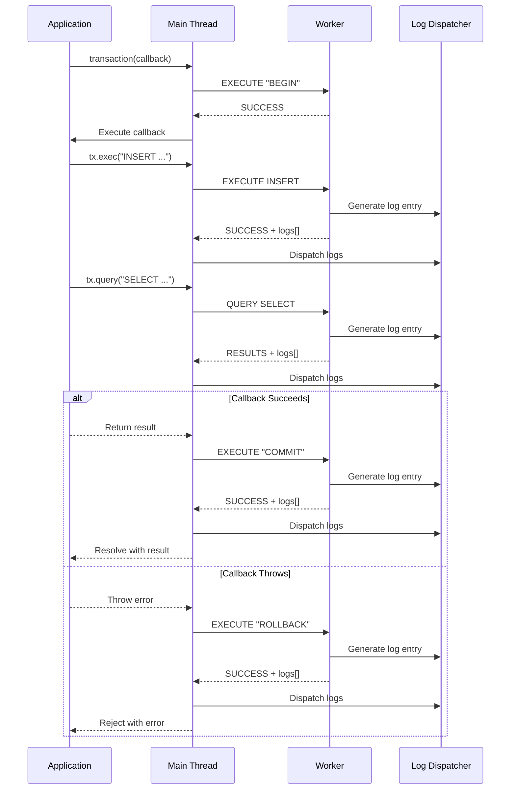
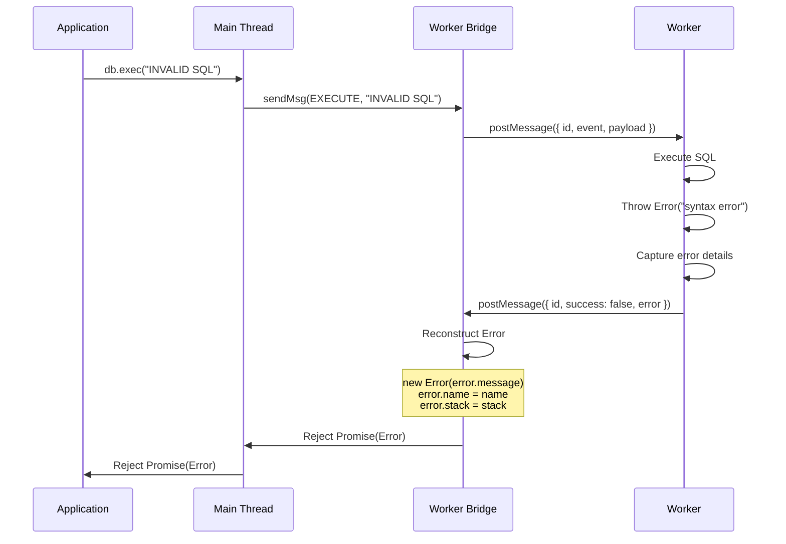
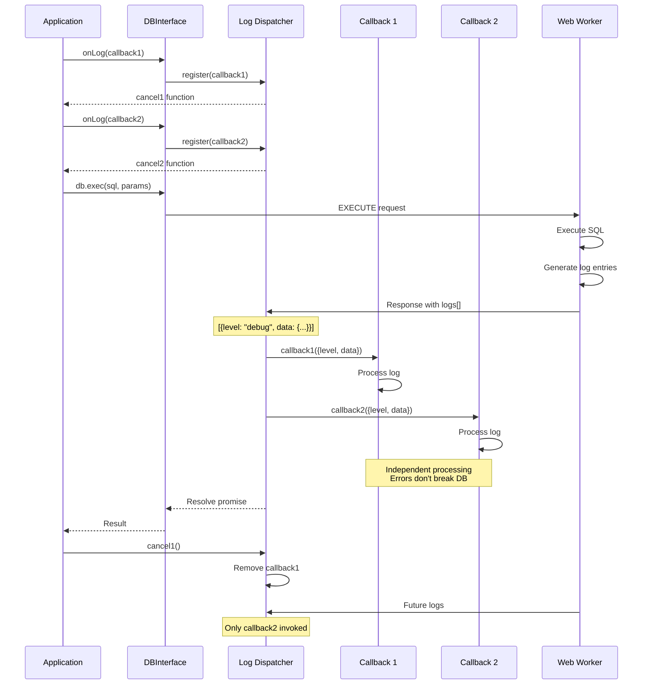
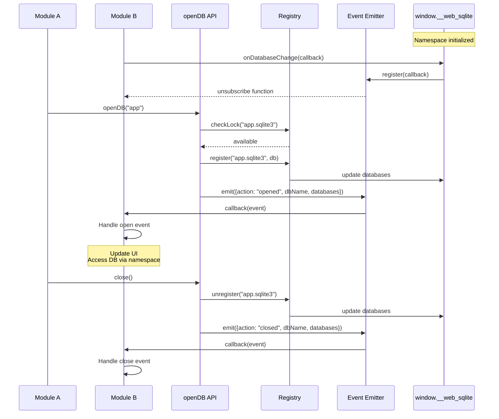

# 02 Event Catalog

> **Note**: This document describes the **internal worker message protocol** used between the main thread and Web Worker. This is an implementation detail. For the public API that users call, see [01 API Contracts](./01-api.md).

## Message Protocol

All worker messages follow this structure:

**Request Message**:

```typescript
type SqliteReqMsg<T> = {
  id: number; // Unique message ID for correlation
  event: string; // Event type: "open", "execute", "query", "close"
  payload?: T; // Optional event-specific payload
};
```

**Success Response**:

```typescript
type SqliteResMsg<T> = {
  id: number; // Same ID as request
  success: true; // Indicates success
  payload: T; // Response payload (event-specific)
  logs?: LogEntry[]; // v2.0.0: Structured logs from worker
};
```

**Error Response**:

```typescript
type SqliteResMsg<void> = {
  id: number;           // Same ID as request
  success: false;       // Indicates failure
  error: {
    name: string;       // Error class name
    message: string;    // Error message
    stack: string;      // Stack trace
  };
};
```

---

## 1) Worker Message Events

### Event: OPEN

**Description**: Initialize and open a database connection in the worker context. Used internally for both user databases and metadata tracking.

**Direction**: Main Thread → Worker

**Usage Note**: This is an internal event. Users call `openDB(filename, options)` which generates these worker messages automatically.

**Payload Schema**:

```typescript
type OpenDBArgs = {
  filename: string; // Full database file path in OPFS (e.g., "myapp.sqlite3/release.sqlite3")
  options?: {
    debug?: boolean; // Enable SQL execution logging
  };
  target?: "active" | "meta"; // "active" = user data, "meta" = release metadata
  replace?: boolean; // Close existing connection before opening (internal use)
};
```

**Internal Usage**:

- `target: "meta"` - Opens the release metadata database (tracks versions)
- `target: "active"` - Opens the user's actual database
- `filename` - Full OPFS path constructed by `openReleaseDB()`, not user input
- `replace` - Used internally when switching between versions

**Response Schema**:

```typescript
// Success: no payload (void)
type OpenDBResponse = undefined;

// Error: error object
type ErrorResponse = {
  error: {
    name: string;
    message: string;
    stack: string;
  };
};
```

**Error Conditions**:

- SQLite WASM module initialization failure
- OPFS file access errors
- Invalid filename format

**State Changes**:

- Initializes SQLite WASM module on first call
- Creates new `sqlite3.oo1.OpfsDb` instance
- Stores reference in `activeDb` or `metaDb` global variable
- Configures debug logging if `options.debug === true`

**Example**:

```typescript
// Internal: Opening metadata database
{
  id: 1,
  event: "open",
  payload: {
    filename: "myapp.sqlite3/release.sqlite3",
    target: "meta"
  }
}

// Internal: Opening user's active database
{
  id: 2,
  event: "open",
  payload: {
    filename: "myapp.sqlite3/1.0.0/db.sqlite3",
    options: { debug: true },
    target: "active"
  }
}

// Response (success)
{
  id: 2,
  success: true
}

// Response (error)
{
  id: 2,
  success: false,
  error: {
    name: "Error",
    message: "Database is not open",
    stack: "..."
  }
}
```

**Public API to Internal Messages**:

```typescript
// User calls:
const db = await openDB("myapp", { debug: true });

// Which generates internal worker messages:
// 1. OPEN { filename: "myapp.sqlite3/release.sqlite3", target: "meta" }
// 2. OPEN { filename: "myapp.sqlite3/1.0.0/db.sqlite3", target: "active", options: { debug: true } }
```

**Flow Diagram**:



---

### Event: EXECUTE

**Description**: Execute SQL statements without returning rows. Used for DDL (CREATE, DROP, ALTER) and DML (INSERT, UPDATE, DELETE) operations.

**Direction**: Main Thread → Worker

**Payload Schema**:

```typescript
type ExecutePayload = {
  sql: string; // SQL string to execute
  bind?: SQLParams; // Bind parameters (positional or named)
  target?: "active" | "meta"; // Database target (default: "active")
};
```

**Response Schema**:

```typescript
type ExecuteResult = {
  changes: number | bigint; // Number of rows changed
  lastInsertRowid: number | bigint; // Last inserted row ID
};
```

**Error Conditions**:

- SQL syntax errors
- Constraint violations (UNIQUE, NOT NULL, FOREIGN KEY)
- Table or column not found
- Database not open

**State Changes**:

- Executes SQL in specified database (active or meta)
- Modifies database state
- Updates internal `changes` and `lastInsertRowid` counters

**Performance**:

- Typical execution time: 0.2-0.5ms for simple operations
- Timing logged if debug mode enabled

**v2.0.0 Structured Logging**:

Worker responses now include structured logs:

```typescript
{
  id: 2,
  success: true,
  payload: {
    changes: 1,
    lastInsertRowid: 1
  },
  logs: [
    { level: "debug", data: { sql: "INSERT INTO users...", duration: 0.35, bind: ["Alice"] } }
  ]
}
```

**Example**:

```typescript
// Request (positional parameters)
{
  id: 2,
  event: "execute",
  payload: {
    sql: "INSERT INTO users (name, email) VALUES (?, ?)",
    bind: ["Alice", "alice@example.com"],
    target: "active"
  }
}

// Response (success)
{
  id: 2,
  success: true,
  payload: {
    changes: 1,
    lastInsertRowid: 1
  },
  logs: [
    { level: "debug", data: { sql: "...", duration: 0.35, bind: ["Alice", "alice@example.com"] } }
  ]
}

// Response (error)
{
  id: 2,
  success: false,
  error: {
    name: "Error",
    message: "SQLITE_CONSTRAINT: UNIQUE constraint failed: users.email",
    stack: "..."
  }
}
```

**Debug Logging**:

```typescript
// When debug mode is enabled
console.debug({
  sql: "INSERT INTO users (name, email) VALUES (?, ?)",
  duration: 0.35,
  bind: ["Alice", "alice@example.com"],
});
```

---

### Event: QUERY

**Description**: Execute a SELECT query and return all result rows as an array of objects.

**Direction**: Main Thread → Worker

**Payload Schema**:

```typescript
type QueryPayload = {
  sql: string; // SELECT SQL to execute
  bind?: SQLParams; // Bind parameters (positional or named)
  target?: "active" | "meta"; // Database target (default: "active")
};
```

**Response Schema**:

```typescript
type QueryResult<T = unknown> = T[]; // Array of row objects
```

**Error Conditions**:

- SQL syntax errors
- Table or column not found
- Invalid bind parameters
- Database not open

**State Changes**:

- No state changes (read-only operation)

**Performance**:

- Typical execution time: 0.2-0.5ms for simple queries
- Timing logged if debug mode enabled
- Full result set transferred via structured clone

**v2.0.0 Structured Logging**:

Worker responses now include structured logs:

```typescript
{
  id: 4,
  success: true,
  payload: [
    { id: 1, name: "Alice", email: "alice@example.com" }
  ],
  logs: [
    { level: "debug", data: { sql: "SELECT * FROM users", duration: 0.28, bind: [] } }
  ]
}
```

**Example**:

```typescript
// Request
{
  id: 4,
  event: "query",
  payload: {
    sql: "SELECT id, name, email FROM users WHERE age > ?",
    bind: [18],
    target: "active"
  }
}

// Response (success)
{
  id: 4,
  success: true,
  payload: [
    { id: 1, name: "Alice", email: "alice@example.com" },
    { id: 2, name: "Bob", email: "bob@example.com" }
  ],
  logs: [
    { level: "debug", data: { sql: "...", duration: 0.28, bind: [18] } }
  ]
}

// Response (empty result)
{
  id: 4,
  success: true,
  payload: [],
  logs: []
}

// Response (error)
{
  id: 4,
  success: false,
  error: {
    name: "Error",
    message: "no such table: users",
    stack: "..."
  }
}
```

**Debug Logging**:

```typescript
// When debug mode is enabled
console.debug({
  sql: "SELECT id, name FROM users",
  duration: 0.28,
  bind: [],
});
```

---

### Event: CLOSE

**Description**: Close database connections and cleanup worker resources.

**Direction**: Main Thread → Worker

**Payload Schema**:

```typescript
type ClosePayload = undefined; // No payload
```

**Response Schema**:

```typescript
// Success: no payload (void)
type CloseResponse = undefined;
```

**Error Conditions**:

- None (idempotent operation)

**State Changes**:

- Closes `activeDb` connection if open
- Closes `metaDb` connection if open
- Clears `sqlite3` module reference
- Worker becomes unusable for subsequent operations

**Example**:

```typescript
// Request
{
  id: 5,
  event: "close"
}

// Response (success)
{
  id: 5,
  success: true
}
```

---

## 2) Internal Application Events

### Event: Release Lock Acquisition

**Description**: Acquire metadata lock before release/rollback operations to prevent concurrent modifications.

**Triggered By**:

- `openDB()` when applying new releases
- `devTool.release()` when creating dev version
- `devTool.rollback()` when rolling back version

**Payload**: Not applicable (database transaction)

**Behavior**:

```typescript
// Execute in metadata database
await metaExec("BEGIN IMMEDIATE");
await metaExec(
  "INSERT OR REPLACE INTO release_lock (id, lockedAt) VALUES (1, ?)",
  [new Date().toISOString()],
);
```

**Error Conditions**:

- Lock already held by another operation ("Release operation already in progress")

**State Changes**:

- Metadata database locked for write
- `release_lock` table updated with timestamp

---

### Event: Release Lock Release

**Description**: Release metadata lock after release/rollback operations complete (success or failure).

**Triggered By**:

- Completion of release application
- Completion of rollback operation
- Error during release/rollback (automatic rollback)

**Payload**: Not applicable (database transaction)

**Behavior**:

```typescript
// On success
await metaExec("COMMIT");

// On error
await metaExec("ROLLBACK");
```

**State Changes**:

- Metadata database lock released
- Transaction committed or rolled back

---

### Event: Version Application

**Description**: Apply a new release or dev version by copying database and executing migration SQL.

**Triggered By**:

- `openDB()` detecting new release versions
- `devTool.release()` creating dev version

**Payload**:

```typescript
type VersionApplication = {
  config: ReleaseConfigWithHash;
  mode: "release" | "dev";
};
```

**Behavior**:

1. Create version directory in OPFS
2. Copy latest database to new version
3. Write migration.sql and seed.sql files
4. Open new database in worker
5. Execute BEGIN transaction
6. Execute migration SQL
7. Execute seed SQL (if provided)
8. Execute COMMIT
9. Insert metadata row

**Error Handling**:

- On SQL error: ROLLBACK, remove version directory, rethrow error
- On copy error: Cleanup partial files, rethrow error

**State Changes**:

- New version directory created in OPFS
- Metadata database updated with version record
- Active database switched to new version

---

### Event: Rollback Execution

**Description**: Remove dev versions above target version and switch active database.

**Triggered By**:

- `devTool.rollback(version)` call

**Payload**:

```typescript
type RollbackExecution = {
  targetVersion: string;
};
```

**Behavior**:

1. Query all versions from metadata
2. Validate target version exists
3. Validate target version >= latest release
4. Identify dev versions to remove
5. For each dev version:
   - Remove version directory from OPFS
   - Delete metadata row
6. Switch active database to target version

**Error Conditions**:

- Target version not found
- Rollback below latest release version

**State Changes**:

- Dev version directories removed from OPFS
- Dev version metadata rows deleted
- Active database switched to target version

---

## 3) Debug Events

### Event: SQL Execution Logging

**Description**: Log SQL execution details when debug mode is enabled.

**Triggered By**:

- Every EXECUTE or QUERY operation when `options.debug === true`

**Payload Schema**:

```typescript
type SqlLogInfo = {
  sql: string; // Executed SQL
  duration: number; // Execution time in milliseconds
  bind?: SQLParams; // Bind parameters used
};
```

**Output Method**:

- `console.debug()` in worker context
- Visible in browser DevTools console

**Example Output**:

```javascript
{sql: "SELECT * FROM users WHERE id = ?", duration: 0.28, bind: [1]}
{sql: "INSERT INTO users (name) VALUES (?)", duration: 0.35, bind: ["Alice"]}
{sql: "CREATE TABLE posts (id INTEGER PRIMARY KEY)", duration: 1.2, bind: undefined}
```

**Usage**:

```typescript
const db = await openDB("myapp", {
  debug: true, // Enable logging
});
```

---

## 4) Error Events

### Event: Worker Error

**Description**: Error occurred during worker operation execution.

**Triggered By**:

- SQL execution errors
- Database not open
- Invalid payload
- Any unexpected worker exception

**Payload Schema**:

```typescript
type WorkerError = {
  name: string; // Error class name (e.g., "Error", "TypeError")
  message: string; // Error message
  stack: string; // Stack trace
};
```

**Response Schema**:

```typescript
// Error response (success: false)
type ErrorResponse = {
  id: number;
  success: false;
  error: {
    name: string;
    message: string;
    stack: string;
  };
};
```

**Error Reconstruction**:

```typescript
// In worker bridge
worker.onmessage = (event) => {
  const { id, success, error } = event.data;

  if (!success) {
    const newError = new Error(error.message);
    newError.name = error.name;
    newError.stack = error.stack;
    task.reject(newError);
  }
};
```

**Example**:

```typescript
// Request (invalid SQL)
{
  id: 6,
  event: "query",
  payload: {
    sql: "SELCT * FROM users", // Typo: SELCT
    target: "active"
  }
}

// Response (error)
{
  id: 6,
  success: false,
  error: {
    name: "Error",
    message: "near \"SELCT\": syntax error",
    stack: "Error: near \"SELCT\": syntax error\n    at worker.ts:123:15\n    ..."
  }
}
```

---

### Event: Worker Termination

**Description**: Worker terminated abnormally or explicitly.

**Triggered By**:

- Worker crash
- Explicit `worker.terminate()` call
- Browser tab close
- Out of memory error

**Behavior**:

- All pending promises rejected with "Worker terminated" error
- Message ID map cleared
- Worker becomes unusable

**Example**:

```typescript
// In worker bridge
const terminate = () => {
  worker.terminate();
  idMapPromise.forEach((task) => {
    task.reject(new Error("Worker terminated"));
  });
  idMapPromise.clear();
};
```

---

## 5) v2.0.0 Structured Logging Events

### Event: Log Entry Generation (Worker → Main Thread)

**Description**: Worker generates structured log entries for SQL operations and forwards them to main thread for dispatch to registered callbacks.

**Triggered By**:

- SQL execution (EXECUTE, QUERY operations)
- Transaction operations (BEGIN, COMMIT, ROLLBACK)
- Application events (open, close)

**Payload Schema**:

```typescript
type LogEntry = {
  level: "info" | "debug" | "error";
  data: unknown;
};
```

**Log Sources**:

- **SQL Execution**: `{level: "debug", data: {sql, duration, bind}}`
- **Transaction Events**: `{level: "info", data: {action: "commit|rollback", sql}}`
- **Application Events**: `{level: "info", data: {action: "open|close", dbName}}`
- **Errors**: `{level: "error", data: {error, sql}}`

**Flow Diagram**:



**Response Format**:

```typescript
// Worker response includes logs array
{
  id: 2,
  success: true,
  payload: {
    changes: 1,
    lastInsertRowid: 1
  },
  logs: [
    { level: "debug", data: { sql: "INSERT INTO users...", duration: 0.35, bind: ["Alice"] } }
  ]
}
```

**Log Dispatch Behavior**:

- Logs are dispatched to all registered callbacks in order
- Callback errors are caught and don't break database operations
- Multiple callbacks can be registered per database
- Each callback gets its own cancel function

**Example**:

```typescript
// Register log listener
const cancel1 = db.onLog((log) => {
  console.log(`[${log.level}]`, log.data);
});

// Register another listener
const cancel2 = db.onLog((log) => {
  if (log.level === "error") {
    sendToErrorTracking(log.data);
  }
});

// Both callbacks receive the same log entries
```

---

## 6) v2.0.0 Database Change Events

### Event: Database Lifecycle Changes

**Description**: Emitted when a database is opened or closed. Subscribers can listen to these events via the global namespace.

**Triggered By**:

- `openDB()` successful completion (action: "opened")
- `close()` successful completion (action: "closed")

**Payload Schema**:

```typescript
type DatabaseChangeEvent = {
  action: "opened" | "closed";
  dbName: string; // Normalized database name (e.g., "myapp.sqlite3")
  databases: string[]; // All currently opened database names
};
```

**Subscription API**:

```typescript
// Subscribe via global namespace
const unsubscribe = window.__web_sqlite.onDatabaseChange((event) => {
  console.log(`Database ${event.action}: ${event.dbName}`);
  console.log("Current databases:", event.databases);
});
```

**Flow Diagram**:



**Event Properties**:

- `action`: What happened ("opened" or "closed")
- `dbName`: Which database changed (normalized name with .sqlite3 suffix)
- `databases`: Array of all currently opened database names

**Example**:

```typescript
// Subscribe to database changes
const unsubscribe = window.__web_sqlite.onDatabaseChange((event) => {
  if (event.action === "opened") {
    console.log(`✅ Database opened: ${event.dbName}`);
    // Access the newly opened database directly
    const db = window.__web_sqlite.databases[event.dbName];
    console.log("Database instance:", db);
  } else {
    console.log(`❌ Database closed: ${event.dbName}`);
  }
  console.log("Current databases:", event.databases);
});

// Open a database
await openDB("app");
// Output: ✅ Database opened: app.sqlite3
// Output: Current databases: ["app.sqlite3"]

// Open another database
await openDB("users");
// Output: ✅ Database opened: users.sqlite3
// Output: Current databases: ["app.sqlite3", "users.sqlite3"]

// Close first database
await window.__web_sqlite.databases["app.sqlite3"].close();
// Output: ❌ Database closed: app.sqlite3
// Output: Current databases: ["users.sqlite3"]

// Unsubscribe
unsubscribe();
```

**Use Cases**:

- **DevTools Integration**: Show active databases in browser DevTools
- **UI Synchronization**: Update database list UI when databases open/close
- **Monitoring**: Track database lifecycle for debugging
- **Cross-Module Communication**: React to database changes without imports

---

## 7) Event Flow Examples

### Flow: Database Initialization with Release



---

### Flow: Transaction Execution



---

### Flow: Error Propagation



---

### Flow: Structured Log Dispatch (v2.0.0)



---

### Flow: Database Change Events (v2.0.0)



---

## 8) Event Timing Characteristics

### Message Latency Breakdown

| Operation                   | Latency        | Notes                     |
| --------------------------- | -------------- | ------------------------- |
| postMessage (Main → Worker) | ~0.02ms        | Structured clone overhead |
| Worker processing           | 0.2-0.5ms      | SQLite execution time     |
| postMessage (Worker → Main) | ~0.02ms        | Structured clone overhead |
| Promise resolution          | ~0.01ms        | Map lookup and cleanup    |
| **Total Round-trip**        | **~0.3-0.6ms** | End-to-end latency        |

### High-Volume Events

- **Query Execution**: 1000+ queries/second (measured)
- **Transaction Throughput**: 1000+ transactions/second
- **Concurrent Operations**: 100+ via mutex queue

### Low-Volume Events

- **Database Open**: 10-100ms (includes WASM initialization, migrations)
- **Release Application**: 50-100ms per version
- **Rollback**: 10-50ms (directory removal + metadata cleanup)

### v2.0.0 Event Performance

- **Log Callback Dispatch**: <0.01ms per callback per log entry
- **Database Change Event Dispatch**: <0.001ms per subscriber
- **Registry Lookup**: <0.001ms per database check
- **Global DB Access**: 0ms (direct reference, no overhead)

---

## 9) Event Correlation

### Message ID Generation

```typescript
const getLatestMsgId = (() => {
  let latestId = 0;
  return () => ++latestId;
})();
```

- Each request gets unique incremental ID
- IDs are 64-bit integers (in practice, much smaller)
- IDs wrap safely due to JavaScript number precision

### Promise Storage

```typescript
const idMapPromise: Map<number, Task<unknown>> = new Map();

type Task<T> = {
  resolve: (value: T) => void;
  reject: (reason?: unknown) => void;
};
```

- Promises stored in Map keyed by message ID
- Removed after response received or worker terminated
- Prevents memory leaks from unresolved promises

### Timeout Protection

- No explicit timeout implementation
- Worker termination rejects all pending promises
- Future enhancement: Add timeout option to API

---

## 10) Event Serialization

### Structured Clone Algorithm

All message payloads are serialized using the structured clone algorithm:

**Supported Types**:

- Primitives: `undefined`, `null`, `boolean`, `number`, `string`
- Objects: Plain objects, arrays
- Binary: `ArrayBuffer`, `Uint8Array`
- Dates: `Date` objects
- Errors: Error objects (custom serialization)

**Not Supported**:

- Functions
- Classes
- DOM nodes
- Map/Set (must be converted to arrays)

### Error Serialization

```typescript
// Worker serializes error
const serialized = {
  name: errorObj.name,
  message: errorObj.message,
  stack: errorObj.stack,
} as Error;

// Main thread reconstructs error
const reconstructed = new Error(serialized.message);
reconstructed.name = serialized.name;
reconstructed.stack = serialized.stack;
```

---

## 11) Event Security

### Input Validation

- SQL strings validated as non-empty
- Filenames validated as non-empty strings
- Release versions validated against semver pattern
- Bind parameters accepted as-is (SQLite handles validation)

### SQL Injection Prevention

- Parameterized queries enforced via bind parameters
- No string concatenation for SQL construction
- SQLite prepared statements used internally

### Worker Isolation

- Worker runs in isolated context
- No access to main thread DOM or globals
- OPFS access restricted to same origin
- WASM sandbox prevents code escape

---

## 12) Event Debugging

### Debug Mode Activation

```typescript
const db = await openDB("myapp", {
  debug: true, // Enable SQL logging
});
```

### Console Output

```javascript
// Worker initialization
[openDB] input validation start
[openDB] input validation end
[openDB] normalized filename: myapp
[openDB] ensured directory: myapp
[openDB] ensured default.sqlite3
[openDB] opened release.sqlite3
[openDB] ensured metadata tables and default row
[openDB] latest version: 1.0.0, release rows: 1

// SQL execution (debug mode)
{sql: "SELECT * FROM users", duration: 0.28, bind: []}

// Release operations
[release] lock acquired
[release] apply start 1.1.0 (release)
[release] apply end 1.1.0 (release)
[release] lock released

// Dev tooling
[devTool.release] start 1.2.0
[devTool.release] end 1.2.0
[devTool.rollback] start 1.0.0
[devTool.rollback] end 1.0.0
```

### v2.0.0 Structured Logging Output

```typescript
// Log callback receives structured entries
db.onLog((log) => {
    console.log(`[${log.level}]`, log.data);
});

// Output examples:
[debug] {sql: "SELECT * FROM users", duration: 0.28, bind: []}
[info] {action: "commit", sql: "COMMIT"}
[error] {error: "SQLITE_CONSTRAINT: UNIQUE constraint failed", sql: "INSERT INTO users..."}
[info] {action: "open", dbName: "myapp.sqlite3"}
[info] {action: "close", dbName: "myapp.sqlite3"}
```

### Worker Debug Tools

- Chrome DevTools: Sources → Workers → worker.js
- Firefox DevTools: Debugger → Threads → worker
- Console.debug appears in worker console context
- Breakpoints work in worker code (limited support)

---

## Navigation

**Previous**: [01 API Contracts](./01-api.md) - Public API specifications

**Next in Series**: [03 Error Standards](./03-errors.md) - Error codes and handling

**Related Design Documents**:

- [Back to Contracts: 01 API](./01-api.md)
- [Worker Bridge Module](../03-modules/worker-bridge.md) - Event handling implementation

**All Design Documents**:

- [Contracts](./) - API, Events, Errors
- [Schema](../02-schema/) - Database, Migrations
- [Modules](../03-modules/) - Core, Release Management, Worker Bridge

**Related ADRs**:

- [ADR-0001: Web Worker](../../04-adr/0001-web-worker-architecture.md) - Worker message protocol

**Back to**: [Spec Index](../../00-control/00-spec.md)
