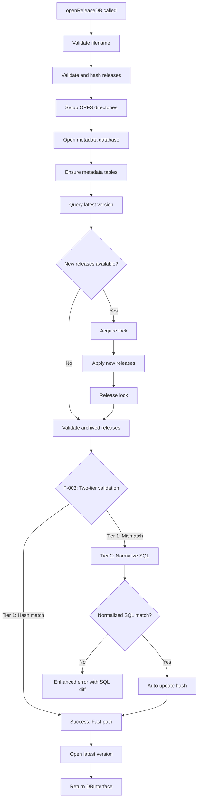
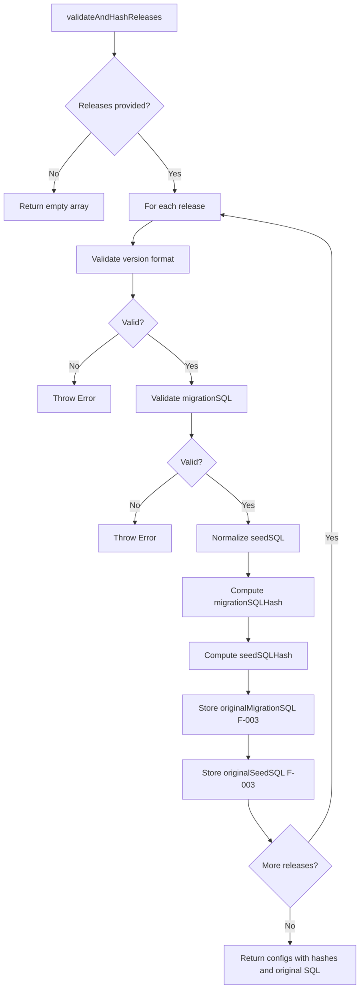
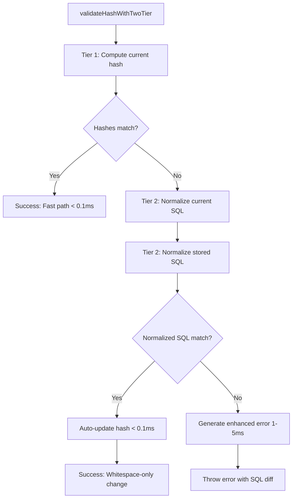
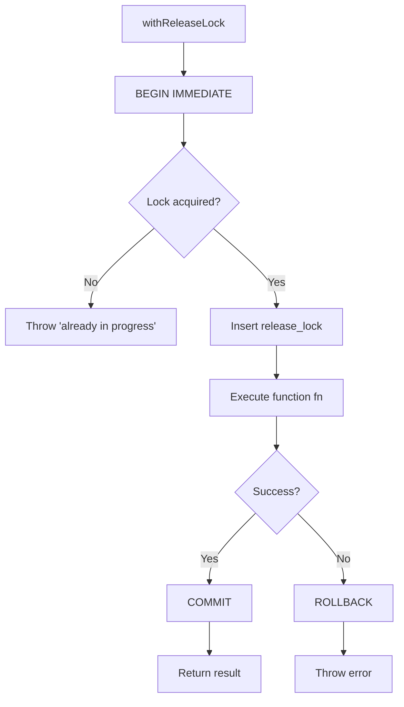
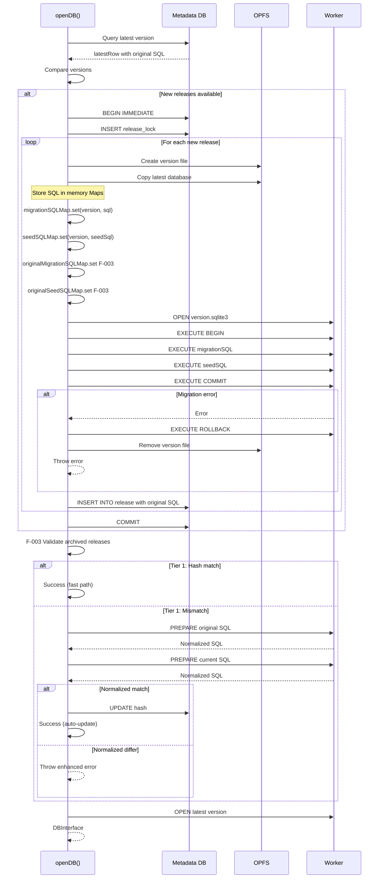
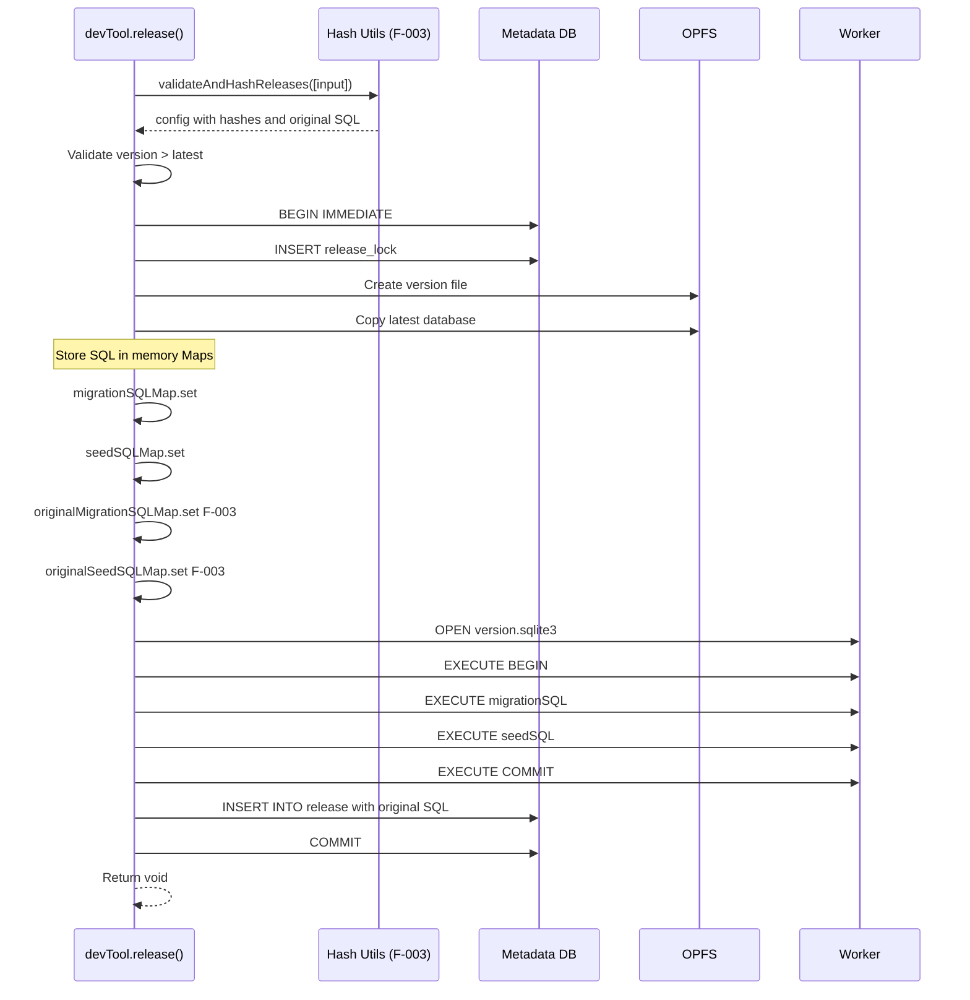
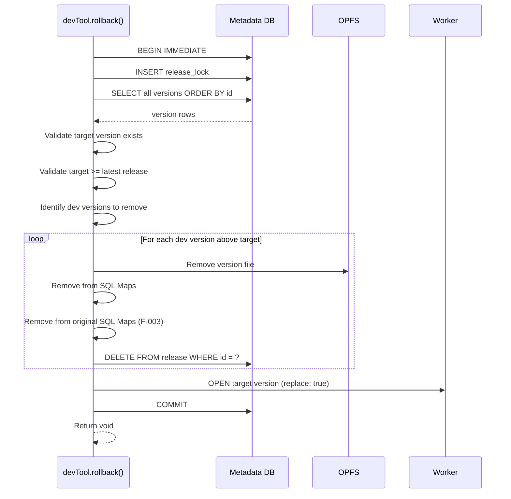

# Module: Release Management

## 1) Assets

**Purpose**: Manage database versioning with release isolation, migration application, rollback capability, and two-tier SQL validation (F-003).

**Links to Contracts**:

- API: `agent-docs/05-design/01-contracts/01-api.md#module-dev-tooling-devtool`
- Events: `agent-docs/05-design/01-contracts/02-events.md#event-version-application`
- Errors: `agent-docs/05-design/01-contracts/03-errors.md#category-2-release-validation-errors`

**Links to Schema**:

- Database: `agent-docs/05-design/02-schema/01-database.md#module-release-metadata-database`
- Migrations: `agent-docs/05-design/02-schema/02-migrations.md`

**File Tree (Design + Code)**:

```
agent-docs/05-design/03-modules/release-management.md  (this file)
src/modules/release-management/                                (intended code root)
├── release-manager.ts        # Main orchestrator
├── hash-utils-two-tier.ts    # F-003: Two-tier validation
├── opfs-utils.ts             # OPFS operations
├── lock-utils.ts             # Metadata lock management
├── version-utils.ts          # Version comparison
├── types.ts                  # Type definitions
└── constants.ts              # Constants
```

---

## 2) Module Responsibilities

### Primary Responsibilities

1. **Release Validation**: Two-tier hash validation with auto-update for whitespace changes (F-003)
2. **Metadata Management**: Create and query metadata database with original SQL storage
3. **Version Application**: Apply new releases with migration and seed SQL
4. **Dev Tooling**: Create dev versions and rollback to previous versions
5. **Lock Management**: Serialize release operations to prevent conflicts
6. **OPFS Operations**: Create version directories and copy database files

### Cross-Cutting Concerns

- **Atomicity**: All version operations in transactions
- **Isolation**: Metadata lock prevents concurrent modifications
- **Consistency**: Two-tier hash validation ensures release integrity (F-003)
- **Durability**: OPFS provides persistent storage
- **Developer Experience**: Auto-update hashes for whitespace changes, enhanced errors for structure changes (F-003)

---

## 3) Public Interface

### Function: `openReleaseDB(deps): Promise<DBInterface>`

**Purpose**: Open and prepare a versioned database using release metadata with two-tier validation (F-003).

**File**: `src/release/release-manager.ts`

**Parameters**:

```typescript
type ReleaseManagerDeps = {
  filename: string;
  options?: OpenDBOptions;
  sendMsg: <TRes, TReq>(event: SqliteEvent, payload?: TReq) => Promise<TRes>;
  runMutex: <T>(callback: () => Promise<T>) => Promise<T>;
};
```

**Returns**: `Promise<DBInterface>` - Database interface for latest version

**Flow (F-003 Enhanced)**:



**Key Operations**:

1. Validate filename and release configs
2. Compute SHA-256 hashes for migration and seed SQL
3. Create OPFS directories and default database
4. Open metadata database (`release.sqlite3`)
5. Ensure metadata tables exist (including original SQL columns for F-003)
6. Query latest version from metadata
7. **F-003**: Validate release configs against archived versions using two-tier validation
8. Apply new releases if available
9. Open latest version as active database
10. Create DBInterface with exec, query, transaction, close, devTool
11. Populate global namespace with SQL Maps (including original SQL Maps for F-003)

---

### Function: `validateAndHashReleases(releases): Promise<ReleaseConfigWithHash[]>`

**Purpose**: Validate release configs and compute SHA-256 hashes.

**File**: `src/release/hash-utils-two-tier.ts` (F-003)

**Parameters**:

```typescript
type ReleaseConfig = {
  version: string;
  migrationSQL: string;
  seedSQL?: string | null;
};
```

**Returns**: `Promise<ReleaseConfigWithHash[]>` - Release configs with computed hashes and original SQL

**Validation Rules**:

1. Version must match semver pattern: `^(0|[1-9]\d*)\.(0|[1-9]\d*)\.(0|[1-9]\d*)$`
2. Migration SQL must be non-empty string
3. Seed SQL must be string or null/undefined
4. Versions must be in ascending order

**Hash Computation**:

```typescript
async function hashSQL(value: string): Promise<string> {
  const data = new TextEncoder().encode(value.trim());
  const hashBuffer = await crypto.subtle.digest("SHA-256", data);
  const hashArray = Array.from(new Uint8Array(hashBuffer));
  return hashArray.map((b) => b.toString(16).padStart(2, "0")).join("");
}

const normalizedSeedSQL =
  seedSQL === undefined || seedSQL === null || seedSQL === "" ? null : seedSQL;
const migrationSQLHash = await hashSQL(migrationSQL);
const seedSQLHash = normalizedSeedSQL ? await hashSQL(normalizedSeedSQL) : null;
```

**F-003 Enhancement**: Store original SQL for two-tier validation

```typescript
type ReleaseConfigWithHash = {
  version: string;
  migrationSQL: string;
  normalizedSeedSQL: string | null;
  migrationSQLHash: string;
  seedSQLHash: string | null;
  originalMigrationSQL: string; // F-003: Original SQL at release time
  originalSeedSQL: string | null; // F-003: Original seed SQL at release time
};
```

**Flow**:



---

### Function: `validateHashWithTwoTier(sql, storedHash, version, sqlType): Promise<void>` (F-003)

**Purpose**: Two-tier hash validation with auto-update for whitespace changes and enhanced errors for structure changes.

**File**: `src/release/hash-utils-two-tier.ts` (F-003)

**Parameters**:

```typescript
type ValidateHashParams = {
  sql: string; // Current SQL from config
  storedHash: string; // Archived hash from metadata
  version: string; // Release version
  sqlType: "migrationSQL" | "seedSQL";
  originalSQL: string | null; // Original SQL from metadata (F-003)
  sendMsg: <TRes, TReq>(event: SqliteEvent, payload?: TReq) => Promise<TRes>;
};
```

**Returns**: `Promise<void>` - Resolves on success, throws on structure mismatch

**Two-Tier Validation Logic**:

**Tier 1 (Fast)**: `trim()` + hash compare (< 0.1ms)

```typescript
// Fast path: trim and hash
const currentHash = await hashSQL(sql.trim());
if (currentHash === storedHash) {
  return; // Success (fast path)
}
```

**Tier 2 (Slow)**: SQLite `prepare()` normalization (1-5ms)

```typescript
// Slow path: normalize via prepare()
const normalizedCurrent = await normalizeSQL(sql);
const normalizedStored = await normalizeSQL(originalSQL);

if (normalizedCurrent === normalizedStored) {
  // Auto-update hash (whitespace-only change)
  await updateHash(version, currentHash, sqlType);
} else {
  // Throw enhanced error with SQL diff
  throw new HashMismatchError(version, sql, originalSQL, sqlType);
}
```

**Flow**:



**Enhanced Error Generation**:

```typescript
function generateHashMismatchError(
  version: string,
  currentSQL: string,
  storedSQL: string,
  sqlType: "migrationSQL" | "seedSQL",
): Error {
  const truncate = (sql: string) =>
    sql.length > 200 ? sql.substring(0, 200) + "..." : sql;

  const message = `
${sqlType} hash mismatch for ${version}

The ${sqlType} has been modified from the original release.

Original SQL (first 200 chars):
${truncate(storedSQL)}

Current SQL (first 200 chars):
${truncate(currentSQL)}

The SQL structure has changed. Please either:
1. Revert to the original SQL, or
2. Create a new version with this migration
  `.trim();

  return new Error(message);
}
```

**Code**:

```typescript
export const validateHashWithTwoTier = async ({
  sql,
  storedHash,
  version,
  sqlType,
  originalSQL,
  sendMsg,
}: ValidateHashParams): Promise<void> => {
  // Tier 1: Fast hash compare
  const currentHash = await hashSQL(sql.trim());
  if (currentHash === storedHash) {
    return; // Success (fast path)
  }

  // Tier 2: Normalize via prepare()
  if (!originalSQL) {
    // Original SQL not available (legacy release)
    throw new Error(
      `${sqlType} hash mismatch for ${version} (original SQL not available)`,
    );
  }

  const normalizedCurrent = await normalizeSQL(sql, sendMsg);
  const normalizedStored = await normalizeSQL(originalSQL, sendMsg);

  if (normalizedCurrent === normalizedStored) {
    // Auto-update hash (whitespace-only change)
    await updateHash(version, currentHash, sqlType, sendMsg);
  } else {
    // Throw enhanced error with SQL diff
    throw generateHashMismatchError(version, sql, originalSQL, sqlType);
  }
};

async function normalizeSQL(
  sql: string,
  sendMsg: SendMsgFunction,
): Promise<string> {
  const result = await sendMsg<PrepareResult>("prepare", { sql });
  return result.normalizedSQL;
}
```

---

### Function: `applyVersion(config, mode): Promise<void>`

**Purpose**: Apply a new version by copying database and executing migration SQL.

**File**: `src/release/release-manager.ts` (internal function in `openReleaseDB`)

**Parameters**:

```typescript
type ReleaseConfigWithHash = {
  version: string;
  migrationSQL: string;
  normalizedSeedSQL: string | null;
  migrationSQLHash: string;
  seedSQLHash: string | null;
  originalMigrationSQL: string; // F-003
  originalSeedSQL: string | null; // F-003
};
```

**Flow (F-003 Enhanced)**:

```mermaid
flowchart TD
    A[applyVersion] --> B[Create version file]
    B --> C[Copy latest database]
    Note over C: v2.1.0: Use flat file naming {version}.sqlite3
    C --> D[Store migrationSQL in Map]
    D --> E[Store seedSQL in Map]
    Note over D,E: v2.1.0: SQL stored in memory, not files
    E --> F[Store originalMigrationSQL in Map F-003]
    F --> G[Store originalSeedSQL in Map F-003]
    G --> H[Open new database in worker]
    H --> I[BEGIN transaction]
    I --> J[Execute migrationSQL]
    J --> K{Success?}
    K -->|No| L[ROLLBACK]
    L --> M[Remove version file]
    M --> N[Switch back to previous version]
    N --> O[Throw error]
    K -->|Yes| P{seedSQL exists?}
    P -->|Yes| Q[Execute seedSQL]
    P -->|No| R[Skip seedSQL]
    Q --> S{Success?}
    S -->|No| L
    S -->|Yes| T[COMMIT]
    R --> T
    T --> U[Insert metadata row with original SQL F-003]
    U --> V[Update latest version]
    V --> W[Return void]
```

**Error Handling**:

- SQL execution error: ROLLBACK, remove version directory, rethrow error
- OPFS error: Cleanup partial files, rethrow error
- Metadata error: Transaction rollback, rethrow error

**Code (F-003 Enhanced)**:

```typescript
const applyVersion = async (
  config: ReleaseConfigWithHash,
  mode: "release" | "dev",
): Promise<void> => {
  // v2.1.0: Use flat file naming {version}.sqlite3
  const versionFilename = `${config.version}.sqlite3`;
  const destDbHandle = await baseDir.getFileHandle(versionFilename, {
    create: true,
  });

  await copyFileHandle(latestDbHandle, destDbHandle);

  // v2.1.0: Store SQL in memory Maps instead of files
  migrationSQLMap.set(config.version, config.migrationSQL);
  if (config.normalizedSeedSQL) {
    seedSQLMap.set(config.version, config.normalizedSeedSQL);
  }

  // F-003: Store original SQL in memory Maps
  originalMigrationSQLMap.set(config.version, config.originalMigrationSQL);
  if (config.originalSeedSQL) {
    originalSeedSQLMap.set(config.version, config.originalSeedSQL);
  }

  await openActiveDb(
    getDbPathForVersion(normalizedFilename, config.version),
    true,
  );

  try {
    await _exec("BEGIN", undefined, "active");
    await _exec(config.migrationSQL, undefined, "active");
    if (config.normalizedSeedSQL) {
      await _exec(config.normalizedSeedSQL, undefined, "active");
    }
    await _exec("COMMIT", undefined, "active");
  } catch (error) {
    await _exec("ROLLBACK", undefined, "active");
    await openActiveDb(
      getDbPathForVersion(normalizedFilename, latestVersion),
      true,
    );
    await removeDir(baseDir, config.version);
    throw error;
  }

  // F-003: Insert metadata row with original SQL
  await metaExec(
    "INSERT INTO release (version, migrationSQLHash, seedSQLHash, originalMigrationSQL, originalSeedSQL, mode, createdAt) VALUES (?, ?, ?, ?, ?, ?, ?)",
    [
      config.version,
      config.migrationSQLHash,
      config.seedSQLHash,
      config.originalMigrationSQL, // F-003
      config.originalSeedSQL, // F-003
      mode,
      new Date().toISOString(),
    ],
  );

  latestVersion = config.version;
  latestDbHandle = destDbHandle;
};
```

---

### Function: `withReleaseLock<T>(fn): Promise<T>`

**Purpose**: Acquire metadata lock, execute function, release lock on success or error.

**File**: `src/release/release-manager.ts` (internal function in `openReleaseDB`)

**Parameters**:

```typescript
type LockFunction<T> = () => Promise<T>;
```

**Returns**: `Promise<T>` - Result of the function

**Flow**:



**Lock Detection**:

```typescript
try {
  await metaExec("BEGIN IMMEDIATE");
} catch (error) {
  if (isLockError(error)) {
    throw new Error("Release operation already in progress");
  }
  throw error;
}
```

**Code**:

```typescript
const withReleaseLock = async <T>(fn: () => Promise<T>): Promise<T> => {
  try {
    await metaExec("BEGIN IMMEDIATE");
  } catch (error) {
    if (isLockError(error)) {
      throw new Error("Release operation already in progress");
    }
    throw error;
  }
  await metaExec(
    "INSERT OR REPLACE INTO release_lock (id, lockedAt) VALUES (1, ?)",
    [new Date().toISOString()],
  );
  try {
    const result = await fn();
    await metaExec("COMMIT");
    return result;
  } catch (error) {
    try {
      await metaExec("ROLLBACK");
    } catch {
      // ignore rollback errors
    }
    throw error;
  }
};
```

---

## 4) Internal Operations

### Operation: Metadata Table Creation

**Purpose**: Ensure metadata database has required tables and default data.

**Location**: `src/release/release-manager.ts` (in `openReleaseDB`)

**Tables Created (F-003 Enhanced)**:

```sql
CREATE TABLE release (
  id INTEGER PRIMARY KEY AUTOINCREMENT,
  version TEXT NOT NULL,
  migrationSQLHash TEXT,
  seedSQLHash TEXT,
  originalMigrationSQL TEXT,      -- F-003: Original migration SQL
  originalSeedSQL TEXT,            -- F-003: Original seed SQL
  mode TEXT NOT NULL CHECK (mode IN ('release', 'dev')),
  createdAt TEXT NOT NULL
);

CREATE UNIQUE INDEX idx_release_version ON release(version);

CREATE TABLE release_lock (
  id PRIMARY KEY CHECK (id = 1),
  lockedAt TEXT NOT NULL
);
```

**Default Data**:

```sql
INSERT INTO release (version, migrationSQLHash, seedSQLHash, mode, createdAt)
VALUES ('default', NULL, NULL, 'release', '<timestamp>');
```

**Note**: The 'default' version is an internal version representing the initial empty database file (`default.sqlite3`). User-provided versions must be semver `x.y.z` (no leading zeros); `default` is reserved.

**F-003 Migration Path**:

```sql
-- v2.1.0: Add original SQL columns
ALTER TABLE release ADD COLUMN originalMigrationSQL TEXT;
ALTER TABLE release ADD COLUMN originalSeedSQL TEXT;

-- Backfill existing rows with current SQL (if available)
-- New rows will have original SQL populated automatically
```

**Code**:

```typescript
const ensureMetadata = async (): Promise<void> => {
  await metaExec(RELEASE_TABLE_SQL);
  await metaExec(RELEASE_INDEX_SQL);
  await metaExec(RELEASE_LOCK_TABLE_SQL);

  // F-003: Check if original SQL columns exist, add if not
  const columns = await metaQuery<{ sql: string }>(
    "SELECT sql FROM sqlite_master WHERE type='table' AND name='release'",
  );
  const hasOriginalColumns = columns[0]?.sql.includes("originalMigrationSQL");

  if (!hasOriginalColumns) {
    await metaExec("ALTER TABLE release ADD COLUMN originalMigrationSQL TEXT");
    await metaExec("ALTER TABLE release ADD COLUMN originalSeedSQL TEXT");
  }

  const defaults = await metaQuery<{ id: number }>(
    "SELECT id FROM release WHERE version = ? LIMIT 1",
    [DEFAULT_VERSION],
  );
  if (defaults.length === 0) {
    await metaExec(
      "INSERT INTO release (version, migrationSQLHash, seedSQLHash, mode, createdAt) VALUES (?, ?, ?, ?, ?)",
      [DEFAULT_VERSION, null, null, "release", new Date().toISOString()],
    );
  }
};
```

---

### Operation: Version Comparison

**Purpose**: Compare semantic version strings.

**Location**: `src/release/version-utils.ts`

**Algorithm**:

```typescript
export function compareVersions(v1: string, v2: string): number {
  const parse = (v: string) => {
    const match = v.match(/^(\d+)\.(\d+)\.(\d+)/);
    return match
      ? [parseInt(match[1]), parseInt(match[2]), parseInt(match[3])]
      : [0, 0, 0];
  };

  const [major1, minor1, patch1] = parse(v1);
  const [major2, minor2, patch2] = parse(v2);

  if (major1 !== major2) return major1 - major2;
  if (minor1 !== minor2) return minor1 - minor2;
  return patch1 - patch2;
}
```

**Return Values**:

- `< 0`: v1 < v2
- `= 0`: v1 = v2
- `> 0`: v1 > v2

**Usage**:

```typescript
if (compareVersions(config.version, latestVersion) <= 0) {
  throw new Error("Version must be greater than latest");
}
```

---

### Operation: OPFS File Operations

**Purpose**: Manage OPFS directories and files for versioned databases.

**Location**: `src/release/opfs-utils.ts`

**Key Functions**:

#### `ensureDir(root, name): Promise<FileSystemDirectoryHandle>`

Create or get directory handle.

```typescript
export const ensureDir = async (
  root: FileSystemDirectoryHandle,
  name: string,
): Promise<FileSystemDirectoryHandle> => {
  return await root.getDirectoryHandle(name, { create: true });
};
```

#### `ensureFile(dir, name): Promise<FileSystemFileHandle>`

Create or get file handle.

```typescript
export const ensureFile = async (
  dir: FileSystemDirectoryHandle,
  name: string,
): Promise<FileSystemFileHandle> => {
  return await dir.getFileHandle(name, { create: true });
};
```

#### `copyFileHandle(src, dest): Promise<void>`

Copy file contents from source to destination.

```typescript
export const copyFileHandle = async (
  src: FileSystemFileHandle,
  dest: FileSystemFileHandle,
): Promise<void> => {
  const srcFile = await src.getFile();
  const srcData = await srcFile.arrayBuffer();
  const destWritable = await dest.createWritable();
  await destWritable.write(srcData);
  await destWritable.close();
};
```

#### `writeTextFile(dir, name, contents): Promise<void>`

Write text contents to file.

```typescript
export const writeTextFile = async (
  dir: FileSystemDirectoryHandle,
  name: string,
  contents: string,
): Promise<void> => {
  const fileHandle = await dir.getFileHandle(name, { create: true });
  const writable = await fileHandle.createWritable();
  await writable.write(contents);
  await writable.close();
};
```

#### `removeDir(baseDir, name): Promise<void>`

Remove directory and all contents.

```typescript
export const removeDir = async (
  baseDir: FileSystemDirectoryHandle,
  name: string,
): Promise<void> => {
  const dirHandle = await baseDir.getDirectoryHandle(name);
  // Recursively remove all entries
  for await (const entry of dirHandle.values()) {
    await dirHandle.removeEntry(entry.name, { recursive: true });
  }
  await baseDir.removeEntry(name);
};
```

---

### Operation: Lock Error Detection

**Purpose**: Detect if error is due to metadata lock contention.

**Location**: `src/release/lock-utils.ts`

**Code**:

```typescript
export const isLockError = (error: unknown): boolean => {
  const message = error instanceof Error ? error.message : String(error);
  return (
    message.includes("database is locked") || message.includes("SQLITE_BUSY")
  );
};
```

**Usage**:

```typescript
try {
  await metaExec("BEGIN IMMEDIATE");
} catch (error) {
  if (isLockError(error)) {
    throw new Error("Release operation already in progress");
  }
  throw error;
}
```

---

### Operation: F-003 Two-Tier Validation

**Purpose**: Validate SQL hashes with two-tier approach for better developer experience.

**Location**: `src/release/hash-utils-two-tier.ts`

**Functions**:

#### `hashSQL(sql: string): Promise<string>`

Compute SHA-256 hash of trimmed SQL string.

```typescript
async function hashSQL(sql: string): Promise<string> {
  const data = new TextEncoder().encode(sql.trim());
  const hashBuffer = await crypto.subtle.digest("SHA-256", data);
  const hashArray = Array.from(new Uint8Array(hashBuffer));
  return hashArray.map((b) => b.toString(16).padStart(2, "0")).join("");
}
```

#### `normalizeSQL(sql: string, sendMsg): Promise<string>`

Normalize SQL using SQLite's prepare function.

```typescript
async function normalizeSQL(
  sql: string,
  sendMsg: SendMsgFunction,
): Promise<string> {
  const result = await sendMsg<PrepareResult>("prepare", { sql });
  return result.normalizedSQL;
}
```

#### `updateHash(version, newHash, sqlType, sendMsg): Promise<void>`

Update hash in metadata database after successful Tier 2 validation.

```typescript
async function updateHash(
  version: string,
  newHash: string,
  sqlType: "migrationSQL" | "seedSQL",
  sendMsg: SendMsgFunction,
): Promise<void> {
  await metaExec(`UPDATE release SET ${sqlType}Hash = ? WHERE version = ?`, [
    newHash,
    version,
  ]);
}
```

#### `generateHashMismatchError(version, currentSQL, storedSQL, sqlType): Error`

Generate enhanced error message with SQL diff.

```typescript
function generateHashMismatchError(
  version: string,
  currentSQL: string,
  storedSQL: string,
  sqlType: "migrationSQL" | "seedSQL",
): Error {
  const truncate = (sql: string) =>
    sql.length > 200 ? sql.substring(0, 200) + "..." : sql;

  const message = `
${sqlType} hash mismatch for ${version}

The ${sqlType} has been modified from the original release.

Original SQL (first 200 chars):
${truncate(storedSQL)}

Current SQL (first 200 chars):
${truncate(currentSQL)}

The SQL structure has changed. Please either:
1. Revert to the original SQL, or
2. Create a new version with this migration
  `.trim();

  return new Error(message);
}
```

---

## 5) Data Flow

### Release Application Flow (F-003 Enhanced)



### Dev Tool Release Flow



### Dev Tool Rollback Flow



---

## 6) Error Handling

### Error Categories

1. **Hash Mismatch (F-003 Enhanced)**: Two-tier validation with auto-update or enhanced error
2. **Version Conflict**: Version not greater than latest
3. **Lock Contention**: Concurrent release operation in progress
4. **Migration Failure**: SQL execution error during version application
5. **OPFS Errors**: File not found, quota exceeded, permission denied

### F-003 Error Recovery

**Migration Failure**:

```typescript
try {
  await _exec("BEGIN");
  await _exec(migrationSQL);
  await _exec(seedSQL);
  await _exec("COMMIT");
} catch (error) {
  await _exec("ROLLBACK");
  await removeDir(baseDir, version);
  throw error;
}
```

**Lock Contention**:

```typescript
try {
  await metaExec("BEGIN IMMEDIATE");
} catch (error) {
  if (isLockError(error)) {
    throw new Error("Release operation already in progress");
  }
  throw error;
}
```

**F-003 Two-Tier Validation**:

```typescript
try {
  await validateHashWithTwoTier({
    sql: currentSQL,
    storedHash: metadataHash,
    version,
    sqlType: "migrationSQL",
    originalSQL: metadataOriginalSQL,
    sendMsg,
  });
} catch (error) {
  // Enhanced error with SQL diff
  throw error;
}
```

---

## 7) Performance Characteristics

### Operation Timing

| Operation                       | Typical Latency | Notes                    |
| ------------------------------- | --------------- | ------------------------ |
| Hash computation (Tier 1)       | < 0.1ms         | SHA-256 via Web Crypto   |
| SQL normalization (Tier 2)      | 1-5ms           | SQLite prepare()         |
| Auto-update hash (after Tier 2) | < 0.1ms         | Metadata UPDATE          |
| Enhanced error generation       | < 1ms           | SQL truncation to 200    |
| Metadata table creation         | 5-10ms          | One-time on first open   |
| Release validation              | 1-5ms           | Depends on release count |
| Version directory creation      | 5-10ms          | OPFS file operations     |
| Database copy (50MB)            | 10-20ms         | OPFS file copy           |
| Migration application           | 1-5ms           | Typical migration SQL    |
| Seed application                | 5-10ms          | 1000 rows typical        |
| Rollback (per version)          | 10-20ms         | Directory removal        |

### F-003 Performance Impact

**Best Case (Tier 1 Success)**:

- No additional overhead
- Fast path < 0.1ms per version
- Most common scenario (whitespace unchanged)

**Typical Case (Tier 2 Auto-Update)**:

- 1-5ms for SQL normalization
- < 0.1ms for hash update
- Occurs when whitespace changes
- No error thrown, hash auto-updated

**Worst Case (Tier 2 Error)**:

- 1-5ms for SQL normalization
- < 1ms for error generation
- Occurs when SQL structure changes
- Enhanced error thrown with SQL diff

### Storage Usage

**Per Version Overhead**:

- Database file: Same as latest database size
- Metadata row: < 1KB (including original SQL)
- Memory Maps:
  - migrationSQL: Typically < 100KB
  - seedSQL: Typically < 100KB (if present)
  - originalMigrationSQL (F-003): Typically < 100KB
  - originalSeedSQL (F-003): Typically < 100KB (if present)

**Total Storage Estimation**:

```
Total = (Database Size × Version Count) + (Metadata Size)
```

Example: 50MB database, 15 versions, 1MB metadata

- Database storage: 50MB × 15 = 750MB
- Metadata: 1MB (including original SQL)
- Total: ~751MB

---

## 8) Dependencies

### Internal Dependencies

```
src/release/release-manager.ts
├── src/release/constants.ts
├── src/release/types.ts
├── src/release/opfs-utils.ts
├── src/release/hash-utils-two-tier.ts  # F-003
├── src/release/lock-utils.ts
└── src/release/version-utils.ts
```

### External Dependencies

- **Browser APIs**: OPFS, Web Crypto
- **Worker Protocol**: SqliteEvent, sendMsg (including PREPARE for F-003)
- **Mutex**: runMutex for serialization

---

## 9) Testing Strategy

### Unit Tests

- No dedicated unit tests for release hashing/versioning yet.
- Coverage is exercised via E2E release tests (hash mismatch, release apply, rollback).
- **F-003**: Need tests for two-tier validation scenarios

### E2E Tests

- **Release Application**: `tests/e2e/release.e2e.test.ts`
  - Migration application
  - Hash validation (Tier 1)
  - Metadata row creation
  - Version directory creation

- **Dev Tooling**: `tests/e2e/release.e2e.test.ts`
  - devTool.release() creation
  - devTool.rollback() behavior
  - Rollback constraints

- **F-003 Two-Tier Validation**: `tests/e2e/f-003-validation.e2e.test.ts` (new)
  - Tier 1 success (fast path)
  - Tier 2 auto-update (whitespace changes)
  - Tier 2 enhanced error (structure changes)
  - SQL truncation to 200 chars
  - Original SQL storage and retrieval

### F-003 Test Scenarios

**Scenario 1: Tier 1 Success**

```typescript
test("Tier 1: Hash match - fast path", async () => {
  const db = await openDB("test", {
    releases: [
      {
        version: "1.0.0",
        migrationSQL: "CREATE TABLE users (id INTEGER PRIMARY KEY, name TEXT);",
      },
    ],
  });

  // Re-open with same SQL
  await openDB("test", {
    releases: [
      {
        version: "1.0.0",
        migrationSQL: "CREATE TABLE users (id INTEGER PRIMARY KEY, name TEXT);",
      },
    ],
  });

  // Should succeed without Tier 2 validation
});
```

**Scenario 2: Tier 2 Auto-Update**

```typescript
test("Tier 2: Whitespace change - auto-update hash", async () => {
  // Original: "CREATE TABLE users (id INTEGER PRIMARY KEY, name TEXT);"
  // Current:  "CREATE TABLE users ( id INTEGER PRIMARY KEY, name TEXT );"

  const db = await openDB("test", {
    releases: [
      {
        version: "1.0.0",
        migrationSQL:
          "CREATE TABLE users ( id INTEGER PRIMARY KEY, name TEXT );", // Different whitespace
      },
    ],
  });

  // Should succeed with auto-updated hash
});
```

**Scenario 3: Tier 2 Enhanced Error**

```typescript
test("Tier 2: Structure change - enhanced error", async () => {
  // Original: "CREATE TABLE users (id INTEGER PRIMARY KEY, name TEXT);"
  // Current:  "CREATE TABLE users (id INTEGER PRIMARY KEY, name TEXT, email TEXT);"

  await expect(
    openDB("test", {
      releases: [
        {
          version: "1.0.0",
          migrationSQL:
            "CREATE TABLE users (id INTEGER PRIMARY KEY, name TEXT, email TEXT);",
        },
      ],
    }),
  ).rejects.toThrow("migrationSQL hash mismatch for 1.0.0");

  // Error should include SQL diff
});
```

---

## 10) Security Considerations

### Hash Validation (F-003 Enhanced)

**Purpose**: Detect unauthorized modifications to release SQL with better developer experience

**Algorithm**: SHA-256 (cryptographically secure)

**Two-Tier Validation**:

- Tier 1: Fast hash compare (< 0.1ms)
- Tier 2: SQLite prepare() normalization (1-5ms)
- Auto-update: Hashes updated for whitespace changes
- Enhanced errors: SQL diff for structure changes

**Validation**: On every `openDB()` call, compare config hashes with metadata hashes

**Failure**: Throws enhanced error with SQL diff, prevents database open

### Release Immutability

**Purpose**: Prevent accidental modification of released migrations

**Enforcement**:

- Release configs validated against metadata on every open
- Hash mismatch triggers two-tier validation
- Whitespace changes: Auto-update hashes
- Structure changes: Enhanced error thrown
- Cannot modify released SQL (only add new versions)

### Metadata Lock

**Purpose**: Prevent concurrent release operations that could corrupt metadata

**Mechanism**: BEGIN IMMEDIATE transaction with lock table

**Detection**: isLockError() detects lock contention

**Behavior**: Throws "Release operation already in progress" error

---

## Navigation

**Previous**: [Core Module](./core.md) - Core database API implementation

**Next in Series**: [Worker Bridge Module](./worker-bridge.md) - Worker communication layer

**Related Design Documents**:

- [Back to Modules](./)
- [Database Schema](../02-schema/01-database.md) - Metadata database structure

**All Design Documents**:

- [Contracts](../01-contracts/) - API, Events, Errors
- [Schema](../02-schema/) - Database, Migrations

**Related ADRs**:

- [ADR-0004: Release Versioning](../../04-adr/0004-release-versioning-system.md) - Versioning system
- [ADR-0003: Mutex Queue](../../04-adr/0003-mutex-queue-concurrency.md) - Metadata lock
- [Feature F-003: SQL Normalization](../../01-discovery/03-scope.md#f-003-sql-normalization) - Two-tier validation

**Back to**: [Spec Index](../../00-control/00-spec.md)
