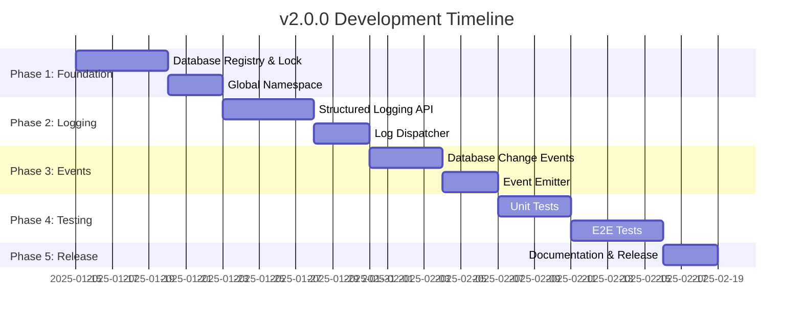

# 01 Roadmap & Strategy

**Project**: web-sqlite-js
**Current Version**: 1.1.2 (Production)
**Target Version**: 2.0.0 (In Development)
**Last Updated**: 2025-01-10
**Status**: v1.1.2 Stable - v2.0.0 Feature Development

---

## Overview

This roadmap defines the release strategy for web-sqlite-js v2.0.0, which introduces enhanced logging, database registry, and direct database access capabilities. The roadmap is organized by releases with clear timelines, dependencies, and risk mitigations.

### Current State

**v1.1.2** is the current stable production release. All v2.0.0 features are in architecture/design phase and will be implemented in Q1 2025.

---

## 1. Active Release: v2.0.0

> **Focus**: Enhanced Logging and Direct Database Access
> **Target Date**: Q1 2025 (January - March)
> **Status**: Architecture & Design Phase

### Release Summary

v2.0.0 introduces developer experience improvements including structured logging, a global database registry, and event-driven database lifecycle tracking. These features enable better observability, cross-module database access, and monitoring capabilities.

### Key Features (Scope)

- [ ] **F-001**: Enhanced Logging and Direct Database Access
  - Database Registry (Singleton tracking)
  - Database Lock (Prevent duplicate opens)
  - Global Namespace (`window.__web_sqlite`)
  - Structured Logging API (`onLog()`)
  - Database Change Events (`onDatabaseChange()`)
  - E2E Tests for all features

### Timeline

### Implementation Phases

#### Phase 1: Database Registry and Lock (Foundation)

**Duration**: 1 week
**Start**: 2025-01-15
**Dependencies**: None

**Tasks**:

- TASK-201: Database Registry Module
- TASK-202: Database Lock Implementation
- TASK-203: Registry Integration with openDB

**Deliverables**:

- Singleton registry for tracking opened databases
- Lock mechanism to prevent duplicate database opens
- Registry CRUD operations (register, unregister, get, list)

**Success Criteria**:

- Opening same database twice throws error
- Registry maintains accurate database list
- Lock releases on database close

#### Phase 2: Global Namespace

**Duration**: 3 days
**Dependencies**: Phase 1 complete

**Tasks**:

- TASK-204: Global Namespace Initialization
- TASK-205: Namespace Type Definitions

**Deliverables**:

- `window.__web_sqlite` namespace object
- Readonly `databases` property
- Non-enumerable namespace implementation

**Success Criteria**:

- Namespace accessible from any module
- Database instances are direct references
- Namespace survives page reloads (cleared on unload)

#### Phase 3: Structured Logging

**Duration**: 1 week
**Dependencies**: Phase 2 complete

**Tasks**:

- TASK-206: Log Dispatcher Implementation
- TASK-207: onLog API Implementation
- TASK-208: Worker Log Forwarding

**Deliverables**:

- Log dispatcher with callback management
- `onLog(callback)` API with cancel function
- Worker-to-main thread log forwarding

**Success Criteria**:

- Multiple callbacks supported per database
- Callback errors don't break DB operations
- Logs include SQL execution, timing, errors

#### Phase 4: Database Events

**Duration**: 1 week
**Dependencies**: Phase 3 complete

**Tasks**:

- TASK-209: Event Emitter Implementation
- TASK-210: onDatabaseChange API
- TASK-211: Event Integration with Registry

**Deliverables**:

- Event emitter for database lifecycle events
- `onDatabaseChange(callback)` API
- Events emitted on open/close

**Success Criteria**:

- Events fire on database open/close
- Event payload includes action, dbName, databases list
- Multiple subscribers supported

#### Phase 5: Testing and Documentation

**Duration**: 2 weeks
**Dependencies**: Phase 4 complete

**Tasks**:

- TASK-212: Unit Tests for Registry
- TASK-213: Unit Tests for Log Dispatcher
- TASK-214: Unit Tests for Event Emitter
- TASK-215: E2E Tests for v2.0.0 Features
- TASK-216: Documentation Updates

**Deliverables**:

- Comprehensive unit test coverage
- E2E tests for all new features
- Updated API documentation
- Migration guide (if needed)

**Success Criteria**:

- All tests passing (unit + E2E)
- 100% code coverage for new features
- Documentation complete and accurate

### Dependencies

**Internal Dependencies**:

- Phase 1 (Registry) must complete before Phase 2 (Namespace)
- Phase 2 (Namespace) must complete before Phase 3 (Logging)
- Phase 3 (Logging) must complete before Phase 4 (Events)
- Phase 4 (Events) must complete before Phase 5 (Testing)

**External Dependencies**:

- None (all dependencies are internal to the library)

### Risks and Mitigations

| Risk                                 | Severity | Probability | Mitigation                                         |
| ------------------------------------ | -------- | ----------- | -------------------------------------------------- |
| Breaking changes to existing API     | Medium   | Low         | Backward compatibility tests, deprecation warnings |
| Performance degradation from logging | Medium   | Medium      | Benchmark logging overhead, optimize dispatch      |
| Memory leaks from callback storage   | High     | Low         | Automatic cleanup, weak references if needed       |
| Global namespace collisions          | Low      | Low         | Unique namespace name, non-enumerable property     |
| Worker message complexity            | Low      | Medium      | Clear message protocol, backward compatible        |

### Definition of Done

v2.0.0 is complete when:

- [ ] All P0 tasks implemented and tested
- [ ] Unit tests pass (100% coverage of new code)
- [ ] E2E tests pass (all v2.0.0 features)
- [ ] Documentation updated (API docs, examples)
- [ ] No breaking changes to v1.x.x API
- [ ] Performance benchmarks show no regression
- [ ] Code review approved
- [ ] Status board updated

---

## 2. Upcoming Releases (Backlog)

### Release v2.1.0 (Planned: Q2 2025)

**Focus**: Safari/Firefox Support
**Dependencies**: Spike S-001 completion

**Potential Features**:

- [ ] **F-002**: Safari/Firefox OPFS Polyfill
- [ ] **F-003**: Fallback storage mechanisms

**Status**: Blocked by Spike S-001 investigation

### Release v2.2.0 (Planned: Q3 2025)

**Focus**: Performance Enhancements
**Dependencies**: Spike S-002 completion

**Potential Features**:

- [ ] **F-004**: Prepared Statements API (if spike shows >20% improvement)
- [ ] **F-005**: Query Streaming (if spike shows viability)
- [ ] **F-006**: Connection Pooling

**Status**: Blocked by Spike S-002 investigation

### Release v2.3.0 (Planned: Q4 2025)

**Focus**: Advanced Features
**Dependencies**: v2.2.0 complete

**Potential Features**:

- [ ] **F-007**: Backup/Restore API
- [ ] **F-008**: Database Export/Import
- [ ] **F-009**: Encryption at Rest

**Status**: Conceptual only

---

## 3. Maintenance (v1.1.x)

**Status**: Active Maintenance

**Scope**:

- Bug fixes only (patch releases)
- Security updates
- Documentation improvements
- Performance optimizations (non-breaking)

**No New Features**:

- v1.1.x will not receive new features
- All new development in v2.x.x line

### Maintenance Tasks

- [ ] **TASK-101**: Monitor v1.1.2 production stability
  - **Priority**: P0 (Ongoing)
  - **Frequency**: Weekly review
  - **DoD**: Critical bugs responded to within 24 hours

- [ ] **TASK-102**: Improve error message documentation
  - **Priority**: P1
  - **Boundary**: `agent-docs/05-design/01-contracts/03-errors.md`
  - **DoD**: Common error scenarios documented with solutions

- [ ] **TASK-103**: Add edge case E2E tests
  - **Priority**: P1
  - **Boundary**: `tests/e2e/*.e2e.test.ts`
  - **DoD**: Cover concurrent transactions, large datasets, OPFS quota

- [ ] **TASK-104**: Framework integration examples
  - **Priority**: P2
  - **Boundary**: `examples/` (new directory)
  - **DoD**: React/Vue/Svelte examples working

---

## 4. Milestones (History)

### v1.1.2 - 2025-01-09

**Status**: ✅ Current Production Release

**Achievements**:

- 32 P0 tasks completed
- 100% test coverage (unit + E2E)
- Comprehensive documentation (32 documents)
- Published to npm
- Production-ready release

### v1.1.0 - 2024

**Status**: ✅ Previous Release

**Achievements**:

- Initial stable release
- Core SQLite operations
- Release versioning system
- Dev tooling

---

## 5. Strategic Priorities

### Q1 2025: v2.0.0 Delivery

**Focus**: Complete F-001 implementation
**Key Metrics**:

- Time-to-market: <3 months
- Code quality: 100% test coverage
- Performance: <5% overhead for new features

### Q2 2025: Browser Compatibility

**Focus**: Execute Spike S-001, plan Safari/Firefox support
**Key Metrics**:

- Spike completion by end of Q2
- Decision on feasibility

### Q3 2025: Performance

**Focus**: Execute Spike S-002, evaluate prepared statements
**Key Metrics**:

- Spike completion by end of Q3
- Performance benchmark >20% improvement

### Q4 2025: Advanced Features

**Focus**: Plan v2.3.0 features
**Key Metrics**:

- Feature specification complete
- Architecture designed

---

## 6. Resource Allocation

### Development Team

- **S7 Task Manager**: Project scheduling and tracking
- **Backend Developer**: Feature implementation (Phases 1-4)
- **QA Engineer**: Test development (Phase 5)
- **Technical Writer**: Documentation updates (Phase 5)

### Time Allocation (Q1 2025)

- **Phase 1 (Foundation)**: 1 week
- **Phase 2 (Namespace)**: 3 days
- **Phase 3 (Logging)**: 1 week
- **Phase 4 (Events)**: 1 week
- **Phase 5 (Testing/Docs)**: 2 weeks

**Total**: ~6 weeks for v2.0.0 completion

---

## 7. Release Criteria

### v2.0.0 Release Checklist

**Code Quality**:

- [ ] All tasks completed per Definition of Done
- [ ] Code review approved by maintainers
- [ ] No open P0 or P1 bugs
- [ ] Performance benchmarks pass

**Testing**:

- [ ] Unit tests pass (100% coverage)
- [ ] E2E tests pass (all scenarios)
- [ ] Manual testing complete
- [ ] Browser compatibility verified

**Documentation**:

- [ ] API documentation updated
- [ ] Migration guide published (if needed)
- [ ] Examples updated
- [ ] Changelog published

**Release**:

- [ ] Version bumped to 2.0.0
- [ ] Release notes published
- [ ] npm package published
- [ ] Git tag created
- [ ] Documentation site deployed

---

## Navigation

**Previous**: [Stage 6: Implementation Strategy](../06-implementation/04-release-and-rollback.md)

**Next**: [02 Task Catalog](./02-task-catalog.md)

**Up**: [Spec Index](../00-control/00-spec.md)
