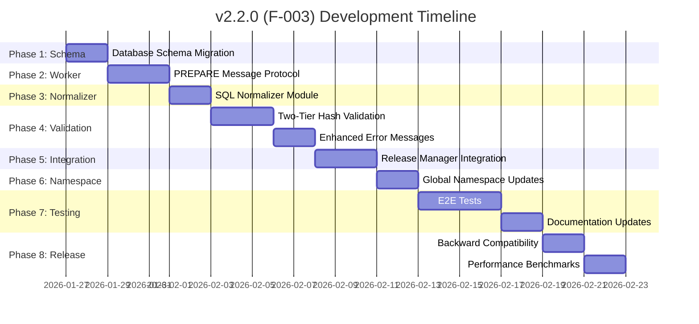

# 01 Roadmap & Strategy

**Project**: web-sqlite-js
**Current Version**: 1.1.2 (Production)
**Target Version**: 2.2.0 (F-003 - Planning)
**Last Updated**: 2026-01-26
**Status**: v1.1.2 Stable - v2.0.0 Complete - v2.1.0 Complete - v2.2.0 (F-003) Task Breakdown Ready

---

## Overview

This roadmap defines the release strategy for web-sqlite-js v2.2.0 (F-003: SQL Normalization and Enhanced Validation Error Reporting). The roadmap is organized by releases with clear timelines, dependencies, and risk mitigations.

### Current State

- **v1.1.2**: Current stable production release
- **v2.0.0**: Enhanced Logging and Direct Database Access - Complete
- **v2.1.0**: Flat OPFS Structure and In-Memory Release Configs - Complete
- **v2.2.0 (F-003)**: Two-Tier SQL Validation - Architecture Complete, Task Breakdown Ready

---

## 1. Active Release: v2.2.0 (F-003)

> **Focus**: SQL Normalization and Enhanced Validation Error Reporting
> **Target Date**: Q1 2026 (February)
> **Status**: Architecture Complete - Task Breakdown Ready

### Release Summary

v2.2.0 introduces a two-tier SQL validation system that optimizes performance while providing enhanced error messages. The fast path (trim + hash) handles most cases, while the slow path (prepare normalization) only activates on hash mismatch to detect whitespace-only changes.

### Key Features (Scope)

- [ ] **F-003**: SQL Normalization and Enhanced Validation Error Reporting
  - Two-Tier SQL Validation (Fast Path: trim + hash, Slow Path: prepare normalization)
  - Auto-Update for Whitespace-Only Differences
  - Enhanced Error Messages with SQL Diff
  - Persistent Original SQL Storage
  - Global Namespace Integration (Original SQL Maps)

### Timeline

### Implementation Phases

#### Phase 1: Database Schema Migration

**Duration**: 2 days
**Start**: 2026-01-27
**Dependencies**: None

**Tasks**:

- TASK-401: Add Original SQL Columns to Release Table
- TASK-402: Update Release Manager for Original SQL Storage

**Deliverables**:

- `originalMigrationSQL TEXT` column in release table
- `originalSeedSQL TEXT` column in release table
- ALTER TABLE migration script for existing databases
- Original SQL storage logic in release manager

**Success Criteria**:

- Schema migration succeeds on existing databases
- Original SQL stored on release creation
- Original SQL loaded on database open
- Schema documentation updated

**Risks**:

- ALTER TABLE may fail on existing databases
- **Mitigation**: Test migration with v1.1.2, v2.0.0, and v2.1.0 databases

#### Phase 2: Worker Protocol Extension

**Duration**: 3 days
**Dependencies**: Phase 1 complete

**Tasks**:

- TASK-403: Add PREPARE Message Type
- TASK-404: Expose normalizeSQL via Worker Bridge

**Deliverables**:

- PREPARE message type in worker protocol
- `prepare()` function in worker using SQLite `sqlite3_prepare_v2()`
- `sqlite3_expanded_sql()` to get normalized SQL
- `normalizeSQL()` public API in worker bridge

**Success Criteria**:

- PREPARE messages handled correctly
- SQL normalized via SQLite prepare
- Normalized SQL returned to main thread
- Error handling for invalid SQL

**Risks**:

- SQLite prepare may behave differently across versions
- **Mitigation**: Use consistent SQLite WASM version, document normalization rules

#### Phase 3: SQL Normalizer Implementation

**Duration**: 2 days
**Dependencies**: Phase 2 complete

**Tasks**:

- TASK-405: Create SQL Normalizer Module

**Deliverables**:

- `src/release/sql-normalizer.ts` module
- `normalizeSQLViaPrepare()` function
- Edge case handling (empty SQL, comments, whitespace)
- Unit tests (5+ test cases)

**Success Criteria**:

- SQL normalizer module created
- Normalizes SQL using SQLite prepare
- Handles edge cases
- Unit tests pass

**Risks**:

- Normalization may be too aggressive
- **Mitigation**: Use SQLite's built-in prepare (battle-tested)

#### Phase 4: Two-Tier Hash Validation

**Duration**: 3 days
**Dependencies**: Phase 3 complete

**Tasks**:

- TASK-406: Implement Tier 1 Fast Path Validation
- TASK-407: Implement Tier 2 Slow Path Validation
- TASK-408: Create Enhanced Hash Mismatch Error

**Deliverables**:

- `src/release/hash-utils-two-tier.ts` module
- Tier 1: trim + hash compare (< 0.1ms)
- Tier 2: prepare normalization (1-5ms)
- Enhanced `HashMismatchError` with SQL diff

**Success Criteria**:

- Tier 1 validation < 0.1ms
- Tier 2 validation 1-5ms
- Auto-update on whitespace-only differences
- Enhanced error with SQL diff

**Risks**:

- Performance overhead from prepare calls
- **Mitigation**: Only call on hash mismatch (rare case)

#### Phase 5: Integration with Release Manager

**Duration**: 3 days
**Dependencies**: Phase 4 complete

**Tasks**:

- TASK-409: Update Hash Validation with Two-Tier Approach
- TASK-410: Populate Original SQL Maps

**Deliverables**:

- Two-tier validation integrated in release manager
- Original SQL Maps populated on database open
- Backward compatibility for releases created before F-003

**Success Criteria**:

- Two-tier validation working end-to-end
- Original SQL accessible via namespace
- Backward compatibility maintained
- Integration tests pass

**Risks**:

- Breaking changes to existing validation
- **Mitigation**: Comprehensive E2E tests, maintain backward compatibility

#### Phase 6: Global Namespace Integration

**Duration**: 2 days
**Dependencies**: Phase 5 complete

**Tasks**:

- TASK-411: Update DatabaseRecord Type Definitions
- TASK-412: Sync Original SQL to Global Namespace

**Deliverables**:

- `originalMigrationSQL` Map in DatabaseRecord
- `originalSeedSQL` Map in DatabaseRecord
- Updated `WebSqliteNamespace` type definitions
- Namespace sync for original SQL Maps

**Success Criteria**:

- Original SQL accessible via `window.__web_sqlite`
- Maps properly synced
- Readonly enforced externally
- TypeScript compiles without errors

**Risks**:

- Type conflicts with existing namespace
- **Mitigation**: Incremental type updates, compile-time verification

#### Phase 7: Testing and Documentation

**Duration**: 4 days
**Dependencies**: Phase 6 complete

**Tasks**:

- TASK-413: Tier 1 Fast Path E2E Tests
- TASK-414: Tier 2 Normalization E2E Tests
- TASK-415: Auto-Update E2E Tests
- TASK-416: Enhanced Error E2E Tests
- TASK-417: Original SQL Storage E2E Tests
- TASK-418: Update Error Standards Documentation
- TASK-419: Update API Documentation
- TASK-420: Update Database Schema Documentation

**Deliverables**:

- 25+ E2E tests (5 tests per task)
- Updated error standards documentation
- Updated API documentation
- Updated database schema documentation

**Success Criteria**:

- All E2E tests pass
- 100% coverage for new code
- Documentation complete and accurate
- Examples provided

**Risks**:

- Insufficient test coverage
- **Mitigation**: 5+ tests per scenario, edge case coverage

#### Phase 8: Backward Compatibility and Performance

**Duration**: 2 days
**Dependencies**: Phase 7 complete

**Tasks**:

- TASK-421: Test Migration from Pre-F-003 Databases
- TASK-422: Benchmark Two-Tier Validation

**Deliverables**:

- Backward compatibility tests
- Performance benchmarks
- Migration validation

**Success Criteria**:

- Existing databases migrate successfully
- Tier 1 < 0.1ms verified
- Tier 2 1-5ms verified
- No regression vs old validation

**Risks**:

- Performance regression
- **Mitigation**: Benchmark before/after, optimize hot paths

### Dependencies

**Internal Dependencies**:

- Phase 1 (Schema) must complete before Phase 2 (Worker)
- Phase 2 (Worker) must complete before Phase 3 (Normalizer)
- Phase 3 (Normalizer) must complete before Phase 4 (Validation)
- Phase 4 (Validation) must complete before Phase 5 (Integration)
- Phase 5 (Integration) must complete before Phase 6 (Namespace)
- Phase 6 (Namespace) must complete before Phase 7 (Testing)
- Phase 7 (Testing) must complete before Phase 8 (Compatibility)

**External Dependencies**:

- SQLite WASM: `sqlite3_prepare_v2()` and `sqlite3_expanded_sql()` functions

### Risks and Mitigations

| Risk                                                      | Severity | Probability | Mitigation                                                         |
| --------------------------------------------------------- | -------- | ----------- | ------------------------------------------------------------------ |
| SQL normalization behavior changes across SQLite versions | High     | Low         | Use consistent SQLite WASM version, document normalization rules   |
| Performance overhead from `prepare` calls                 | Medium   | Low         | Only call on hash mismatch (rare case), cache results              |
| Metadata schema migration fails                           | Medium   | Low         | Test ALTER TABLE with existing databases, provide rollback         |
| Whitespace normalization is too aggressive                | Medium   | Low         | Use SQLite's built-in `prepare` (battle-tested), document behavior |
| Breaking changes to existing validation                   | High     | Low         | Comprehensive E2E tests, maintain backward compatibility           |
| Type conflicts with existing namespace                    | Medium   | Low         | Incremental type updates, compile-time verification                |

### Definition of Done

v2.2.0 is complete when:

- [ ] All 23 F-003 tasks implemented and tested
- [ ] Unit tests pass (100% coverage for new code)
- [ ] E2E tests pass (all F-003 scenarios)
- [ ] Documentation updated (error standards, API, schema)
- [ ] Backward compatibility maintained (v1.1.2, v2.0.0, v2.1.0 databases)
- [ ] Performance benchmarks pass (Tier 1 < 0.1ms, Tier 2 1-5ms)
- [ ] Code review approved
- [ ] Status board updated

---

## 2. Completed Releases

### Release v2.1.0 (Completed: 2026-01-12)

**Focus**: Flat OPFS Structure and In-Memory Release Configs

**Key Features**:

- [x] **F-002**: Flat OPFS Structure
  - Flat file naming (no nested version directories)
  - In-memory SQL Maps instead of OPFS SQL files
  - Dev version suffix notation (`.dev.sqlite3`)
  - Automatic migration from v2.0.0 structure

**Tasks Completed**: 3/3 (TASK-301, TASK-302, TASK-303)
**Total Estimated Hours**: 16 hours

### Release v2.0.0 (Completed: 2026-01-11)

**Focus**: Enhanced Logging and Direct Database Access

**Key Features**:

- [x] **F-001**: Enhanced Logging and Direct Database Access
  - Database Registry (Singleton tracking)
  - Database Lock (Prevent duplicate opens)
  - Global Namespace (`window.__web_sqlite`)
  - Structured Logging API (`onLog()`)
  - Database Change Events (`onDatabaseChange()`)
  - E2E Tests for all features

**Tasks Completed**: 12/12 (TASK-201 through TASK-222)
**Total Estimated Hours**: 61 hours

### Release v1.1.2 (Completed: 2025-01-09)

**Focus**: Initial Stable Production Release

**Key Features**:

- Core Database Operations (open, exec, query, transaction, close)
- Web Worker Architecture
- Release Versioning System
- Dev Tooling (release, rollback)
- TypeScript & Types
- Testing (Unit + E2E)
- Documentation

**Tasks Completed**: 32/32 (TASK-001 through TASK-032)

---

## 3. Upcoming Releases (Backlog)

### Release v2.3.0 (Planned: Q2 2026)

**Focus**: Safari/Firefox Support
**Dependencies**: Spike S-001 completion

**Potential Features**:

- [ ] **F-002**: Safari/Firefox OPFS Polyfill
- [ ] **F-003**: Fallback storage mechanisms

**Status**: Blocked by Spike S-001 investigation

### Release v2.4.0 (Planned: Q3 2026)

**Focus**: Performance Enhancements
**Dependencies**: Spike S-002 completion

**Potential Features**:

- [ ] **F-004**: Prepared Statements API (if spike shows >20% improvement)
- [ ] **F-005**: Query Streaming (if spike shows viability)
- [ ] **F-006**: Connection Pooling

**Status**: Blocked by Spike S-002 investigation

### Release v2.5.0 (Planned: Q4 2026)

**Focus**: Advanced Features
**Dependencies**: v2.4.0 complete

**Potential Features**:

- [ ] **F-007**: Backup/Restore API
- [ ] **F-008**: Database Export/Import
- [ ] **F-009**: Encryption at Rest

**Status**: Conceptual only

---

## 4. Maintenance (v1.1.x)

**Status**: Active Maintenance

**Scope**:

- Bug fixes only (patch releases)
- Security updates
- Documentation improvements
- Performance optimizations (non-breaking)

**No New Features**:

- v1.1.x will not receive new features
- All new development in v2.x.x line

### Maintenance Tasks

- [ ] **TASK-101**: Monitor v1.1.2 production stability
  - **Priority**: P0 (Ongoing)
  - **Frequency**: Weekly review
  - **DoD**: Critical bugs responded to within 24 hours

- [ ] **TASK-102**: Improve error message documentation
  - **Priority**: P1
  - **Boundary**: `agent-docs/05-design/01-contracts/03-errors.md`
  - **DoD**: Common error scenarios documented with solutions

- [ ] **TASK-103**: Add edge case E2E tests
  - **Priority**: P1
  - **Boundary**: `tests/e2e/*.e2e.test.ts`
  - **DoD**: Cover concurrent transactions, large datasets, OPFS quota

- [ ] **TASK-104**: Framework integration examples
  - **Priority**: P2
  - **Boundary**: `examples/` (new directory)
  - **DoD**: React/Vue/Svelte examples working

---

## 5. Milestones (History)

### v2.1.0 - 2026-01-12

**Status**: ✅ Complete

**Achievements**:

- 3 P0 tasks completed
- 100% test coverage (unit + E2E)
- Flat OPFS structure implemented
- In-memory SQL Maps implemented
- Automatic migration from v2.0.0
- All tests passing

### v2.0.0 - 2026-01-11

**Status**: ✅ Complete

**Achievements**:

- 12 P0/P1 tasks completed
- 100% test coverage (unit + E2E)
- Database registry implemented
- Global namespace implemented
- Structured logging implemented
- Database events implemented
- Documentation complete

### v1.1.2 - 2025-01-09

**Status**: ✅ Current Production Release

**Achievements**:

- 32 P0 tasks completed
- 100% test coverage (unit + E2E)
- Comprehensive documentation (32 documents)
- Published to npm
- Production-ready release

### v1.1.0 - 2024

**Status**: ✅ Previous Release

**Achievements**:

- Initial stable release
- Core SQLite operations
- Release versioning system
- Dev tooling

---

## 6. Strategic Priorities

### Q1 2026: v2.2.0 (F-003) Delivery

**Focus**: Complete F-003 implementation
**Key Metrics**:

- Time-to-market: <4 weeks
- Code quality: 100% test coverage
- Performance: Tier 1 < 0.1ms, Tier 2 1-5ms

### Q2 2026: Browser Compatibility

**Focus**: Execute Spike S-001, plan Safari/Firefox support
**Key Metrics**:

- Spike completion by end of Q2
- Decision on feasibility

### Q3 2026: Performance

**Focus**: Execute Spike S-002, evaluate prepared statements
**Key Metrics**:

- Spike completion by end of Q3
- Performance benchmark >20% improvement

### Q4 2026: Advanced Features

**Focus**: Plan v2.5.0 features
**Key Metrics**:

- Feature specification complete
- Architecture designed

---

## 7. Resource Allocation

### Development Team

- **S7 Task Manager**: Project scheduling and tracking
- **Backend Developer**: Feature implementation (Phases 1-8)
- **QA Engineer**: Test development (Phase 7)
- **Technical Writer**: Documentation updates (Phase 7)

### Time Allocation (Q1 2026)

- **Phase 1 (Schema)**: 2 days (7h)
- **Phase 2 (Worker)**: 3 days (6h)
- **Phase 3 (Normalizer)**: 2 days (3h)
- **Phase 4 (Validation)**: 3 days (8h)
- **Phase 5 (Integration)**: 3 days (7h)
- **Phase 6 (Namespace)**: 2 days (4h)
- **Phase 7 (Testing/Docs)**: 4 days (23h)
- **Phase 8 (Compatibility)**: 2 days (6h)

**Total**: ~21 days for v2.2.0 (F-003) completion (~64 hours)

---

## 8. Release Criteria

### v2.2.0 (F-003) Release Checklist

**Code Quality**:

- [ ] All 23 tasks completed per Definition of Done
- [ ] Code review approved by maintainers
- [ ] No open P0 or P1 bugs
- [ ] Performance benchmarks pass

**Testing**:

- [ ] Unit tests pass (100% coverage)
- [ ] E2E tests pass (all F-003 scenarios)
- [ ] Manual testing complete
- [ ] Browser compatibility verified

**Documentation**:

- [ ] Error standards updated (E011, E012)
- [ ] API documentation updated
- [ ] Database schema documentation updated
- [ ] Migration guide published (if needed)

**Release**:

- [ ] Version bumped to 2.2.0
- [ ] Release notes published
- [ ] npm package published
- [ ] Git tag created
- [ ] Documentation site deployed

---

## Navigation

**Previous**: [Stage 6: Implementation Strategy](../06-implementation/04-release-and-rollback.md)

**Next**: [02 Task Catalog](./02-task-catalog.md)

**Up**: [Spec Index](../00-control/00-spec.md)
