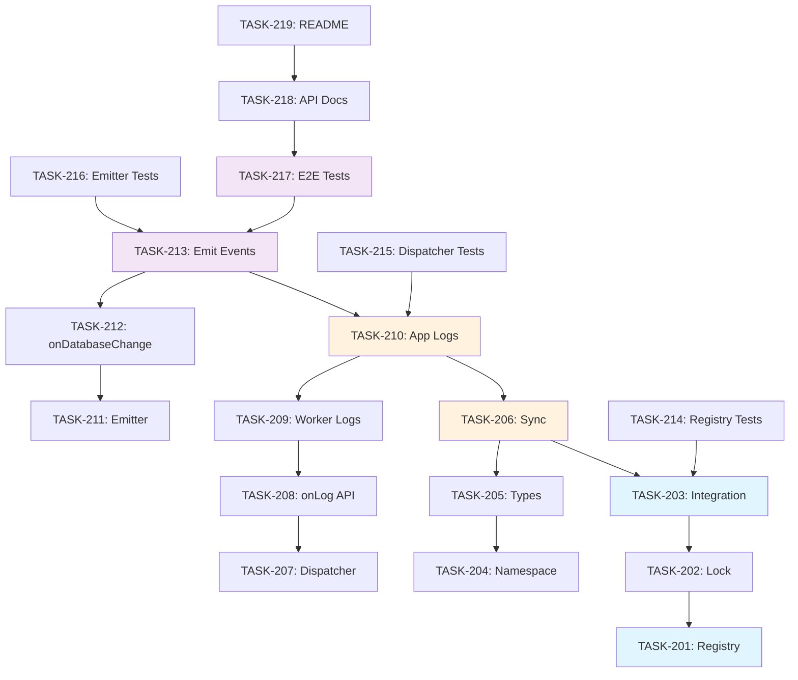

# 02 Task Catalog (Release Grouped)

**Project**: web-sqlite-js
**Current Version**: 1.1.2 (Production)
**Target Version**: 2.0.0 (In Development)
**Last Updated**: 2026-01-10
**Status**: v1.1.2 Stable - v2.0.0 Implementation In Progress (TASK-201 Complete)

---

## Status Legend

- `[ ]` **Pending**: Ready to be picked up
- `[-]` **In Progress**: Currently being executed
- `[x]` **Completed**: Tested, verified, and merged

---

## Release v2.0.0 (Active Development)

> **Focus**: Enhanced Logging and Direct Database Access
> **Target Date**: Q1 2026
> **Status**: Implementation In Progress (1/19 tasks complete)

### Phase 1: Database Registry and Lock (Foundation)

- [x] **TASK-201**: [Registry] Create Database Registry Module
  - **Priority**: P0 (Blocker)
  - **Dependencies**: None
  - **Boundary**: `src/registry/database-registry.ts`
  - **Description**: Implement singleton registry for tracking opened database instances
  - **Implementation Details**:
    - Create `DatabaseRegistry` class with singleton pattern
    - Implement `register(filename: string, db: DBInterface): void`
    - Implement `unregister(filename: string): void`
    - Implement `get(filename: string): DBInterface | undefined`
    - Implement `list(): string[]` (returns all registered database names)
    - Implement `has(filename: string): boolean`
  - **DoD**:
    - Registry singleton pattern implemented
    - All CRUD operations working
    - Thread-safe operations (if needed)
    - Unit tests pass (`src/registry/database-registry.unit.test.ts`)
  - **Estimated**: 4 hours
  - **Completed**: 2026-01-10

- [x] **TASK-202**: [Registry] Implement Database Lock
  - **Priority**: P0 (Blocker)
  - **Dependencies**: TASK-201
  - **Boundary**: `src/registry/database-registry.ts`
  - **Description**: Add lock mechanism to prevent duplicate database opens
  - **Implementation Details**:
    - Implement `checkLock(filename: string): void` (throws if locked)
    - Implement `acquireLock(filename: string): void`
    - Implement `releaseLock(filename: string): void`
    - Lock state stored in registry
    - Error message: "Database '{filename}' is already open"
  - **DoD**:
    - Lock prevents duplicate opens
    - Lock releases on database close
    - Proper error messages
    - Unit tests pass (lock scenarios)
  - **Estimated**: 3 hours
  - **Completed**: 2026-01-10 (Included in TASK-201 implementation)
  - **Notes**: Lock mechanism was implemented as part of TASK-201. Registry includes checkLock, acquireLock, releaseLock methods with comprehensive test coverage.

- [x] **TASK-203**: [Registry] Integrate Registry with openDB
  - **Priority**: P0 (Blocker)
  - **Dependencies**: TASK-201 (Lock mechanism available)
  - **Boundary**: `src/main.ts` (openDB function)
  - **Description**: Update openDB to use registry for lock checking and registration
  - **Implementation Details**:
    - Call `registry.checkLock()` before opening database
    - Call `registry.register()` after successful open
    - Call `registry.unregister()` in close() method
    - Normalize filenames consistently
  - **DoD**:
    - Opening same database twice throws error
    - Database registered after successful open
    - Database unregistered after close
    - E2E tests pass
  - **Estimated**: 3 hours
  - **Completed**: 2026-01-11
  - **Evidence**:
    - ✅ Updated `src/main.ts` with checkLock() and register()
    - ✅ Updated `src/release/release-manager.ts` with unregister()
    - ✅ Created `tests/e2e/registry-integration.e2e.test.ts` (6 tests)
    - ✅ Updated `tests/e2e/query.e2e.test.ts` for new behavior
    - ✅ All 21 E2E tests passing
  - **Notes**: Database registry fully integrated. Opening same database twice now throws `DatabaseAlreadyOpenError`. Database is automatically unregistered on close.
  - **Micro-Spec**: [draft](../08-task/active/TASK-203.md)

### Phase 2: Global Namespace

- [x] **TASK-204**: [Namespace] Initialize Global Namespace
  - **Priority**: P0
  - **Dependencies**: TASK-203
  - **Boundary**: `src/global/namespace.ts`
  - **Description**: Create and initialize `window.__web_sqlite` namespace object
  - **Implementation Details**:
    - Create `initializeNamespace()` function
    - Define non-enumerable property on `window` object
    - Initialize `databases` property as empty object
    - Initialize `onDatabaseChange` property
    - Call initialization on library load (IIFE)
  - **DoD**:
    - Namespace accessible via `window.__web_sqlite`
    - Namespace not enumerable in `Object.keys(window)`
    - `databases` property exists (empty initially)
    - `onDatabaseChange` function exists
  - **Estimated**: 2 hours
  - **Completed**: 2026-01-11
  - **Evidence**:
    - ✅ Created `src/global/namespace.ts` with namespace implementation
    - ✅ Created `src/types/global.ts` with type definitions
    - ✅ Updated `src/main.ts` to import namespace (initializes on load)
    - ✅ Created `src/global/namespace.unit.test.ts` (10 tests)
    - ✅ Created `vitest.unit.setup.ts` for test environment setup
    - ✅ All 10 unit tests passing
    - ✅ All 21 E2E tests passing
  - **Micro-Spec**: [draft](../08-task/active/TASK-204.md)

- [x] **TASK-205**: [Namespace] Define Namespace Type Definitions
  - **Priority**: P0
  - **Dependencies**: TASK-204
  - **Boundary**: `src/global/namespace.ts`, `src/types/global.ts`, `src/main.ts`
  - **Description**: Add TypeScript type definitions for global namespace
  - **Implementation Details**:
    - Extend `Window` interface with `__web_sqlite` property
    - Define `WebSqliteNamespace` interface
    - Define `DatabaseChangeEvent` type
    - Export types for consumers
  - **DoD**:
    - ✅ TypeScript types compile without errors
    - ✅ IntelliSense shows namespace properties
    - ✅ Type definitions included in build output (`dist/index.d.ts`)
    - ✅ Type test file created for compile-time verification
    - ✅ All 44 unit tests passing
    - ✅ All 21 E2E tests passing
  - **Estimated**: 2 hours
  - **Micro-Spec**: [draft](../08-task/active/TASK-205.md)

- [x] **TASK-206**: [Namespace] Sync Namespace with Registry
  - **Priority**: P0
  - **Dependencies**: TASK-205
  - **Boundary**: `src/registry/database-registry.ts`
  - **Description**: Update namespace `databases` property when registry changes
  - **Implementation Details**:
    - Update `register()` to add to `window.__web_sqlite.databases`
    - Update `unregister()` to remove from `window.__web_sqlite.databases`
    - Make `databases` property readonly externally
  - **DoD**:
    - Namespace `databases` reflects current registry state
    - Direct access to database instances works
    - Readonly enforced externally
  - **Estimated**: 2 hours
  - **Completed**: 2026-01-11
  - **Evidence**:
    - ✅ Updated `src/registry/database-registry.ts` with namespace sync
    - ✅ Fixed `src/global/namespace.ts` `_updateDatabases()` to properly clear old keys
    - ✅ Created `tests/e2e/namespace-sync.e2e.test.ts` (5 tests)
    - ✅ All 26 E2E tests passing
  - **Micro-Spec**: [draft](../08-task/active/TASK-206.md)

### Phase 3: Structured Logging

- [x] **TASK-207**: [Logging] Create Log Dispatcher
  - **Status**: ✅ COMPLETE
  - **Completed**: 2026-01-11
  - **Priority**: P0
  - **Dependencies**: TASK-206
  - **Boundary**: `src/logs/log-dispatcher.ts`
  - **Description**: Implement log dispatcher for callback management
  - **Implementation Details**:
    - Created `createLogDispatcher()` factory function (functional programming)
    - Implemented `register(callback: LogCallback): () => void` (returns cancel function)
    - Implemented `dispatch(log: LogEntry): void`
    - Handle callback errors (error isolation)
  - **Evidence**:
    - ✅ Created `src/logs/log-dispatcher.ts` with `createLogDispatcher()` factory function
    - ✅ Created `src/logs/log-dispatcher.unit.test.ts` (9 tests)
    - ✅ Added `LogEntry` type to `src/types/DB.ts`
    - ✅ Added `onLog()` method to `DBInterface`
    - ✅ All 53 unit tests passing
    - ✅ TypeScript compiles without errors
  - **Estimated**: 3 hours
  - **Micro-Spec**: [complete](../08-task/active/TASK-207.md)

- [x] **TASK-208**: [Logging] Implement onLog API
  - **Status**: ✅ COMPLETE
  - **Completed**: 2026-01-11
  - **Priority**: P0
  - **Dependencies**: TASK-207
  - **Boundary**: `src/release/release-manager.ts` (DBInterface)
  - **Description**: Add `onLog(callback)` method to DBInterface
  - **Implementation Details**:
    - Added `createLogDispatcher` import
    - Created `logDispatcher` instance per database
    - Implemented `onLog(callback: LogCallback): () => void`
    - Removed placeholder implementation
  - **Evidence**:
    - ✅ Imported `createLogDispatcher` from `../logs/log-dispatcher`
    - ✅ Created `logDispatcher` instance in `openReleaseDB()`
    - ✅ Implemented `onLog()` to call `logDispatcher.register()`
    - ✅ All 53 unit tests passing
    - ✅ TypeScript compiles without errors
  - **Estimated**: 2 hours
  - **Micro-Spec**: [complete](../08-task/active/TASK-208.md)

- [x] **TASK-209**: [Logging] Implement Worker Log Forwarding
  - **Status**: ✅ COMPLETE
  - **Completed**: 2026-01-11
  - **Priority**: P0
  - **Dependencies**: TASK-208
  - **Boundary**: `src/types/message.ts`, `src/worker.ts`, `src/worker-bridge.ts`
  - **Description**: Generate logs in worker and forward to main thread for dispatching
  - **Implementation Details**:
    - Added `WorkerLogEntry` type to `src/types/message.ts`
    - Updated `SqliteResMsg` to include `logs` array
    - Worker generates logs for SQL execution (debug level)
    - Worker generates logs for errors (error level)
    - Worker bridge extracts logs and dispatches them
    - Release manager passes log dispatcher to worker bridge
  - **Evidence**:
    - ✅ Added `WorkerLogEntry` type
    - ✅ Worker collects logs via `addLog()` helper
    - ✅ Worker includes logs in response messages
    - ✅ Worker bridge dispatches logs via `logDispatcher.dispatch()`
    - ✅ Created `tests/e2e/worker-logs.e2e.test.ts` (5 tests)
    - ✅ All 31 E2E tests passing
    - ✅ TypeScript compiles without errors
  - **Estimated**: 4 hours
  - **Micro-Spec**: [complete](../08-task/active/TASK-209.md)

- [ ] **TASK-210**: [Logging] Add Application-Level Logs
  - **Priority**: P1
  - **Dependencies**: TASK-209
  - **Boundary**: `src/main.ts`, `src/release/release-manager.ts`
  - **Description**: Emit log entries for application events (open, close, transactions)
  - **Implementation Details**:
    - Emit `{level: "info", data: {action: "open", dbName}}` on open
    - Emit `{level: "info", data: {action: "close", dbName}}` on close
    - Emit transaction logs (commit/rollback)
    - Use log dispatcher for application events
  - **DoD**:
    - Application events logged
    - Logs dispatched to callbacks
    - E2E tests pass
  - **Estimated**: 2 hours

### Phase 4: Database Events

- [ ] **TASK-211**: [Events] Create Event Emitter
  - **Priority**: P0
  - **Dependencies**: TASK-210
  - **Boundary**: `src/events/event-emitter.ts`
  - **Description**: Implement event emitter for database lifecycle events
  - **Implementation Details**:
    - Create `EventEmitter` class
    - Implement `subscribe(callback: EventCallback): () => void`
    - Implement `unsubscribe(callback: EventCallback): void`
    - Implement `emit(event: DatabaseChangeEvent): void`
    - Handle subscriber errors (error isolation)
  - **DoD**:
    - Multiple subscribers supported
    - Subscriber errors don't break emitting
    - Cancel function works
    - Unit tests pass
  - **Estimated**: 3 hours

- [ ] **TASK-212**: [Events] Implement onDatabaseChange API
  - **Priority**: P0
  - **Dependencies**: TASK-211
  - **Boundary**: `src/global/namespace.ts`
  - **Description**: Add `onDatabaseChange(callback)` to global namespace
  - **Implementation Details**:
    - Add `onDatabaseChange` method to namespace
    - Integrate with event emitter
    - Return cancel function
    - Document in JSDoc comments
  - **DoD**:
    - `onDatabaseChange()` accessible via `window.__web_sqlite`
    - Returns cancel function
    - Multiple subscribers supported
    - JSDoc documentation complete
  - **Estimated**: 2 hours

- [ ] **TASK-213**: [Events] Emit Database Change Events
  - **Priority**: P0
  - **Dependencies**: TASK-212
  - **Boundary**: `src/main.ts`, `src/registry/database-registry.ts`
  - **Description**: Emit events when databases are opened or closed
  - **Implementation Details**:
    - Emit `{action: "opened", dbName, databases}` on open
    - Emit `{action: "closed", dbName, databases}` on close
    - Get current database list from registry
    - Forward to event emitter
  - **DoD**:
    - Events emitted on open/close
    - Event payload correct (action, dbName, databases)
    - Subscribers receive events
    - E2E tests pass
  - **Estimated**: 3 hours

### Phase 5: Testing and Documentation

- [ ] **TASK-214**: [Test] Unit Tests for Database Registry
  - **Priority**: P0
  - **Dependencies**: TASK-203
  - **Boundary**: `src/registry/database-registry.unit.test.ts`
  - **Description**: Comprehensive unit tests for registry module
  - **Test Cases**:
    - Register database and retrieve
    - Unregister database
    - Check if database exists
    - List all databases
    - Lock prevents duplicate opens
    - Lock releases on close
    - Normalized filenames
  - **DoD**:
    - All test cases pass
    - Edge cases covered
    - 100% code coverage for registry module
  - **Estimated**: 4 hours

- [ ] **TASK-215**: [Test] Unit Tests for Log Dispatcher
  - **Priority**: P0
  - **Dependencies**: TASK-210
  - **Boundary**: `src/logs/log-dispatcher.unit.test.ts`
  - **Description**: Comprehensive unit tests for log dispatcher
  - **Test Cases**:
    - Register callback
    - Unregister callback
    - Dispatch log to single callback
    - Dispatch log to multiple callbacks
    - Cancel function works
    - Callback errors don't break dispatching
  - **DoD**:
    - All test cases pass
    - Edge cases covered
    - 100% code coverage for log dispatcher
  - **Estimated**: 3 hours

- [ ] **TASK-216**: [Test] Unit Tests for Event Emitter
  - **Priority**: P0
  - **Dependencies**: TASK-213
  - **Boundary**: `src/events/event-emitter.unit.test.ts`
  - **Description**: Comprehensive unit tests for event emitter
  - **Test Cases**:
    - Subscribe to events
    - Unsubscribe from events
    - Emit event to single subscriber
    - Emit event to multiple subscribers
    - Cancel function works
    - Subscriber errors don't break emitting
  - **DoD**:
    - All test cases pass
    - Edge cases covered
    - 100% code coverage for event emitter
  - **Estimated**: 3 hours

- [ ] **TASK-217**: [Test] E2E Tests for v2.0.0 Features
  - **Priority**: P0
  - **Dependencies**: TASK-213
  - **Boundary**: `tests/e2e/v2-features.e2e.test.ts`
  - **Description**: End-to-end tests for all v2.0.0 features
  - **Test Scenarios**:
    - Database registry (register, unregister, get, list)
    - Database lock (prevent duplicate opens)
    - Global namespace (access databases)
    - Structured logging (onLog callback, cancel)
    - Database events (onDatabaseChange callback, cancel)
    - Multiple callbacks/subscribers
    - Error isolation
  - **DoD**:
    - All test scenarios pass
    - Real browser testing (Playwright)
    - Coverage of all v2.0.0 features
  - **Estimated**: 8 hours

- [ ] **TASK-218**: [Docs] Update API Documentation
  - **Priority**: P0
  - **Dependencies**: TASK-217
  - **Boundary**: `agent-docs/05-design/01-contracts/01-api.md`
  - **Description**: Update API documentation with v2.0.0 features
  - **Updates**:
    - Add `onLog()` method documentation
    - Add `window.__web_sqlite` namespace documentation
    - Add `onDatabaseChange()` method documentation
    - Update examples with new features
    - Add migration notes (if breaking changes)
  - **DoD**:
    - All v2.0.0 APIs documented
    - Examples provided
    - JSDoc comments complete
  - **Estimated**: 4 hours

- [ ] **TASK-219**: [Docs] Update README and Examples
  - **Priority**: P1
  - **Dependencies**: TASK-218
  - **Boundary**: `README.md`, `examples/`
  - **Description**: Update README and create examples for v2.0.0 features
  - **Updates**:
    - Add v2.0.0 features section to README
    - Create example for database registry
    - Create example for structured logging
    - Create example for database events
    - Update usage examples
  - **DoD**:
    - README updated
    - Examples working
    - Code snippets tested
  - **Estimated**: 4 hours

---

## Release v2.1.0 (Backlog - Planned Q2 2025)

> **Focus**: Safari/Firefox Support
> **Dependencies**: Spike S-001 completion

- [ ] **TASK-301**: [Spike] Execute Spike S-001 (Safari/Firefox OPFS)
  - **Priority**: P0
  - **Dependencies**: None
  - **Boundary**: `spikes/S-001-safari-firefox-opfs/`
  - **Description**: Investigate Safari/Firefox OPFS support and fallback mechanisms
  - **DoD**: Spike report with GO/NO-GO recommendation

---

## Release v2.2.0 (Backlog - Planned Q3 2025)

> **Focus**: Performance Enhancements
> **Dependencies**: Spike S-002 completion

- [ ] **TASK-401**: [Spike] Execute Spike S-002 (Prepared Statements)
  - **Priority**: P0
  - **Dependencies**: None
  - **Boundary**: `spikes/S-002-prepared-statements/`
  - **Description**: Benchmark prepared statement performance vs current approach
  - **DoD**: Spike report with performance metrics and GO/NO-GO recommendation

---

## Release v1.1.x (Maintenance)

> **Focus**: Bug fixes and documentation
> **Status**: Active Maintenance

- [ ] **TASK-101**: [Maintenance] Monitor v1.1.2 production stability
  - **Priority**: P0 (Ongoing)
  - **Dependencies**: None
  - **Boundary**: Issue triage, npm comments
  - **DoD**: Weekly review of issues, critical bugs responded to within 24 hours
  - **Estimated**: 2 hours/week ongoing

- [ ] **TASK-102**: [Documentation] Improve error message documentation
  - **Priority**: P1
  - **Dependencies**: None
  - **Boundary**: `agent-docs/05-design/01-contracts/03-errors.md`
  - **Description**: Document common error scenarios with solutions
  - **DoD**: Common errors documented with troubleshooting steps
  - **Estimated**: 4 hours

- [ ] **TASK-103**: [Testing] Add edge case E2E tests
  - **Priority**: P1
  - **Dependencies**: None
  - **Boundary**: `tests/e2e/*.e2e.test.ts`
  - **Description**: Add E2E tests for edge cases (concurrent transactions, large datasets, OPFS quota)
  - **DoD**: Edge case tests pass, coverage improved
  - **Estimated**: 8 hours

- [ ] **TASK-104**: [Documentation] Framework integration examples
  - **Priority**: P2
  - **Dependencies**: None
  - **Boundary**: `examples/` (new directory)
  - **Description**: Create React/Vue/Svelte integration examples
  - **DoD**: Examples working, README with setup instructions
  - **Estimated**: 12 hours

---

## Release v1.1.2 (Completed)

> **Status**: ✅ Production Release
> **Completed**: 2025-01-09

### Core Database Implementation

- [x] **TASK-001**: [Core] Implement openDB API
- [x] **TASK-002**: [Core] Implement exec API
- [x] **TASK-003**: [Core] Implement query API
- [x] **TASK-004**: [Core] Implement transaction API
- [x] **TASK-005**: [Core] Implement close API

### Web Worker Architecture

- [x] **TASK-006**: [Worker] Create Web Worker implementation
- [x] **TASK-007**: [Worker] Implement worker bridge
- [x] **TASK-008**: [Worker] Implement mutex queue

### Release Versioning System

- [x] **TASK-009**: [Release] Design release data structures
- [x] **TASK-010**: [Release] Implement release manager
- [x] **TASK-011**: [Release] Implement OPFS utilities
- [x] **TASK-012**: [Release] Implement SHA-256 hashing

### Dev Tooling

- [x] **TASK-013**: [DevTool] Implement devTool.release API
- [x] **TASK-014**: [DevTool] Implement devTool.rollback API
- [x] **TASK-015**: [DevTool] Implement metadata lock

### TypeScript & Types

- [x] **TASK-016**: [Types] Define main type interfaces
- [x] **TASK-017**: [Types] Define worker event types

### Testing

- [x] **TASK-018**: [Test] Write mutex unit tests
- [x] **TASK-019**: [Test] Write E2E tests for core operations
- [x] **TASK-020**: [Test] Write E2E tests for transactions
- [x] **TASK-021**: [Test] Write E2E tests for release versioning
- [x] **TASK-022**: [Test] Write E2E tests for error handling

### Debug & Error Handling

- [x] **TASK-023**: [Debug] Implement debug logger
- [x] **TASK-024**: [Error] Implement error handling

### Build & Release

- [x] **TASK-025**: [Build] Configure Vite build
- [x] **TASK-026**: [Build] Configure TypeScript
- [x] **TASK-027**: [Build] Configure Vitest
- [x] **TASK-028**: [Release] Set up npm publish workflow
- [x] **TASK-029**: [Release] Publish v1.1.2 to npm

### Documentation

- [x] **TASK-030**: [Docs] Write API documentation
- [x] **TASK-031**: [Docs] Create README
- [x] **TASK-032**: [Docs] Deploy documentation site

**Total v1.1.2 Tasks Completed**: 32

---

## Summary

### v2.0.0 Task Breakdown

| Phase                       | Tasks  | Estimated Hours | Status                      |
| --------------------------- | ------ | --------------- | --------------------------- |
| Phase 1: Registry & Lock    | 3      | 10h             | 2/3 Complete (TASK-201/202) |
| Phase 2: Global Namespace   | 3      | 6h              | Ready to Start (TASK-203)   |
| Phase 3: Structured Logging | 4      | 11h             | Pending                     |
| Phase 4: Database Events    | 3      | 8h              | Pending                     |
| Phase 5: Testing & Docs     | 6      | 26h             | Pending                     |
| **Total**                   | **19** | **61h**         | **2/19 Complete (~11%)**    |

### Task Priority Distribution

| Priority  | v2.0.0 Done | v2.0.0 Remaining | v1.1.x | Total  |
| --------- | ----------- | ---------------- | ------ | ------ |
| P0        | 2           | 14               | 1      | 17     |
| P1        | 0           | 3                | 3      | 6      |
| P2        | 0           | 0                | 1      | 1      |
| **Total** | **2**       | **17**           | **5**  | **24** |

### Kanban Board View

**Backlog** (Ready to start):

- TASK-203 through TASK-219 (v2.0.0 implementation)
- TASK-301, TASK-401 (Future spikes)

**In Progress**:

- None

**Review / QA**:

- None

**Done**:

- TASK-201, TASK-202 (Database Registry & Lock - v2.0.0)
- TASK-001 through TASK-032 (v1.1.2 completed)

---

## Dependencies Graph

---

## Navigation

**Previous**: [01 Roadmap](./01-roadmap.md)

**Up**: [Spec Index](../00-control/00-spec.md)
