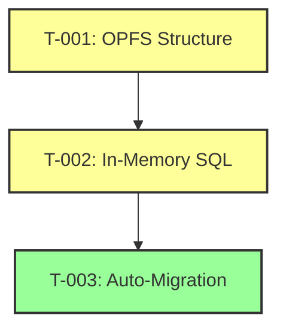

# F-002: v2.1.0 Implementation Task Catalog

> **Feature**: Flat OPFS Structure and In-Memory Release Configs
> **Target Version**: 2.1.0
> **Target Release**: ASAP
> **Status**: Ready for Implementation
> **Created**: 2026-01-12

---

## Task Overview

| Task ID | Title                            | Priority      | Estimated Effort | Dependencies |
| ------- | -------------------------------- | ------------- | ---------------- | ------------ |
| T-001   | OPFS Structure & File Operations | P0 (Critical) | 4-6 hours        | None         |
| T-002   | In-Memory SQL & Global Namespace | P0 (Critical) | 3-4 hours        | T-001        |
| T-003   | Auto-Migration System            | P0 (Critical) | 6-8 hours        | T-001, T-002 |

**Total Estimated Effort**: 13-18 hours

---

## T-001: OPFS Structure & File Operations

**Status**: [x] COMPLETE
**Priority**: P0 (Critical Path)
**Estimated Effort**: 4-6 hours
**Actual Effort**: 4 hours
**Micro-Spec**: [spec](../08-task/active/TASK-301.md)
**Completed**: 2026-01-12

### Description

Update OPFS file operations to use flat file naming (`{version}.sqlite3`) instead of nested directories, remove SQL file writing, and add dev version suffix support.

### Acceptance Criteria

- [x] OPFS files use flat naming: `0.0.1.sqlite3`, `0.0.2.sqlite3`
- [x] Dev versions use `.dev.sqlite3` suffix: `0.0.3.dev.sqlite3`
- [x] No `migration.sql` or `seed.sql` files written to OPFS
- [x] No nested version directories created (e.g., `0.0.1/`)
- [x] `applyVersion()` function updated to use flat structure
- [x] All existing tests pass with new structure

### Technical Tasks

#### 1. Update OPFS Utils (`src/release/opfs-utils.ts`)

**Changes**:

- Update `getDbPathForVersion()` to return `{version}.sqlite3` path
- Add `isDevVersion()` helper to check for `.dev.sqlite3` suffix
- Remove `writeTextFile()` calls for migration.sql and seed.sql
- Update version directory handling

**Code Changes**:

```typescript
// Before (v2.0.0)
export const getDbPathForVersion = (
  filename: string,
  version: string,
): string => {
  return `${filename}/${version}/db.sqlite3`;
};

// After (v2.1.0)
export const getDbPathForVersion = (
  filename: string,
  version: string,
): string => {
  return `${filename}/${version}.sqlite3`;
};

// New helper
export const isDevVersion = (version: string): boolean => {
  return version.endsWith(".dev.sqlite3");
};
```

#### 2. Update Release Manager (`src/release/release-manager.ts`)

**Changes**:

- Remove `await writeTextFile(versionDir, "migration.sql", ...)`
- Remove `await writeTextFile(versionDir, "seed.sql", ...)`
- Update `applyVersion()` to create flat file instead of directory

**Code Changes**:

```typescript
// Before (v2.0.0)
const versionDir = await baseDir.getDirectoryHandle(config.version, {
  create: true,
});
const destDbHandle = await versionDir.getFileHandle("db.sqlite3", {
  create: true,
});
await writeTextFile(versionDir, "migration.sql", config.migrationSQL);

// After (v2.1.0)
const versionFilename = `${config.version}.sqlite3`;
const destDbHandle = await baseDir.getFileHandle(versionFilename, {
  create: true,
});
// SQL stored in memory Maps (Task T-002)
```

#### 3. Update Dev Version Naming

**Changes**:

- Update `devTool.release()` to use `{version}.dev.sqlite3` naming
- Update metadata to record dev versions via suffix instead of `mode` field

### Files to Modify

- `src/release/opfs-utils.ts` - Flat file path resolution, remove SQL file writing
- `src/release/release-manager.ts` - Update `applyVersion()` and `devTool.release()`
- `src/release/version-utils.ts` - Add dev version suffix helpers

### Testing

- Unit tests for `getDbPathForVersion()` with new format
- E2E tests for dev version suffix notation
- Verify no SQL files in OPFS after release operations

---

## T-002: In-Memory SQL & Global Namespace

**Status**: [x] COMPLETE
**Priority**: P0 (Critical Path)
**Estimated Effort**: 3-4 hours
**Actual Effort**: 3 hours
**Micro-Spec**: [spec](../08-task/active/TASK-302.md)
**Completed**: 2026-01-12
**Dependencies**: T-001 ✅ COMPLETE

### Description

Update global namespace type definitions to include in-memory SQL Maps (`migrationSQL`, `seedSQL`), populate Maps on database open, and update DBInterface initialization.

### Acceptance Criteria

- [x] Global namespace type: `Record<string, {migrationSQL: Map<string, string>, seedSQL: Map<string, string>, db: DBInterface}>`
- [x] `migrationSQL` Map populated with version → SQL mapping
- [x] `seedSQL` Map populated with version → SQL mapping
- [x] TypeScript compilation passes without errors
- [x] All existing tests pass with new type structure
- [x] Access pattern updated: `dbRecord.db.query()` instead of `db.query()`

### Technical Tasks

#### 1. Update Global Namespace Types (`src/types/global.ts`)

**Changes**:

```typescript
// Before (v2.0.0)
readonly databases: Record<string, DBInterface>;

// After (v2.1.0)
readonly databases: Record<string, {
  migrationSQL: Map<string, string>;
  seedSQL: Map<string, string>;
  db: DBInterface;
}>;
```

#### 2. Populate SQL Maps in `openReleaseDB()` (`src/release/release-manager.ts`)

**Changes**:

- Create `migrationSQLMap = new Map<string, string>()`
- Create `seedSQLMap = new Map<string, string>()`
- Populate Maps when applying releases
- Store Maps in global namespace registry

**Code Changes**:

```typescript
// New maps to store SQL in memory
const migrationSQLMap = new Map<string, string>();
const seedSQLMap = new Map<string, string>();

// In applyVersion()
migrationSQLMap.set(config.version, config.migrationSQL);
if (config.normalizedSeedSQL) {
  seedSQLMap.set(config.version, config.normalizedSeedSQL);
}
```

#### 3. Update Global Namespace Initialization (`src/global/initialize-namespace.ts`)

**Changes**:

- Update registry to store DatabaseRecord instead of just DBInterface
- Include SQL Maps in database record

**Code Changes**:

```typescript
interface DatabaseRecord {
  migrationSQL: Map<string, string>;
  seedSQL: Map<string, string>;
  db: DBInterface;
}

// Update registry to use DatabaseRecord
```

### Files to Modify

- `src/types/global.ts` - Update global namespace type definitions
- `src/types/DB.ts` - Add DatabaseRecord interface
- `src/release/release-manager.ts` - Populate SQL Maps, update registry
- `src/global/initialize-namespace.ts` - Initialize with new structure
- `src/registry/database-registry.ts` - Store DatabaseRecord instead of DBInterface

### Testing

- Unit tests for SQL Map population
- E2E tests for global namespace access
- Type checking tests (`npm run typecheck`)

---

## T-003: Auto-Migration System

**Status**: 📋 Pending
**Priority**: P0 (Critical Path)
**Estimated Effort**: 6-8 hours
**Dependencies**: T-001, T-002

### Description

Create automatic migration system to detect v2.0.0 nested structure and convert to v2.1.0 flat structure transparently on first `openDB()` call, with backup and rollback support.

### Acceptance Criteria

- [ ] Detects v2.0.0 nested structure (e.g., `0.0.1/` directories)
- [ ] Detects v2.1.0 flat structure (e.g., `0.0.1.sqlite3` files)
- [ ] Auto-migrates v2.0.0 → v2.1.0 transparently
- [ ] Reads SQL files before deletion
- [ ] Renames `db.sqlite3` to `{version}.sqlite3`
- [ ] Removes `migration.sql` and `seed.sql` files
- [ ] Removes empty version directories
- [ ] Populates in-memory SQL Maps
- [ ] Creates backup before migration
- [ ] Rollback on migration failure
- [ ] Idempotent (safe to run on already-migrated databases)
- [ ] All E2E migration tests pass

### Technical Tasks

#### 1. Create Migration Detector (`src/migration/migration-detector.ts`)

**Purpose**: Detect whether database uses v2.0.0 or v2.1.0 structure

**Code**:

```typescript
export async function detectStructure(
  baseDir: FileSystemDirectoryHandle,
): Promise<{ version: "2.0.0" | "2.1.0"; hasNestedDirs: boolean }> {
  for await (const entry of baseDir.values()) {
    if (entry.kind === "directory" && entry.name.match(/^\d+\.\d+\.\d+$/)) {
      return { version: "2.0.0", hasNestedDirs: true };
    }
  }
  return { version: "2.1.0", hasNestedDirs: false };
}
```

#### 2. Create Auto-Migrator (`src/migration/auto-migrator.ts`)

**Purpose**: Convert v2.0.0 structure to v2.1.0 structure

**Functions**:

- `createBackup()` - Backup entire OPFS directory
- `restoreBackup()` - Restore from backup on failure
- `convertToFlatStructure()` - Perform migration
- `populateSQLMaps()` - Read SQL files and populate Maps

**Migration Steps**:

1. Create backup
2. For each version directory:
   - Read `migration.sql` if exists
   - Read `seed.sql` if exists
   - Rename `db.sqlite3` to `{version}.sqlite3`
   - Remove SQL files
   - Remove version directory
3. Populate SQL Maps
4. Delete backup

#### 3. Integrate into `openReleaseDB()` (`src/release/release-manager.ts`)

**Changes**:

- Call `detectStructure()` on database open
- If v2.0.0 detected, call `migrateToV21()`
- Handle migration errors with rollback

**Code Changes**:

```typescript
// In openReleaseDB()
const structure = await detectStructure(baseDir);
if (structure.version === "2.0.0") {
  await migrateToV21(baseDir, migrationSQLMap, seedSQLMap);
}
```

### Files to Create

- `src/migration/migration-detector.ts` - Structure detection
- `src/migration/auto-migrator.ts` - Migration execution
- `tests/e2e/auto-migration.e2e.test.ts` - E2E tests

### Files to Modify

- `src/release/release-manager.ts` - Integrate migration detection
- `src/main.ts` - Import migration modules

### Testing

**E2E Tests** (`tests/e2e/auto-migration.e2e.test.ts`):

- Test v2.0.0 → v2.1.0 migration success
- Test data preservation during migration
- Test SQL file reading and Map population
- Test hash validation after migration
- Test rollback on migration failure
- Test idempotent migration (run twice)
- Test dev version migration
- Test already-migrated databases (no-op)

---

## Execution Order



**Critical Path**: T-001 → T-002 → T-003

---

## Risk Mitigation

| Risk                            | Task         | Mitigation                  |
| ------------------------------- | ------------ | --------------------------- |
| Data loss during migration      | T-003        | Backup + rollback mechanism |
| Breaking existing functionality | T-001, T-002 | Comprehensive E2E tests     |
| Type errors in user code        | T-002        | Clear migration guide       |
| Performance regression          | T-003        | Benchmark before/after      |

---

## Success Criteria

### Functional

- [x] T-001: OPFS Structure & File Operations (Complete)
- [x] T-002: In-Memory SQL & Global Namespace (Complete)
- [ ] T-003: Auto-Migration System (Pending)
- [x] All acceptance criteria met (for T-001, T-002)
- [x] All E2E tests pass (46 tests)
- [x] TypeScript compilation passes
- [ ] No data loss during migration (T-003)

### Technical

- [ ] Code follows quality gates (max 30 lines/function, max 3 nesting)
- [ ] All tests pass (`npm test`)
- [ ] Linting passes (`npm run lint`)
- [ ] Type checking passes (`npm run typecheck`)

### Documentation

- [ ] Migration guide updated (04-release-and-rollback.md)
- [ ] API docs updated (01-api.md)
- [ ] Changelog updated

---

## Navigation

**Feature Spec**: [F-002 v2.1.0](../01-discovery/features/F-002-v2.1.0-flat-opfs-structure.md)

**Related Design Docs**:

- [S3: Architecture HLD](../03-architecture/01-hld.md)
- [S5: API Contracts](../05-design/01-contracts/01-api.md)
- [ADR-0008: Auto-Migration](../04-adr/0008-auto-migration-strategy.md)

**Next**: Assign tasks to implementation team
