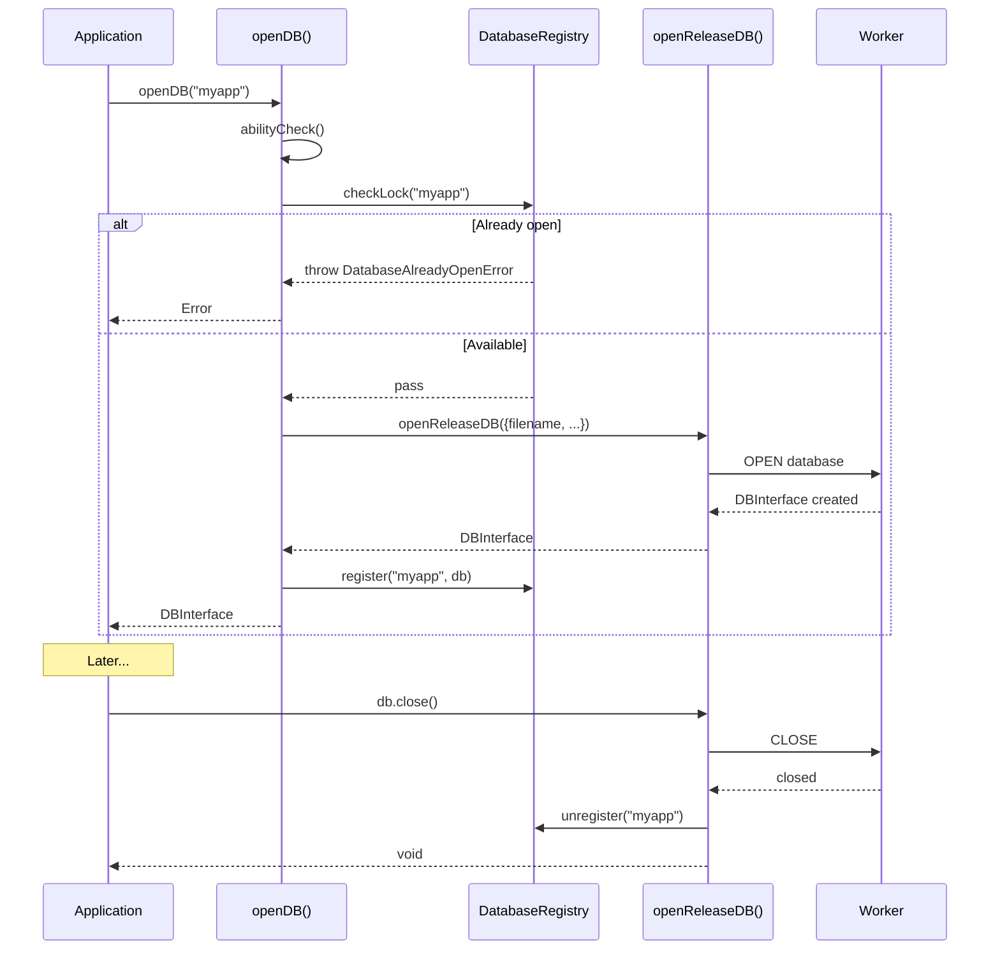

# TASK-203: Integrate Registry with openDB

## Metadata

- **Task ID**: TASK-203
- **Title**: [Registry] Integrate Registry with openDB
- **Priority**: P0 (Blocker)
- **Status**: In Progress
- **Dependencies**: TASK-201 (Registry module available)
- **Boundary**: `src/main.ts`, `src/release/release-manager.ts`
- **Estimated**: 3 hours

---

## 1. Purpose

Integrate the Database Registry (TASK-201) with the `openDB()` function to:

1. Prevent duplicate database opens with lock checking
2. Register databases after successful open
3. Unregister databases on close

---

## 2. Upstream Dependencies

### Completed Tasks

- **TASK-201**: Database Registry module (`src/registry/database-registry.ts`)
  - `DatabaseRegistry` singleton instance
  - `normalizeDatabaseName()` helper
  - `register()`, `unregister()`, `get()`, `has()`, `list()` methods
  - `checkLock()`, `acquireLock()`, `releaseLock()` lock methods
  - `DatabaseAlreadyOpenError` and `DatabaseNotFoundError` error classes

### Relevant Documentation

- **API Contract**: `agent-docs/05-design/01-contracts/01-api.md` - `openDB()` flow diagram includes registry steps
- **Core Module**: `agent-docs/05-design/03-modules/core.md` - `openDB()` responsibilities

---

## 3. Implementation Specification

### 3.1. Files to Modify

1. **`src/main.ts`** - Add registry integration to `openDB()`
2. **`src/release/release-manager.ts`** - Add registry integration to `close()`

### 3.2. Changes to `src/main.ts`

**Add import:**

```typescript
import { DatabaseRegistry } from "./registry/database-registry";
```

**Update `openDB()` function:**

```typescript
export const openDB = async (
  filename: string,
  options?: OpenDBOptions,
): Promise<DBInterface> => {
  abilityCheck();

  // NEW: Check lock before opening
  DatabaseRegistry.checkLock(filename);

  const { sendMsg } = createWorkerBridge();
  const runMutex = createMutex();

  const db = await openReleaseDB({
    filename,
    options,
    sendMsg,
    runMutex,
  });

  // NEW: Register after successful open
  DatabaseRegistry.register(filename, db);

  return db;
};
```

### 3.3. Changes to `src/release/release-manager.ts`

**Add import:**

```typescript
import { DatabaseRegistry } from "../registry/database-registry";
```

**Update `close()` function:**

```typescript
const close = async (): Promise<void> => {
  return runMutex(async () => {
    await sendMsg(SqliteEvent.CLOSE);
    // NEW: Unregister from registry after close
    // Need access to filename - will require passing filename to openReleaseDB
  });
};
```

**Note**: The `close()` function needs access to `normalizedFilename` to call `unregister()`. This requires:

1. Adding `filename` to the `ReleaseManagerDeps` type
2. Passing `filename` from `main.ts` to `openReleaseDB()`

### 3.4. Type Updates

**Update `src/release/types.ts`:**

```typescript
export type ReleaseManagerDeps = {
  filename: string; // NEW: Add filename for unregister on close
  options?: OpenDBOptions;
  sendMsg: <TRes, TReq = unknown>(
    event: SqliteEvent,
    payload?: TReq,
  ) => Promise<TRes>;
  runMutex: <T>(callback: () => Promise<T>) => Promise<T>;
};
```

**Update `src/main.ts` call:**

```typescript
const db = await openReleaseDB({
  filename, // NEW: Pass filename
  options,
  sendMsg,
  runMutex,
});
```

**Update `src/release/release-manager.ts` function signature:**

```typescript
export const openReleaseDB = async ({
  filename, // NEW: Add filename parameter
  options,
  sendMsg,
  runMutex,
}: ReleaseManagerDeps): Promise<DBInterface> => {
  // ... existing code ...
  const normalizedFilename = normalizeFilename(filename);

  // ... existing code ...

  const close = async (): Promise<void> => {
    return runMutex(async () => {
      await sendMsg(SqliteEvent.CLOSE);
      DatabaseRegistry.unregister(normalizedFilename); // NEW: Unregister
    });
  };
  // ...
};
```

---

## 4. Definition of Done (DoD)

TASK-203 is COMPLETE when:

1. **Code Changes**:
   - [ ] `src/main.ts` imports `DatabaseRegistry`
   - [ ] `src/main.ts` calls `checkLock()` before `openReleaseDB()`
   - [ ] `src/main.ts` calls `register()` after successful `openReleaseDB()`
   - [ ] `src/release/types.ts` includes `filename` in `ReleaseManagerDeps`
   - [ ] `src/release/release-manager.ts` imports `DatabaseRegistry`
   - [ ] `src/release/release-manager.ts` calls `unregister()` in `close()`

2. **Error Handling**:
   - [ ] Opening same database twice throws `DatabaseAlreadyOpenError`
   - [ ] Error message: "Database '{filename}' is already open"

3. **Testing**:
   - [ ] E2E test: Opening same database twice throws error
   - [ ] E2E test: Database registered after successful open
   - [ ] E2E test: Database unregistered after close
   - [ ] All existing tests still pass

4. **Documentation**:
   - [ ] Status board updated (`agent-docs/00-control/01-status.md`)
   - [ ] Task catalog updated to `[x] TASK-203`

---

## 5. Sequence Diagram



---

## 6. Edge Cases

1. **Normalized Filename**: Registry uses `normalizeDatabaseName()` which adds `.sqlite3` suffix. The `openReleaseDB()` uses `normalizeFilename()`. Both should produce consistent results.

2. **Close Timing**: The unregister should happen AFTER the worker CLOSE is successful, not before.

3. **Error on Open**: If `openReleaseDB()` throws after `checkLock()` passes, the database is never registered. This is correct behavior.

4. **Double Close**: If `close()` is called twice, the second `unregister()` should be safe (it's a no-op if the key doesn't exist).

---

## 7. Testing Plan

### E2E Test: Registry Integration

**File**: `tests/e2e/registry-integration.e2e.test.ts` (new file)

```typescript
import { describe, it, expect, beforeEach } from "vitest";
import { openDB } from "web-sqlite-js";
import { DatabaseRegistry } from "../../src/registry/database-registry";

describe("Registry Integration (TASK-203)", () => {
  beforeEach(() => {
    DatabaseRegistry._clear(); // Clear registry between tests
  });

  it("should throw error when opening same database twice", async () => {
    const db1 = await openDB("test-db");
    expect(db1).toBeDefined();

    await expect(openDB("test-db")).rejects.toThrow(
      "Database 'test-db.sqlite3' is already open",
    );

    await db1.close();
  });

  it("should register database after successful open", async () => {
    const db = await openDB("myapp");
    expect(DatabaseRegistry.has("myapp")).toBe(true);
    expect(DatabaseRegistry.get("myapp")).toBe(db);
    await db.close();
  });

  it("should unregister database after close", async () => {
    const db = await openDB("myapp");
    expect(DatabaseRegistry.has("myapp")).toBe(true);

    await db.close();
    expect(DatabaseRegistry.has("myapp")).toBe(false);
  });

  it("should allow opening same database after close", async () => {
    const db1 = await openDB("test-db");
    await db1.close();

    // Should not throw - database was closed and unregistered
    const db2 = await openDB("test-db");
    expect(db2).toBeDefined();
    await db2.close();
  });
});
```

---

## 8. References

- **Registry Module**: `src/registry/database-registry.ts`
- **Task Catalog**: `agent-docs/07-taskManager/02-task-catalog.md#TASK-203`
- **API Contract**: `agent-docs/05-design/01-contracts/01-api.md#openDB`
- **Core Module LLD**: `agent-docs/05-design/03-modules/core.md`
