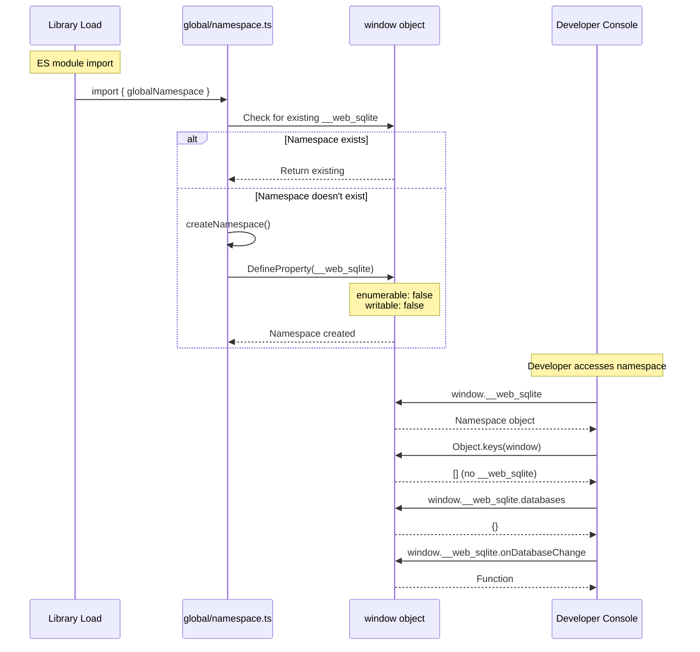

# TASK-204: Initialize Global Namespace

## Metadata

- **Task ID**: TASK-204
- **Title**: [Namespace] Initialize Global Namespace
- **Priority**: P0
- **Status**: In Progress
- **Dependencies**: TASK-203 (Registry integration complete)
- **Boundary**: `src/global/namespace.ts` (new file)
- **Estimated**: 2 hours

---

## 1. Purpose

Create and initialize the `window.__web_sqlite` global namespace object to provide:

1. Direct access to opened database instances via `window.__web_sqlite.databases`
2. Event subscription API via `window.__web_sqlite.onDatabaseChange()`
3. Non-enumerable property to avoid pollution of `Object.keys(window)`

---

## 2. Upstream Dependencies

### Completed Tasks

- **TASK-203**: Registry integration with openDB/close
  - `DatabaseRegistry.register()` called after successful open
  - `DatabaseRegistry.unregister()` called after close
  - Registry tracks all opened databases

### Relevant Documentation

- **F-001 v2.0.0 Feature** (`agent-docs/01-discovery/features/F-001-v2-logging-direct-access.md`)
  - FR-003: Global Database Registry (Direct Access)
  - Type definitions for `Window.__web_sqlite` namespace
- **HLD** (`agent-docs/03-architecture/01-hld.md`)
  - Section 5.5: Global Namespace
  - Container diagram showing namespace component
- **ADR-0006**: TypeScript type system strategy

---

## 3. Implementation Specification

### 3.1. Files to Create

1. **`src/global/namespace.ts`** - Namespace initialization module

### 3.2. New File: `src/global/namespace.ts`

```typescript
import type { DBInterface } from "../types/DB";
import type { DatabaseChangeEvent } from "../types/global";

/**
 * Global namespace for web-sqlite-js
 * Provides direct access to opened database instances and event subscription
 *
 * Properties:
 * - databases: Record<string, DBInterface> - Map of opened database instances
 * - onDatabaseChange: (callback) => () => void - Subscribe to database lifecycle events
 */
export interface WebSqliteNamespace {
  /**
   * Map of currently opened database instances
   * Key: normalized database name (e.g., "myapp.sqlite3")
   * Value: Database interface instance
   * @readonly
   */
  readonly databases: Record<string, DBInterface>;

  /**
   * Subscribe to database open/close events
   * @param callback - Called when a database is opened or closed
   * @returns Unsubscribe function
   */
  onDatabaseChange(callback: (event: DatabaseChangeEvent) => void): () => void;

  /**
   * Internal method to update databases from registry
   * Called by DatabaseRegistry on register/unregister
   * @internal
   */
  _updateDatabases(databases: Record<string, DBInterface>): void;

  /**
   * Internal method to emit database change events
   * @internal
   */
  _emitEvent(event: DatabaseChangeEvent): void;
}

/**
 * Event emitted when a database is opened or closed
 */
export interface DatabaseChangeEvent {
  /**
   * What happened: 'opened' | 'closed'
   */
  action: "opened" | "closed";

  /**
   * Which database changed (normalized name, e.g., "myapp.sqlite3")
   */
  dbName: string;

  /**
   * All currently opened database names
   */
  databases: string[];
}

/**
 * Global namespace property name
 */
const NAMESPACE_PROPERTY = "__web_sqlite";

/**
 * Event emitter for database change events
 */
class DatabaseEventEmitter {
  private subscribers: Set<(event: DatabaseChangeEvent) => void> = new Set();

  subscribe(callback: (event: DatabaseChangeEvent) => void): () => void {
    this.subscribers.add(callback);
    return () => {
      this.subscribers.delete(callback);
    };
  }

  emit(event: DatabaseChangeEvent): void {
    for (const callback of this.subscribers) {
      try {
        callback(event);
      } catch (error) {
        // Error isolation: callback errors don't break other subscribers
        console.error("[__web_sqlite] Event callback error:", error);
      }
    }
  }
}

/**
 * Initialize the global namespace object
 */
function createNamespace(): WebSqliteNamespace {
  const eventEmitter = new DatabaseEventEmitter();

  const namespace: WebSqliteNamespace = {
    // Initialize with empty databases object
    databases: {},

    onDatabaseChange(
      callback: (event: DatabaseChangeEvent) => void,
    ): () => void {
      return eventEmitter.subscribe(callback);
    },

    _updateDatabases(databases: Record<string, DBInterface>): void {
      // Update the databases record (still externally readonly)
      Object.assign(this.databases, databases);
    },

    _emitEvent(event: DatabaseChangeEvent): void {
      eventEmitter.emit(event);
    },
  };

  return namespace;
}

/**
 * Initialize or get the existing global namespace
 */
function getOrCreateNamespace(): WebSqliteNamespace {
  const existing = (window as unknown as Record<string, unknown>)[
    NAMESPACE_PROPERTY
  ] as WebSqliteNamespace | undefined;

  if (existing) {
    return existing;
  }

  const namespace = createNamespace();

  // Define as non-enumerable property on window
  Object.defineProperty(window, NAMESPACE_PROPERTY, {
    value: namespace,
    writable: false,
    enumerable: false, // Key: Don't appear in Object.keys(window)
    configurable: false,
  });

  return namespace;
}

/**
 * Global namespace instance
 * Exported for registry integration
 */
export const globalNamespace = getOrCreateNamespace();
```

### 3.3. Files to Modify

1. **`src/types/global.ts`** (new file) - Global type definitions

```typescript
import type { DBInterface } from "./DB";

/**
 * Event emitted when a database is opened or closed
 */
export interface DatabaseChangeEvent {
  /**
   * What happened: 'opened' | 'closed'
   */
  action: "opened" | "closed";

  /**
   * Which database changed (normalized name, e.g., "myapp.sqlite3")
   */
  dbName: string;

  /**
   * All currently opened database names
   */
  databases: string[];
}

/**
 * Extend the Window interface with the global namespace
 */
declare global {
  interface Window {
    /**
     * web-sqlite-js global namespace
     * Provides direct access to opened database instances
     */
    __web_sqlite: {
      /**
       * Map of currently opened database instances
       * Key: normalized database name (e.g., "myapp.sqlite3")
       * Value: Database interface instance
       * @readonly
       */
      readonly databases: Record<string, DBInterface>;

      /**
       * Subscribe to database open/close events
       * @param callback - Called when a database is opened or closed
       * @returns Unsubscribe function
       */
      onDatabaseChange(
        callback: (event: DatabaseChangeEvent) => void,
      ): () => void;
    };
  }
}

export {};
```

### 3.4. Import Changes

**Add to `src/main.ts`:**

```typescript
// Add at top with other imports
import { globalNamespace } from "./global/namespace";
```

This initializes the namespace on library load via ES module import.

---

## 4. Definition of Done (DoD)

TASK-204 is COMPLETE when:

1. **Code Changes**:
   - [ ] `src/global/namespace.ts` created with namespace implementation
   - [ ] `src/types/global.ts` created with type definitions
   - [ ] `src/main.ts` imports `globalNamespace` (triggers IIFE initialization)

2. **Namespace Verification**:
   - [ ] `window.__web_sqlite` is accessible
   - [ ] `Object.keys(window)` does NOT include `"__web_sqlite"`
   - [ ] `window.__web_sqlite.databases` exists (empty object initially)
   - [ ] `window.__web_sqlite.onDatabaseChange` is a function

3. **Type Safety**:
   - [ ] TypeScript compiles without errors
   - [ ] `Window.__web_sqlite` properties are typed correctly
   - [ ] IntelliSense shows namespace properties

4. **Testing**:
   - [ ] Unit test: Namespace accessible via `window.__web_sqlite`
   - [ ] Unit test: Namespace not enumerable
   - [ ] Unit test: `databases` property exists
   - [ ] Unit test: `onDatabaseChange` function exists
   - [ ] All existing tests still pass

5. **Documentation**:
   - [ ] Task catalog updated with Micro-Spec link
   - [ ] Status board updated (`agent-docs/00-control/01-status.md`)

---

## 5. Sequence Diagram



---

## 6. Edge Cases

1. **Multiple Initialization**: If module is imported multiple times, return existing namespace (singleton pattern).

2. **Property Collision**: The `__web_sqlite` name is prefixed with `__` to minimize collision risk with other libraries.

3. **Non-enumerable**: Using `enumerable: false` ensures the property doesn't appear in `Object.keys(window)` or `for...in` loops.

4. **Read-only Externally**: The `databases` property uses `readonly` in TypeScript, but the internal `_updateDatabases` method can still modify it via `Object.assign`.

5. **IIFE Timing**: The namespace is created immediately on module import, which happens when the library is first imported by the user application.

---

## 7. Testing Plan

### Unit Test: Namespace Initialization

**File**: `src/global/namespace.unit.test.ts` (new file)

```typescript
import { describe, it, expect, beforeEach } from "vitest";
import { globalNamespace } from "./namespace";

describe("Global Namespace (TASK-204)", () => {
  it("should create namespace accessible via window.__web_sqlite", () => {
    expect(window.__web_sqlite).toBeDefined();
    expect(globalNamespace).toBe(window.__web_sqlite);
  });

  it("should not be enumerable in Object.keys(window)", () => {
    const windowKeys = Object.keys(window);
    expect(windowKeys).not.toContain("__web_sqlite");
  });

  it("should have databases property", () => {
    expect(window.__web_sqlite.databases).toBeDefined();
    expect(typeof window.__web_sqlite.databases).toBe("object");
  });

  it("should have onDatabaseChange function", () => {
    expect(window.__web_sqlite.onDatabaseChange).toBeDefined();
    expect(typeof window.__web_sqlite.onDatabaseChange).toBe("function");
  });

  it("should return unsubscribe function from onDatabaseChange", () => {
    const unsubscribe = window.__web_sqlite.onDatabaseChange(() => {});
    expect(typeof unsubscribe).toBe("function");
  });

  it("should be singleton (same instance on multiple imports)", () => {
    const ns1 = window.__web_sqlite;
    // Simulating re-import by accessing again
    const ns2 = window.__web_sqlite;
    expect(ns1).toBe(ns2);
  });
});
```

---

## 8. References

- **Feature Spec**: `agent-docs/01-discovery/features/F-001-v2-logging-direct-access.md#fr-003`
- **HLD**: `agent-docs/03-architecture/01-hld.md#55-global-namespace-v200`
- **ADR-0006**: `agent-docs/04-adr/0006-typescript-type-system.md`
- **Event Catalog**: `agent-docs/05-design/01-contracts/02-events.md#60-database-change-events`
- **Task Catalog**: `agent-docs/07-taskManager/02-task-catalog.md#TASK-204`
