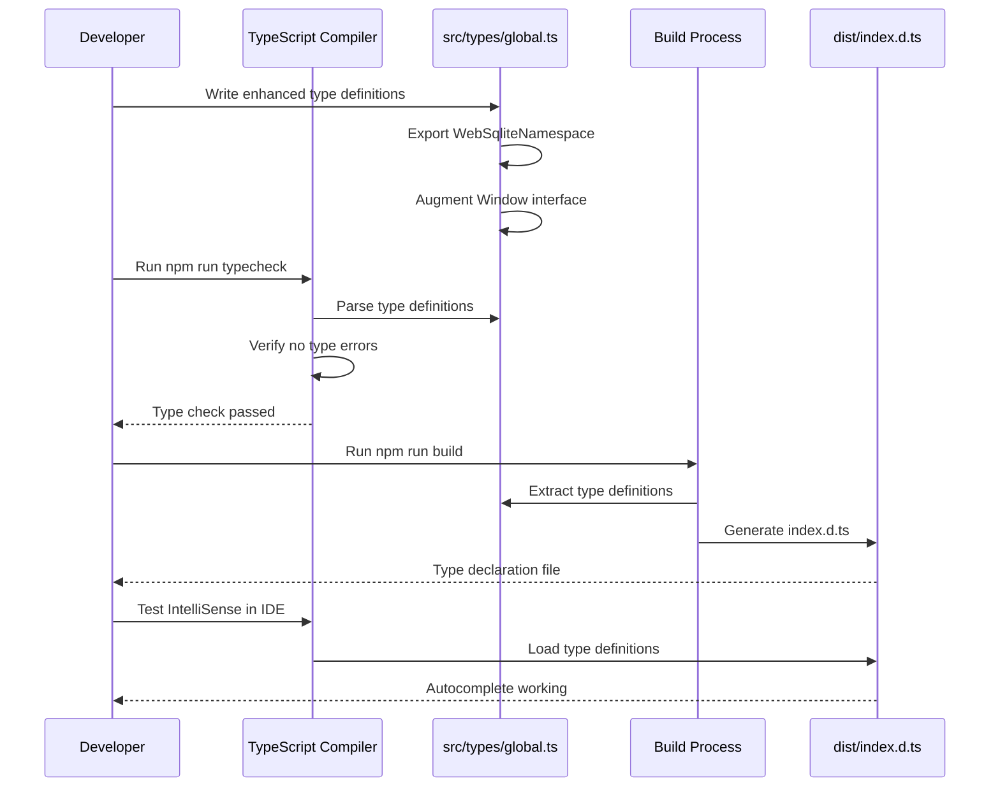

# TASK-205: Define Namespace Type Definitions

## Metadata

- **Task ID**: TASK-205
- **Title**: [Namespace] Define Namespace Type Definitions
- **Priority**: P0
- **Status**: In Progress
- **Dependencies**: TASK-204 (Namespace initialized)
- **Boundary**: `src/types/global.ts`, `src/global/namespace.ts`
- **Estimated**: 2 hours

---

## 1. Purpose

Enhance and validate TypeScript type definitions for the global namespace to ensure:

1. Complete IntelliSense support for `window.__web_sqlite`
2. Type definitions included in build output
3. Types exported for consumer use
4. Full type safety across the namespace API

---

## 2. Upstream Dependencies

### Completed Tasks

- **TASK-204**: Global namespace initialized
  - `src/global/namespace.ts` created with namespace implementation
  - `src/types/global.ts` created with basic `Window.__web_sqlite` interface
  - `DatabaseChangeEvent` interface defined
  - Namespace accessible via `window.__web_sqlite`

### Relevant Documentation

- **ADR-0006**: TypeScript type system strategy
  - Generic type parameters for query results
  - Type definitions included in npm package
  - `strict: true` in tsconfig.json
- **Event Catalog** (`agent-docs/05-design/01-contracts/02-events.md`)
  - Section 6: Database Change Events
  - `DatabaseChangeEvent` schema defined
- **API Contracts** (`agent-docs/05-design/01-contracts/01-api.md`)
  - v2.0.0 global namespace API documentation

---

## 3. Current State Analysis

### Existing Types (from TASK-204)

**`src/types/global.ts`**:

```typescript
import type { DBInterface } from "./DB";

export interface DatabaseChangeEvent {
  action: "opened" | "closed";
  dbName: string;
  databases: string[];
}

declare global {
  interface Window {
    __web_sqlite: {
      readonly databases: Record<string, DBInterface>;
      onDatabaseChange(
        callback: (event: DatabaseChangeEvent) => void,
      ): () => void;
    };
  }
}

export {};
```

**`src/global/namespace.ts`**:

```typescript
export interface WebSqliteNamespace {
  readonly databases: Record<string, DBInterface>;
  onDatabaseChange(callback: (event: DatabaseChangeEvent) => void): () => void;
  _updateDatabases(databases: Record<string, DBInterface>): void;
  _emitEvent(event: DatabaseChangeEvent): void;
}
```

### Gaps Identified

1. **Duplicate type definitions**: `WebSqliteNamespace` in `namespace.ts` duplicates `Window.__web_sqlite`
2. **Missing type re-exports**: `WebSqliteNamespace` not exported from `types/global.ts`
3. **Inconsistent interfaces**: `Window.__web_sqlite` missing `_updateDatabases` and `_emitEvent` (internal methods)
4. **Build output verification**: Need to verify types are included in `dist/` folder
5. **Type documentation**: JSDoc comments may need enhancement

---

## 4. Implementation Specification

### 4.1. Files to Modify

1. **`src/types/global.ts`** - Enhance type definitions and add re-exports
2. **`src/global/namespace.ts`** - Ensure interface consistency (may need updates)

### 4.2. Enhanced Type Definitions

**Update `src/types/global.ts`**:

````typescript
import type { DBInterface } from "./DB";

/**
 * Event emitted when a database is opened or closed
 */
export interface DatabaseChangeEvent {
  /**
   * What happened: 'opened' | 'closed'
   */
  action: "opened" | "closed";

  /**
   * Which database changed (normalized name, e.g., "myapp.sqlite3")
   */
  dbName: string;

  /**
   * All currently opened database names
   */
  databases: string[];
}

/**
 * Global namespace for web-sqlite-js
 * Provides direct access to opened database instances and event subscription
 *
 * @example
 * ```typescript
 * // Access database directly
 * const db = window.__web_sqlite.databases["myapp.sqlite3"];
 *
 * // Subscribe to database changes
 * const unsubscribe = window.__web_sqlite.onDatabaseChange((event) => {
 *   console.log(`Database ${event.action}: ${event.dbName}`);
 * });
 * ```
 */
export interface WebSqliteNamespace {
  /**
   * Map of currently opened database instances
   * Key: normalized database name (e.g., "myapp.sqlite3")
   * Value: Database interface instance
   * @readonly
   */
  readonly databases: Record<string, DBInterface>;

  /**
   * Subscribe to database open/close events
   * @param callback - Called when a database is opened or closed
   * @returns Unsubscribe function
   * @example
   * ```typescript
   * const unsubscribe = window.__web_sqlite.onDatabaseChange((event) => {
   *   if (event.action === "opened") {
   *     console.log("New database:", event.dbName);
   *   }
   * });
   * // Later: unsubscribe();
   * ```
   */
  onDatabaseChange(callback: (event: DatabaseChangeEvent) => void): () => void;
}

/**
 * Extend the global Window interface with web-sqlite-js namespace
 * This allows TypeScript to recognize `window.__web_sqlite` property
 */
declare global {
  interface Window {
    /**
     * web-sqlite-js global namespace
     * Provides direct access to opened database instances and event subscription
     */
    readonly __web_sqlite: WebSqliteNamespace;
  }
}

/**
 * Export empty object to make this a module
 * Required for `declare global` augmentation to work
 */
export {};
````

### 4.3. Build Verification

After types are updated, verify build output includes type definitions:

```bash
# Build the project
npm run build

# Verify type definitions exist in dist/
ls -la dist/
# Expected: dist/index.d.ts (type declaration file)

# Verify types are accessible
cat dist/index.d.ts | grep -A 10 "__web_sqlite"
```

### 4.4. TypeScript Compilation Verification

```bash
# Run type checking
npm run typecheck

# Expected: No errors
```

---

## 5. Definition of Done (DoD)

TASK-205 is COMPLETE when:

1. **Code Changes**:
   - [ ] `src/types/global.ts` enhanced with re-exported `WebSqliteNamespace`
   - [ ] `Window.__web_sqlite` uses `WebSqliteNamespace` type (eliminates duplication)
   - [ ] JSDoc comments enhanced with examples
   - [ ] `readonly` modifier added to `Window.__web_sqlite` property

2. **Type Safety**:
   - [ ] TypeScript compiles without errors (`npm run typecheck`)
   - [ ] `strict: true` mode passes
   - [ ] No duplicate type definitions
   - [ ] `WebSqliteNamespace` exported from `types/global.ts`

3. **Build Output**:
   - [ ] `dist/index.d.ts` includes `Window.__web_sqlite` augmentation
   - [ ] `WebSqliteNamespace` type included in declaration file
   - [ ] `DatabaseChangeEvent` type included in declaration file

4. **IntelliSense Verification**:
   - [ ] Typing `window.__` shows `__web_sqlite` in autocomplete
   - [ ] Typing `window.__web_sqlite.` shows `databases` and `onDatabaseChange`
   - [ ] Type checking prevents invalid assignments to `databases` property

5. **Testing**:
   - [ ] Type test file compiles (new `types/global.type.test.ts`)
   - [ ] All existing tests still pass
   - [ ] No regressions in type coverage

6. **Documentation**:
   - [ ] Task catalog updated with Micro-Spec link
   - [ ] Status board updated (`agent-docs/00-control/01-status.md`)

---

## 6. Type Test File

**Create `src/types/global.type.test.ts`** (compile-time type checking only):

```typescript
import type { WebSqliteNamespace, DatabaseChangeEvent } from "./global";

// Type: Window.__web_sqlite should be WebSqliteNamespace
const ns: WebSqliteNamespace = window.__web_sqlite;

// Type: databases should be readonly
// @ts-expect-error - Cannot assign to readonly property
ns.databases = {};

// Type: onDatabaseChange returns unsubscribe function
const unsubscribe: () => void = window.__web_sqlite.onDatabaseChange(
  (event: DatabaseChangeEvent) => {
    // Type: event.action should be literal "opened" | "closed"
    const action: "opened" | "closed" = event.action;

    // Type: event.dbName should be string
    const name: string = event.dbName;

    // Type: event.databases should be string[]
    const dbs: string[] = event.databases;
  },
);

// Type: DatabaseChangeEvent properties
const event: DatabaseChangeEvent = {
  action: "opened",
  dbName: "test.sqlite3",
  databases: ["test.sqlite3"],
};

// @ts-expect-error - action must be "opened" | "closed"
const invalidEvent1: DatabaseChangeEvent = {
  action: "invalid",
  dbName: "test.sqlite3",
  databases: [],
};

// @ts-expect-error - dbName is required
const invalidEvent2: DatabaseChangeEvent = {
  action: "opened",
  databases: [],
};
```

Run type check only (no execution):

```bash
npx tsx src/types/global.type.test.ts --noEmit
```

---

## 7. Sequence Diagram



---

## 8. Edge Cases

1. **Module Augmentation**: `declare global` requires `export {}` to be a module
   - **Solution**: Already in place, keep as-is

2. **Type Duplication**: `WebSqliteNamespace` defined in multiple files
   - **Solution**: Export from `types/global.ts`, import in `namespace.ts`

3. **Readonly Enforcement**: `readonly` in TypeScript is compile-time only
   - **Mitigation**: Document in JSDoc, runtime enforcement via internal methods

4. **Build Output Types**: Vite may not generate `.d.ts` files by default
   - **Solution**: Verify `vite.config.ts` has `build.lib` configuration with proper `fileName`

5. **Consumer Access**: Users need to import `WebSqliteNamespace` type
   - **Solution**: Export from `types/global.ts` for explicit imports

---

## 9. Testing Plan

### Type Checking Tests

**File**: `src/types/global.type.test.ts` (new file, compile-time only)

Test cases:

- [ ] `window.__web_sqlite` assignable to `WebSqliteNamespace`
- [ ] `databases` property is `readonly` (compile error on assignment)
- [ ] `onDatabaseChange` returns `() => void` (cancel function)
- [ ] `DatabaseChangeEvent` properties have correct types
- [ ] Invalid `action` values cause compile error
- [ ] Missing required properties cause compile error

### Build Verification

```bash
# 1. Type check
npm run typecheck

# 2. Build
npm run build

# 3. Verify .d.ts file exists
test -f dist/index.d.ts && echo "✅ Declaration file exists"

# 4. Verify types in declaration file
grep -q "WebSqliteNamespace" dist/index.d.ts && echo "✅ WebSqliteNamespace exported"
grep -q "DatabaseChangeEvent" dist/index.d.ts && echo "✅ DatabaseChangeEvent exported"
grep -q "__web_sqlite" dist/index.d.ts && echo "✅ Window augmentation included"

# 5. Run all tests
npm test
```

---

## 10. References

- **Feature Spec**: `agent-docs/01-discovery/features/F-001-v2-logging-direct-access.md#fr-003`
- **HLD**: `agent-docs/03-architecture/01-hld.md#55-global-namespace-v200`
- **ADR-0006**: `agent-docs/04-adr/0006-typescript-type-system.md`
- **Event Catalog**: `agent-docs/05-design/01-contracts/02-events.md#60-database-change-events`
- **Task Catalog**: `agent-docs/07-taskManager/02-task-catalog.md#TASK-205`
- **TASK-204 Spec**: `agent-docs/08-task/active/TASK-204.md`

---

## 11. Changes Summary

| File                            | Change                                            | Reason                    |
| ------------------------------- | ------------------------------------------------- | ------------------------- |
| `src/types/global.ts`           | Add `WebSqliteNamespace` export                   | Re-export for consumers   |
| `src/types/global.ts`           | Use `WebSqliteNamespace` in `Window.__web_sqlite` | Eliminate duplication     |
| `src/types/global.ts`           | Add JSDoc examples                                | Better IntelliSense       |
| `src/types/global.ts`           | Add `readonly` to `Window.__web_sqlite`           | Type safety               |
| `src/types/global.type.test.ts` | Create type test file                             | Compile-time verification |
