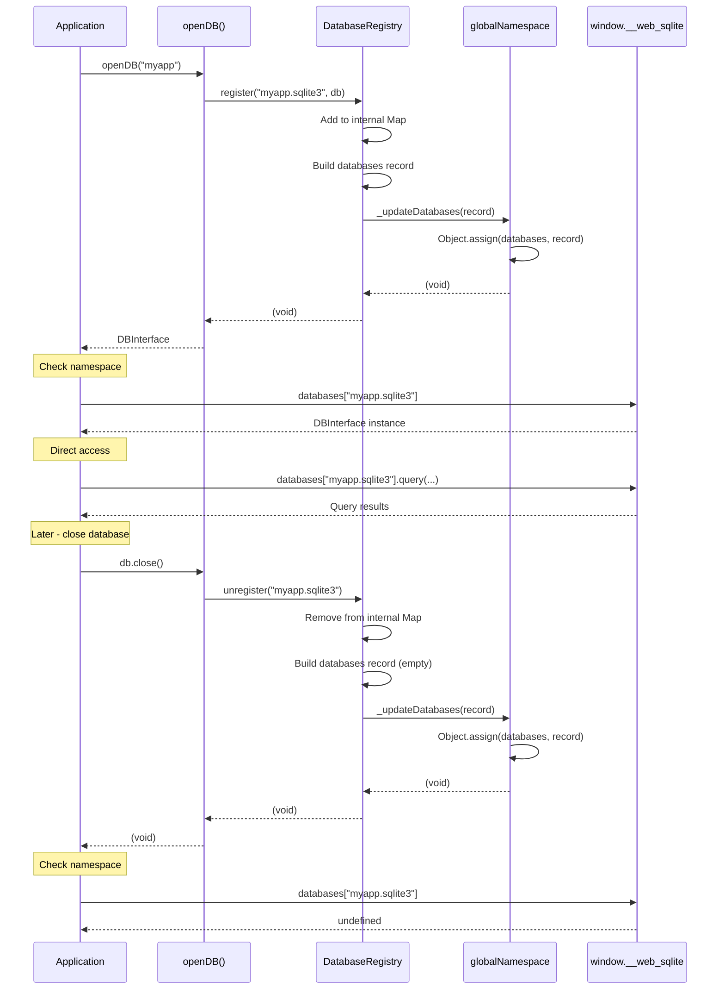

# TASK-206: Sync Namespace with Registry

## Metadata

- **Task ID**: TASK-206
- **Title**: [Namespace] Sync Namespace with Registry
- **Priority**: P0 (Blocker)
- **Status**: In Progress
- **Dependencies**: TASK-205 (Namespace types defined)
- **Boundary**: `src/registry/database-registry.ts`
- **Estimated**: 2 hours

---

## 1. Purpose

Synchronize the global namespace `databases` property with the database registry state. When a database is registered or unregistered in the registry, the namespace's `databases` record should automatically update to reflect the current state.

---

## 2. Upstream Dependencies

### Completed Tasks

- **TASK-204**: Global Namespace Initialization (`src/global/namespace.ts`)
  - `globalNamespace` singleton instance
  - `WebSqliteNamespace` interface with `databases` property
  - `_updateDatabases()` internal method for updating databases
  - Non-enumerable property on `window` object

- **TASK-205**: Namespace Type Definitions (`src/types/global.ts`)
  - `Window` interface extended with `__web_sqlite` property
  - `WebSqliteNamespace` interface with readonly `databases`
  - `DatabaseChangeEvent` type definition

### Relevant Documentation

- **HLD**: `agent-docs/03-architecture/01-hld.md` - Global namespace architecture (Section 5.5)
- **API Contract**: `agent-docs/05-design/01-contracts/01-api.md#module-global-namespace-v2.0.0`

---

## 3. Implementation Specification

### 3.1. Files to Modify

1. **`src/registry/database-registry.ts`** - Add namespace synchronization to `register()` and `unregister()`

### 3.2. Changes to `src/registry/database-registry.ts`

**Add import:**

```typescript
import { globalNamespace } from "../global/namespace";
```

**Update `register()` method:**

```typescript
register(filename: string, db: DBInterface): void {
  const normalized = normalizeDatabaseName(filename);
  if (this.databases.has(normalized)) {
    throw new DatabaseAlreadyOpenError(normalized);
  }
  this.databases.set(normalized, db);
  this.locks.add(normalized);

  // NEW: Sync namespace databases
  const databasesRecord: Record<string, DBInterface> = {};
  for (const [name, dbInstance] of this.databases) {
    databasesRecord[name] = dbInstance;
  }
  globalNamespace._updateDatabases(databasesRecord);
}
```

**Update `unregister()` method:**

```typescript
unregister(filename: string): void {
  const normalized = normalizeDatabaseName(filename);
  this.databases.delete(normalized);
  this.locks.delete(normalized);

  // NEW: Sync namespace databases
  const databasesRecord: Record<string, DBInterface> = {};
  for (const [name, dbInstance] of this.databases) {
    databasesRecord[name] = dbInstance;
  }
  globalNamespace._updateDatabases(databasesRecord);
}
```

### 3.3. Implementation Notes

1. **Readonly Enforcement**: The namespace's `databases` property is marked as `readonly` externally. Internal updates use `_updateDatabases()` which uses `Object.assign()` to modify the object while maintaining external readonly appearance.

2. **Full Rebuild**: Each call rebuilds the entire `databases` record from the registry's current state. This ensures consistency and is efficient given the typical number of open databases is small (<10).

3. **Timing**: The namespace update happens AFTER the registry operation succeeds, ensuring the namespace always reflects a consistent registry state.

---

## 4. Definition of Done (DoD)

TASK-206 is COMPLETE when:

1. **Code Changes**:
   - [ ] `src/registry/database-registry.ts` imports `globalNamespace`
   - [ ] `register()` calls `_updateDatabases()` after registering
   - [ ] `unregister()` calls `_updateDatabases()` after unregistering
   - [ ] Namespace `databases` reflects current registry state after each operation

2. **Functional Tests**:
   - [ ] `window.__web_sqlite.databases` contains database after `openDB()`
   - [ ] `window.__web_sqlite.databases` removes database after `close()`
   - [ ] Direct database access via namespace works: `window.__web_sqlite.databases["myapp.sqlite3"].query(...)`
   - [ ] Multiple databases appear in namespace correctly

3. **Testing**:
   - [ ] E2E test: Namespace databases populated after open
   - [ ] E2E test: Namespace databases removed after close
   - [ ] E2E test: Direct database access via namespace
   - [ ] All existing tests still pass

4. **Documentation**:
   - [ ] Status board updated (`agent-docs/00-control/01-status.md`)
   - [ ] Task catalog updated to `[x] TASK-206`

---

## 5. Sequence Diagram



---

## 6. Edge Cases

1. **Concurrent Access**: JavaScript is single-threaded, so no race conditions between register/unregister operations.

2. **Namespace Not Initialized**: The namespace is initialized on library load via IIFE in `src/global/namespace.ts`, so `globalNamespace` is always available when registry methods are called.

3. **Empty Registry**: When all databases are closed, the namespace's `databases` should be an empty object `{}`.

4. **Multiple Databases**: Opening multiple databases should result in all of them appearing in the namespace.

---

## 7. Testing Plan

### E2E Test: Namespace Synchronization

**File**: `tests/e2e/namespace-sync.e2e.test.ts` (new file)

```typescript
import { describe, it, expect, beforeEach } from "vitest";
import { openDB } from "web-sqlite-js";

describe("Namespace Synchronization (TASK-206)", () => {
  it("should populate namespace databases after open", async () => {
    const db = await openDB("myapp");

    // Check database appears in namespace
    expect(window.__web_sqlite.databases).toHaveProperty("myapp.sqlite3");
    expect(window.__web_sqlite.databases["myapp.sqlite3"]).toBe(db);

    await db.close();
  });

  it("should remove database from namespace after close", async () => {
    const db = await openDB("testdb");

    expect(window.__web_sqlite.databases).toHaveProperty("testdb.sqlite3");

    await db.close();

    expect(window.__web_sqlite.databases).not.toHaveProperty("testdb.sqlite3");
  });

  it("should allow direct database access via namespace", async () => {
    const db = await openDB("direct-access");

    // Create a table
    await db.exec("CREATE TABLE users (id INTEGER, name TEXT)");

    // Access via namespace
    const namespaceDb = window.__web_sqlite.databases["direct-access.sqlite3"];
    expect(namespaceDb).toBe(db);

    // Query via namespace reference
    const users = await namespaceDb.query("SELECT * FROM users");
    expect(users).toEqual([]);

    await db.close();
  });

  it("should handle multiple databases in namespace", async () => {
    const db1 = await openDB("db1");
    const db2 = await openDB("db2");
    const db3 = await openDB("db3");

    const databases = window.__web_sqlite.databases;

    expect(databases).toHaveProperty("db1.sqlite3");
    expect(databases).toHaveProperty("db2.sqlite3");
    expect(databases).toHaveProperty("db3.sqlite3");
    expect(databases["db1.sqlite3"]).toBe(db1);
    expect(databases["db2.sqlite3"]).toBe(db2);
    expect(databases["db3.sqlite3"]).toBe(db3);

    // Close one - others should remain
    await db2.close();

    expect(databases).toHaveProperty("db1.sqlite3");
    expect(databases).not.toHaveProperty("db2.sqlite3");
    expect(databases).toHaveProperty("db3.sqlite3");

    await db1.close();
    await db3.close();
  });

  it("should have empty databases object when no databases open", async () => {
    // Open and close a database
    const db = await openDB("temp");
    await db.close();

    // Namespace should have empty databases object
    expect(Object.keys(window.__web_sqlite.databases)).toHaveLength(0);
  });
});
```

### Unit Test: Registry Integration (Optional Enhancement)

**File**: `src/registry/database-registry.unit.test.ts` (extend existing)

```typescript
describe("Namespace Synchronization", () => {
  beforeEach(() => {
    DatabaseRegistry._clear();
    // Reset namespace databases
    (window as any).__web_sqlite.databases = {};
  });

  it("should update namespace on register", () => {
    const mockDb = {} as DBInterface;
    DatabaseRegistry.register("test", mockDb);

    expect(window.__web_sqlite.databases["test.sqlite3"]).toBe(mockDb);
  });

  it("should update namespace on unregister", () => {
    const mockDb = {} as DBInterface;
    DatabaseRegistry.register("test", mockDb);
    DatabaseRegistry.unregister("test");

    expect(window.__web_sqlite.databases["test.sqlite3"]).toBeUndefined();
  });
});
```

---

## 8. References

- **Registry Module**: `src/registry/database-registry.ts`
- **Namespace Module**: `src/global/namespace.ts`
- **Global Types**: `src/types/global.ts`
- **Task Catalog**: `agent-docs/07-taskManager/02-task-catalog.md#TASK-206`
- **API Contract**: `agent-docs/05-design/01-contracts/01-api.md#module-global-namespace-v2.0.0`
- **HLD**: `agent-docs/03-architecture/01-hld.md#55-global-namespace-v200
