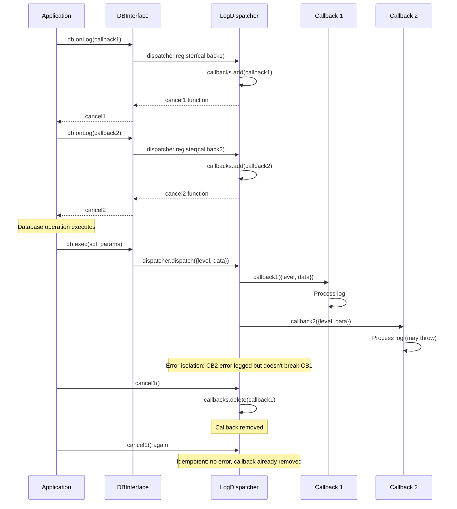

# TASK-207: Create Log Dispatcher

## Metadata

- **Task ID**: TASK-207
- **Title**: [Logging] Create Log Dispatcher
- **Priority**: P0
- **Status**: In Progress
- **Dependencies**: TASK-206 (Namespace sync complete)
- **Boundary**: `src/logs/log-dispatcher.ts` (new file)
- **Estimated**: 3 hours

---

## 1. Purpose

Create a log dispatcher for callback management that enables structured logging in v2.0.0. The log dispatcher will:

1. Manage multiple log callbacks per database instance
2. Provide error isolation (callback errors don't break database operations)
3. Return cancel functions for cleanup
4. Support idempotent cancellation

---

## 2. Upstream Dependencies

### Completed Tasks

- **TASK-204**: Global namespace initialized with `window.__web_sqlite`
- **TASK-205**: Type definitions for `WebSqliteNamespace` complete
- **TASK-206**: Namespace synchronized with registry state

### Relevant Documentation

- **F-001 v2.0.0 Feature** (`agent-docs/01-discovery/features/F-001-v2-logging-direct-access.md`)
  - FR-001: Structured Logging API with Cancel
  - LogEntry type definition: `{level: "info" | "debug" | "error", data: unknown}`
- **Event Catalog** (`agent-docs/05-design/01-contracts/02-events.md`)
  - Section 5: v2.0.0 Structured Logging Events
  - Log dispatch behavior and error isolation
- **Test Plan** (`agent-docs/06-implementation/02-test-plan.md`)
  - Selective unit testing for pure utilities (LogDispatcher qualifies)

---

## 3. Implementation Specification

### 3.1. Type Definition Updates

**Modify `src/types/DB.ts`:**

Add `LogEntry` type and `onLog` method to `DBInterface`:

```typescript
/**
 * Log entry with level and structured data
 */
export type LogEntry = {
  /**
   * Log level: 'info' | 'debug' | 'error'
   */
  level: "info" | "debug" | "error";

  /**
   * Log data (SQL, timing, errors, events, etc.)
   */
  data: unknown;
};

/** Primary DB interface used by client code. */
export interface DBInterface {
  // ... existing methods

  /**
   * Subscribe to log events
   * Logs include SQL execution, timing, errors, and application events
   *
   * @param callback - Called for each log entry
   * @returns Unsubscribe function
   *
   * @example
   * const unsubscribe = db.onLog((log) => {
   *     console.log(`[${log.level}]`, log.data);
   * });
   * // Later: unsubscribe();
   */
  onLog(callback: (log: LogEntry) => void): () => void;

  /** Dev tooling APIs for release testing. */
  devTool: DevTool;
}
```

### 3.2. New File: `src/logs/log-dispatcher.ts`

```typescript
import type { LogEntry } from "../types/DB";

/**
 * Log callback type
 * Receives structured log entries with level and data
 */
export type LogCallback = (log: LogEntry) => void;

/**
 * Cancel function type
 * Idempotent function to unregister a log callback
 */
export type CancelFn = () => void;

/**
 * Log Dispatcher interface
 * Returned by createLogDispatcher factory function
 */
export interface LogDispatcher {
  /**
   * Register a log callback
   * @returns Cancel function to unregister the callback
   */
  register: (callback: LogCallback) => CancelFn;

  /**
   * Dispatch a log entry to all registered callbacks
   */
  dispatch: (log: LogEntry) => void;

  /**
   * Get the number of registered callbacks
   * @internal
   */
  _getCallbackCount: () => number;

  /**
   * Clear all callbacks
   * @internal
   */
  _clear: () => void;
}

/**
 * Create a log dispatcher for managing log callbacks
 *
 * Functional implementation using closures for private state.
 * Each dispatcher instance has isolated callback tracking.
 *
 * Responsibilities:
 * - Register/unregister log callbacks
 * - Dispatch log entries to all registered callbacks
 * - Handle callback errors with isolation (errors don't break dispatching)
 * - Provide idempotent cancel functions
 *
 * Thread-safety: Main-thread only (JavaScript is single-threaded)
 *
 * @example
 * const dispatcher = createLogDispatcher();
 * const cancel = dispatcher.register((log) => console.log(log));
 * dispatcher.dispatch({level: "debug", data: {sql: "SELECT..."}});
 * cancel(); // Remove callback (idempotent)
 */
export function createLogDispatcher(): LogDispatcher {
  // Private state via closure
  const callbacks = new Set<LogCallback>();
  const canceled = new Set<CancelFn>();

  /**
   * Unregister a callback via its cancel function
   */
  const unregister = (cancelFn: CancelFn): void => {
    const callback = cancelFn as unknown as LogCallback;
    callbacks.delete(callback);
    canceled.add(cancelFn);
  };

  /**
   * Register a log callback
   */
  const register = (callback: LogCallback): CancelFn => {
    // Check if this callback was previously canceled
    if (canceled.has(callback as unknown as CancelFn)) {
      canceled.delete(callback as unknown as CancelFn);
    }

    callbacks.add(callback);

    // Create cancel function bound to this specific callback
    const cancelFn: CancelFn = () => {
      unregister(cancelFn);
    };

    // Store reference for idempotent cancellation
    (cancelFn as unknown) = callback;
    return cancelFn;
  };

  /**
   * Dispatch a log entry to all registered callbacks
   *
   * Callback errors are isolated - one callback throwing doesn't
   * prevent other callbacks from receiving the log entry.
   */
  const dispatch = (log: LogEntry): void => {
    for (const callback of callbacks) {
      try {
        callback(log);
      } catch (error) {
        // Error isolation: log callback errors but continue dispatching
        console.error("[LogDispatcher] Callback error:", error);
      }
    }
  };

  /**
   * Get the number of registered callbacks
   * @internal
   */
  const _getCallbackCount = (): number => callbacks.size;

  /**
   * Clear all callbacks
   * @internal
   */
  const _clear = (): void => {
    callbacks.clear();
    canceled.clear();
  };

  return { register, dispatch, _getCallbackCount, _clear };
}
```

### 3.3. Files to Modify

1. **`src/types/DB.ts`** - Add `LogEntry` type and `onLog` method to `DBInterface`

---

## 4. Definition of Done (DoD)

TASK-207 is COMPLETE when:

1. **Code Changes**:
   - [ ] `src/logs/log-dispatcher.ts` created with `createLogDispatcher()` factory function
   - [ ] `src/logs/log-dispatcher.ts` exports `LogDispatcher` interface
   - [ ] `src/types/DB.ts` updated with `LogEntry` type
   - [ ] `src/types/DB.ts` updated with `onLog` method in `DBInterface`

2. **Type Safety**:
   - [ ] TypeScript compiles without errors
   - [ ] `LogEntry` type exported from `src/types/DB.ts`
   - [ ] `LogDispatcher` interface properly typed
   - [ ] `createLogDispatcher()` returns proper interface
   - [ ] Cancel function is idempotent

3. **Unit Tests** (E2E tests will be added in TASK-209):
   - [ ] Register callback returns cancel function
   - [ ] Cancel function removes callback (idempotent)
   - [ ] Dispatch log to single callback
   - [ ] Dispatch log to multiple callbacks
   - [ ] Callback errors don't break dispatching (error isolation)
   - [ ] Re-registering canceled callback works
   - [ ] Independent dispatcher instances (closure isolation)

4. **Testing**:
   - [ ] All unit tests pass
   - [ ] All existing E2E tests still pass

5. **Documentation**:
   - [ ] Task catalog updated with Micro-Spec link
   - [ ] Status board updated (`agent-docs/00-control/01-status.md`)

---

## 5. Sequence Diagram



---

## 6. Edge Cases

1. **Idempotent Cancellation**: Calling cancel multiple times should not error.
   - Implemented via `canceled` Set check

2. **Callback Re-registration**: A previously canceled callback can be registered again.
   - Check `canceled` Set on register and remove if present

3. **Error Isolation**: One callback throwing doesn't prevent others from receiving logs.
   - Wrap each callback invocation in try/catch

4. **Empty Dispatcher**: Dispatching with no callbacks is a no-op (no error).

5. **Cancellation During Dispatch**: Canceling during dispatch doesn't affect current dispatch iteration.
   - Set iteration continues even if callbacks are deleted during loop

---

## 7. Testing Plan

### Unit Test: Log Dispatcher

**File**: `src/logs/log-dispatcher.unit.test.ts` (new file)

```typescript
import { describe, it, expect, beforeEach, vi } from "vitest";
import { createLogDispatcher } from "./log-dispatcher";
import type { LogEntry } from "../types/DB";

describe("LogDispatcher (TASK-207)", () => {
  let dispatcher: ReturnType<typeof createLogDispatcher>;

  beforeEach(() => {
    dispatcher = createLogDispatcher();
  });

  it("should register callback and return cancel function", () => {
    const callback = vi.fn();
    const cancel = dispatcher.register(callback);

    expect(typeof cancel).toBe("function");
    expect(dispatcher._getCallbackCount()).toBe(1);
  });

  it("should dispatch log to single callback", () => {
    const callback = vi.fn();
    dispatcher.register(callback);

    const log: LogEntry = {
      level: "debug",
      data: { sql: "SELECT * FROM users" },
    };
    dispatcher.dispatch(log);

    expect(callback).toHaveBeenCalledWith(log);
    expect(callback).toHaveBeenCalledTimes(1);
  });

  it("should dispatch log to multiple callbacks", () => {
    const callback1 = vi.fn();
    const callback2 = vi.fn();
    dispatcher.register(callback1);
    dispatcher.register(callback2);

    const log: LogEntry = { level: "info", data: { action: "commit" } };
    dispatcher.dispatch(log);

    expect(callback1).toHaveBeenCalledWith(log);
    expect(callback2).toHaveBeenCalledWith(log);
  });

  it("should cancel callback when cancel function is called", () => {
    const callback = vi.fn();
    const cancel = dispatcher.register(callback);

    cancel();
    dispatcher.dispatch({ level: "debug", data: {} });

    expect(callback).not.toHaveBeenCalled();
    expect(dispatcher._getCallbackCount()).toBe(0);
  });

  it("should be idempotent (cancel can be called multiple times)", () => {
    const callback = vi.fn();
    const cancel = dispatcher.register(callback);

    cancel();
    cancel();
    cancel(); // Should not error

    expect(dispatcher._getCallbackCount()).toBe(0);
  });

  it("should isolate callback errors (error in one callback doesn't break others)", () => {
    const errorCallback = vi.fn(() => {
      throw new Error("Callback error");
    });
    const goodCallback = vi.fn();

    dispatcher.register(errorCallback);
    dispatcher.register(goodCallback);

    const log: LogEntry = { level: "debug", data: {} };
    dispatcher.dispatch(log);

    expect(errorCallback).toHaveBeenCalled();
    expect(goodCallback).toHaveBeenCalled();
  });

  it("should allow re-registering a canceled callback", () => {
    const callback = vi.fn();
    const cancel1 = dispatcher.register(callback);

    cancel1();
    expect(dispatcher._getCallbackCount()).toBe(0);

    const cancel2 = dispatcher.register(callback);
    expect(dispatcher._getCallbackCount()).toBe(1);

    dispatcher.dispatch({ level: "debug", data: {} });
    expect(callback).toHaveBeenCalledTimes(1);
  });

  it("should handle empty dispatcher (dispatch with no callbacks)", () => {
    expect(() => {
      dispatcher.dispatch({ level: "debug", data: {} });
    }).not.toThrow();
  });

  it("should create independent dispatcher instances", () => {
    const dispatcher1 = createLogDispatcher();
    const dispatcher2 = createLogDispatcher();

    const callback1 = vi.fn();
    const callback2 = vi.fn();

    dispatcher1.register(callback1);
    dispatcher2.register(callback2);

    const log: LogEntry = { level: "debug", data: {} };

    dispatcher1.dispatch(log);
    dispatcher2.dispatch(log);

    expect(callback1).toHaveBeenCalledTimes(1);
    expect(callback2).toHaveBeenCalledTimes(1);
    expect(dispatcher1._getCallbackCount()).toBe(1);
    expect(dispatcher2._getCallbackCount()).toBe(1);
  });
});
```

---

## 8. References

- **Feature Spec**: `agent-docs/01-discovery/features/F-001-v2-logging-direct-access.md#fr-001`
- **Event Catalog**: `agent-docs/05-design/01-contracts/02-events.md#50-structured-logging-events`
- **Test Plan**: `agent-docs/06-implementation/02-test-plan.md#3-unit-testing`
- **Task Catalog**: `agent-docs/07-taskManager/02-task-catalog.md#TASK-207`
