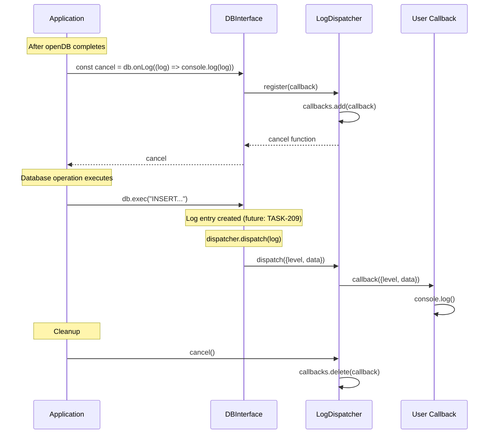

# TASK-208: Implement onLog API

## Metadata

- **Task ID**: TASK-208
- **Title**: [Logging] Implement onLog API
- **Priority**: P0
- **Status**: In Progress
- **Dependencies**: TASK-207 (Log Dispatcher complete)
- **Boundary**: `src/release/release-manager.ts` (DBInterface)
- **Estimated**: 2 hours

---

## 1. Purpose

Integrate the log dispatcher with the DBInterface to enable structured logging. The `onLog()` method will allow users to subscribe to log events from database operations.

---

## 2. Upstream Dependencies

### Completed Tasks

- **TASK-207**: Create Log Dispatcher
  - `createLogDispatcher()` factory function complete
  - `LogDispatcher` interface defined
  - `LogEntry` type defined
  - `onLog()` method added to `DBInterface`

### Relevant Documentation

- **F-001 v2.0.0 Feature** (`agent-docs/01-discovery/features/F-001-v2-logging-direct-access.md`)
  - FR-001: Structured Logging API with Cancel
  - `db.onLog(callback)` returns cancel function
- **API Contracts** (`agent-docs/05-design/01-contracts/01-api.md`)
  - Section: `onLog(callback): () => void` method documentation
- **Event Catalog** (`agent-docs/05-design/01-contracts/02-events.md`)
  - Section 5: v2.0.0 Structured Logging Events

---

## 3. Implementation Specification

### 3.1. Files to Modify

1. **`src/release/release-manager.ts`** - Integrate log dispatcher with DBInterface

### 3.2. Implementation: `src/release/release-manager.ts`

**Add import for `createLogDispatcher`:**

```typescript
import { createLogDispatcher } from "../logs/log-dispatcher";
```

**Replace placeholder `onLog` implementation:**

```typescript
// Inside openReleaseDB function, after the other closures

// Create log dispatcher for this database instance
const logDispatcher = createLogDispatcher();

// Implement onLog method
const onLog = (callback: (log: LogEntry) => void): (() => void) => {
  return logDispatcher.register(callback);
};

// Update the db object to use the real implementation
const db: DBInterface = {
  exec,
  query,
  transaction,
  close,
  onLog,
  devTool,
};
```

**Remove old placeholder implementation** (currently at lines ~455-461):

```typescript
// OLD - Remove this placeholder:
// const onLog = (_callback: (log: LogEntry) => void): (() => void) => {
//   return () => {};
// };
```

---

## 4. Definition of Done (DoD)

TASK-208 is COMPLETE when:

1. **Code Changes**:
   - [ ] `src/release/release-manager.ts` imports `createLogDispatcher`
   - [ ] `logDispatcher` instance created per database
   - [ ] `onLog()` method implemented to call `logDispatcher.register()`
   - [ ] Placeholder implementation removed

2. **Type Safety**:
   - [ ] TypeScript compiles without errors
   - [ ] `onLog()` returns proper cancel function type

3. **Unit Tests** (Functional test):
   - [ ] `onLog()` returns cancel function
   - [ ] Multiple callbacks can be registered
   - [ ] Cancel function removes callback

4. **Testing**:
   - [ ] All unit tests pass
   - [ ] All existing E2E tests still pass

5. **Documentation**:
   - [ ] Task catalog updated with completion status
   - [ ] Status board updated (`agent-docs/00-control/01-status.md`)

---

## 5. Sequence Diagram



---

## 6. Edge Cases

1. **Multiple Registrations**: Same callback can be registered multiple times
   - Each registration returns its own cancel function
   - Callback receives duplicate logs until canceled

2. **Cancellation During Dispatch**: Canceling during dispatch doesn't affect current dispatch iteration
   - Set iteration continues even if callbacks are deleted during loop

3. **Callback Errors**: Callback errors are isolated and logged
   - One callback throwing doesn't prevent others from receiving logs

---

## 7. Testing Plan

### Unit Test: onLog API

**File**: `src/release/onlog-api.unit.test.ts` (new file)

```typescript
import { describe, it, expect, beforeEach } from "vitest";
import { createReleaseManagerDeps, openReleaseDB } from "./release-manager";
import type { LogEntry } from "../types/DB";

describe("onLog API (TASK-208)", () => {
  // Use release manager deps helper for testing
  const mockDeps = createReleaseManagerDeps();

  beforeEach(() => {
    // Setup mock dependencies
    // Clear any existing state
  });

  it("should return cancel function from onLog", async () => {
    const db = await openReleaseDB(mockDeps);
    const cancel = db.onLog(() => {});

    expect(typeof cancel).toBe("function");

    await db.close();
  });

  it("should support multiple callbacks", async () => {
    const db = await openReleaseDB(mockDeps);
    const callback1 = vi.fn();
    const callback2 = vi.fn();

    const cancel1 = db.onLog(callback1);
    const cancel2 = db.onLog(callback2);

    // Both callbacks should be registered
    // (Will verify actual dispatch in TASK-209)

    cancel1();
    cancel2();

    await db.close();
  });

  it("should cancel callback when cancel function is called", async () => {
    const db = await openReleaseDB(mockDeps);
    const callback = vi.fn();

    const cancel = db.onLog(callback);
    cancel();

    // Callback should be removed
    // (Will verify actual dispatch in TASK-209)

    await db.close();
  });
});
```

**Note**: Full E2E testing will be in TASK-209 when worker logs are forwarded.

---

## 8. References

- **Feature Spec**: `agent-docs/01-discovery/features/F-001-v2-logging-direct-access.md#fr-001`
- **API Contracts**: `agent-docs/05-design/01-contracts/01-api.md#onlog`
- **Event Catalog**: `agent-docs/05-design/01-contracts/02-events.md#50-structured-logging-events`
- **Task Catalog**: `agent-docs/07-taskManager/02-task-catalog.md#TASK-208`
- **Previous Task**: `agent-docs/08-task/active/TASK-207.md`
