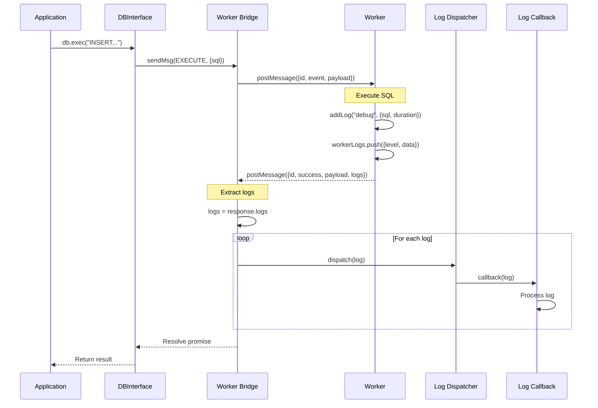

# TASK-209: Implement Worker Log Forwarding

## Metadata

- **Task ID**: TASK-209
- **Title**: [Logging] Implement Worker Log Forwarding
- **Priority**: P0
- **Status**: In Progress
- **Dependencies**: TASK-208 (onLog API complete)
- **Boundary**: `src/types/message.ts`, `src/worker.ts`, `src/worker-bridge.ts`
- **Estimated**: 4 hours

---

## 1. Purpose

Enable structured logging from the worker thread. The worker generates log entries (SQL execution, timing, errors) and forwards them to the main thread where they are dispatched to registered callbacks.

---

## 2. Upstream Dependencies

### Completed Tasks

- **TASK-207**: Create Log Dispatcher - `createLogDispatcher()` factory function complete
- **TASK-208**: Implement onLog API - `onLog()` method integrated with DBInterface

### Relevant Documentation

- **F-001 v2.0.0 Feature** (`agent-docs/01-discovery/features/F-001-v2-logging-direct-access.md`)
  - FR-001: Structured Logging API with Cancel
- **Event Catalog** (`agent-docs/05-design/01-contracts/02-events.md`)
  - Section 5.2: Log forwarding from worker to main thread
- **Architecture** (`agent-docs/03-architecture/01-hld.md`)
  - Worker log collection and forwarding flow

---

## 3. Implementation Specification

### 3.1. Type Updates

**Modify `src/types/message.ts`:**

Add `logs` field to response message type:

```typescript
/**
 * Log entry generated by the worker
 */
export type WorkerLogEntry = {
  level: "info" | "debug" | "error";
  data: unknown;
};

/**
 * Response message shape from the worker.
 */
export type SqliteResMsg<T> = {
  id: number;
  success: boolean;
  error?: Error;
  payload?: T;
  logs?: WorkerLogEntry[]; // NEW: Array of log entries
};
```

### 3.2. Worker Changes

**Modify `src/worker.ts`:**

1. **Import LogEntry type**:

```typescript
import type { WorkerLogEntry } from "./types/message";
```

2. **Create log collection state**:

```typescript
// Add at module level
let workerLogs: WorkerLogEntry[] = [];
```

3. **Add helper function to create logs**:

```typescript
/**
 * Add a log entry to be sent with the next response
 */
const addLog = (level: WorkerLogEntry["level"], data: unknown) => {
  workerLogs.push({ level, data });
};
```

4. **Update `handleExecute` to generate logs**:

```typescript
const handleExecute = (payload: unknown) => {
  const start = performance.now();
  const { sql, bind, target } = payload as ExecParams;

  // ... existing validation ...

  try {
    db.exec({ sql, bind });
    const end = performance.now();
    const duration = end - start;

    // Generate debug log for SQL execution
    addLog("debug", { sql, duration, bind });

    return {
      changes: db.changes(),
      lastInsertRowid: db.selectValue("SELECT last_insert_rowid()"),
    };
  } catch (error) {
    // Generate error log
    addLog("error", { sql, error: (error as Error).message });
    throw error;
  }
};
```

5. **Update message handler to include logs**:

```typescript
self.onmessage = (event: MessageEvent<SqliteReqMsg<unknown>>) => {
  const { id, event: eventName, payload } = event.data;

  // Clear logs for this request
  workerLogs = [];

  try {
    let result;
    switch (eventName) {
      case SqliteEvent.OPEN:
        await handleOpen(payload as OpenDBArgs);
        break;
      case SqliteEvent.EXECUTE:
        result = handleExecute(payload);
        break;
      case SqliteEvent.QUERY:
        result = handleQuery(payload);
        break;
      // ... other cases ...
    }

    // Include logs in response
    self.postMessage({
      id,
      success: true,
      payload: result,
      logs: workerLogs.length > 0 ? [...workerLogs] : undefined,
    } satisfies SqliteResMsg<typeof result>);
  } catch (error) {
    self.postMessage({
      id,
      success: false,
      error: error as Error,
      logs: workerLogs.length > 0 ? [...workerLogs] : undefined,
    } satisfies SqliteResMsg<never>);
  }
};
```

### 3.3. Worker Bridge Changes

**Modify `src/worker-bridge.ts`:**

1. **Add log dispatcher parameter**:

```typescript
import type { LogDispatcher } from "../logs/log-dispatcher";

export const createWorkerBridge = (logDispatcher: LogDispatcher) => {
  // ...
};
```

2. **Update onmessage handler to extract and dispatch logs**:

```typescript
worker.onmessage = (event: MessageEvent<SqliteResMsg<unknown>>) => {
  const { id, success, error, payload, logs } = event.data;
  const task = idMapPromise.get(id);

  if (!task) return;

  // Dispatch logs to registered callbacks
  if (logs && logs.length > 0) {
    for (const log of logs) {
      logDispatcher.dispatch(log);
    }
  }

  if (!success) {
    const newError = new Error(error!.message);
    newError.name = error!.name;
    newError.stack = error!.stack;
    task.reject(newError);
  }

  task.resolve(payload);
  idMapPromise.delete(id);
};
```

### 3.4. Release Manager Changes

**Modify `src/release/release-manager.ts`:**

Update `createWorkerBridge` call to pass log dispatcher:

```typescript
// Inside openReleaseDB function
const { sendMsg, terminate } = createWorkerBridge(logDispatcher);
```

---

## 4. Definition of Done (DoD)

TASK-209 is COMPLETE when:

1. **Type Changes**:
   - [ ] `WorkerLogEntry` type added to `src/types/message.ts`
   - [ ] `SqliteResMsg` includes optional `logs` array

2. **Worker Changes**:
   - [ ] `workerLogs` state added
   - [ ] `addLog()` helper function created
   - [ ] Logs generated for SQL execution (debug level)
   - [ ] Logs generated for errors (error level)
   - [ ] Logs included in response messages

3. **Worker Bridge Changes**:
   - [ ] `logDispatcher` parameter added to `createWorkerBridge()`
   - [ ] Logs extracted from responses
   - [ ] Logs dispatched to callbacks

4. **Integration**:
   - [ ] Release manager passes log dispatcher to worker bridge

5. **Type Safety**:
   - [ ] TypeScript compiles without errors

6. **Testing**:
   - [ ] All unit tests pass
   - [ ] E2E test verifies logs are dispatched

---

## 5. Sequence Diagram



---

## 6. Edge Cases

1. **Empty Logs**: If no logs generated, `logs` is `undefined` (not included in response)
2. **Error During Execution**: Logs are still sent even when operation fails
3. **Multiple Logs**: All logs from a single operation are dispatched together
4. **No Callbacks Registered**: Logs are dispatched but nothing happens (no error)

---

## 7. Testing Plan

### E2E Test: Worker Log Forwarding

**File**: `tests/e2e/worker-logs.e2e.test.ts` (new file)

```typescript
import { describe, it, expect } from "vitest";
import { openDB } from "web-sqlite-js";

describe("Worker Log Forwarding (TASK-209)", () => {
  it("should dispatch debug logs for SQL execution", async () => {
    const logs: unknown[] = [];
    const db = await openDB("test-logs");

    const cancel = db.onLog((log) => {
      logs.push(log);
    });

    await db.exec("CREATE TABLE test (id INTEGER)");
    await db.exec("INSERT INTO test VALUES (1)");

    // Verify logs were dispatched
    const debugLogs = logs.filter(
      (log) => (log as { level: string }).level === "debug",
    );
    expect(debugLogs.length).toBeGreaterThan(0);

    cancel();
    await db.close();
  });

  it("should include SQL and timing in log data", async () => {
    const logs: unknown[] = [];
    const db = await openDB("test-logs-timing");

    const cancel = db.onLog((log) => {
      logs.push(log);
    });

    await db.exec("SELECT 1");

    const execLogs = logs.filter(
      (log: unknown) =>
        (log as { level: string }).level === "debug" &&
        typeof (log as { data: unknown }).data === "object" &&
        (log as { data: { sql?: string } }).data?.sql,
    );

    expect(execLogs.length).toBeGreaterThan(0);

    cancel();
    await db.close();
  });
});
```

---

## 8. References

- **Feature Spec**: `agent-docs/01-discovery/features/F-001-v2-logging-direct-access.md#fr-001`
- **Event Catalog**: `agent-docs/05-design/01-contracts/02-events.md#52-worker-log-forwarding`
- **HLD**: `agent-docs/03-architecture/01-hld.md#5-logging-architecture`
- **Task Catalog**: `agent-docs/07-taskManager/02-task-catalog.md#TASK-209`
- **Previous Task**: `agent-docs/08-task/active/TASK-208.md`
