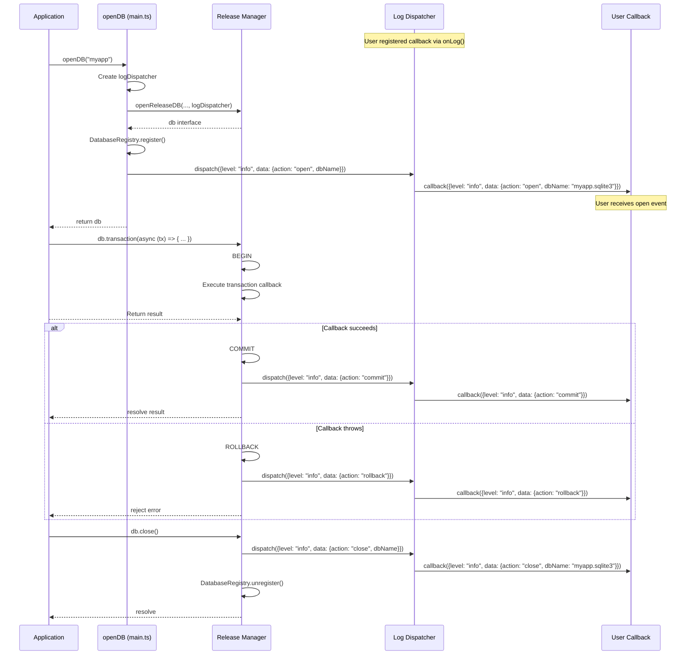

# TASK-220: Application-Level Logging System

## Metadata

- **Task ID**: TASK-220
- **Title**: [Logging] Application-Level Logging System
- **Priority**: P1
- **Status**: In Progress
- **Dependencies**: TASK-209 (Worker Log Forwarding complete)
- **Boundary**: `src/main.ts`, `src/release/release-manager.ts`
- **Estimated**: 2 hours

---

## 1. Purpose

Emit structured log entries for application-level events (database open, database close, transaction commit/rollback) using the log dispatcher. These logs complement the existing SQL execution logs from the worker, providing a complete audit trail of application-level database operations.

---

## 2. Upstream Dependencies

### Completed Tasks

- **TASK-207**: Create Log Dispatcher - `createLogDispatcher()` factory function complete
- **TASK-208**: Implement onLog API - `onLog()` method integrated with DBInterface
- **TASK-209**: Worker Log Forwarding - Worker generates and forwards logs to main thread

### Relevant Documentation

- **F-001 v2.0.0 Feature** (`agent-docs/01-discovery/features/F-001-v2-logging-direct-access.md`)
  - FR-001: Structured Logging API with Cancel
- **Event Catalog** (`agent-docs/05-design/01-contracts/02-events.md`)
  - Section 5.1: Application event logging
- **Data Flow** (`agent-docs/03-architecture/02-dataflow.md`)
  - Transaction execution flow with log points

---

## 3. Implementation Specification

### 3.1. Log Entry Schema

Application-level log entries use the existing `LogEntry` type:

```typescript
type LogEntry = {
  level: "info" | "debug" | "error";
  data: unknown;
};
```

**Application Event Log Shapes:**

| Event                | Level | Data Shape                           |
| -------------------- | ----- | ------------------------------------ |
| Database Open        | info  | `{action: "open", dbName: string}`   |
| Database Close       | info  | `{action: "close", dbName: string}`  |
| Transaction Commit   | info  | `{action: "commit", sql?: string}`   |
| Transaction Rollback | info  | `{action: "rollback", sql?: string}` |

### 3.2. Database Open Logging

**Modify `src/main.ts` - `openDB` function:**

After successful database registration, emit an info-level log:

```typescript
export const openDB = async (
  filename: string,
  options?: OpenDBOptions,
): Promise<DBInterface> => {
  // ... existing code ...

  // Create log dispatcher for this database instance
  const logDispatcher = createLogDispatcher();

  // ... existing code ...

  // Register after successful open
  DatabaseRegistry.register(filename, db);

  // NEW: Emit application log for database open
  logDispatcher.dispatch({
    level: "info",
    data: { action: "open", dbName: normalizedFilename },
  });

  return db;
};
```

### 3.3. Database Close Logging

**Modify `src/release/release-manager.ts` - `close` function:**

Before unregistering, emit an info-level log:

```typescript
const close = async (): Promise<void> => {
  return runMutex(async () => {
    // NEW: Emit application log for database close
    logDispatcher.dispatch({
      level: "info",
      data: { action: "close", dbName: normalizedFilename },
    });

    await sendMsg(SqliteEvent.CLOSE);

    // Unregister from registry after close
    DatabaseRegistry.unregister(normalizedFilename);
  });
};
```

**Note**: `normalizedFilename` is already available in the `openReleaseDB` scope from line 64.

### 3.4. Transaction Commit Logging

**Modify `src/release/release-manager.ts` - `transaction` function:**

After successful COMMIT, emit an info-level log:

```typescript
const transaction = async <T>(fn: transactionCallback<T>): Promise<T> => {
  return runMutex(async () => {
    await _exec("BEGIN", undefined, "active");
    try {
      const result = await fn({
        exec: (sql: string, params?: SQLParams) => _exec(sql, params, "active"),
        query: <U = unknown>(sql: string, params?: SQLParams) =>
          _query<U>(sql, params, "active"),
      });
      await _exec("COMMIT", undefined, "active");

      // NEW: Emit application log for transaction commit
      logDispatcher.dispatch({
        level: "info",
        data: { action: "commit", sql: "COMMIT" },
      });

      return result;
    } catch (error) {
      await _exec("ROLLBACK", undefined, "active");

      // NEW: Emit application log for transaction rollback
      logDispatcher.dispatch({
        level: "info",
        data: { action: "rollback", sql: "ROLLBACK" },
      });

      throw error;
    }
  });
};
```

---

## 4. Definition of Done (DoD)

TASK-220 is COMPLETE when:

1. **Database Open Logging**:
   - [ ] Info log emitted after successful `openDB()`
   - [ ] Log data includes `{action: "open", dbName: string}`
   - [ ] Log dispatched via `logDispatcher.dispatch()`

2. **Database Close Logging**:
   - [ ] Info log emitted before `close()` operation
   - [ ] Log data includes `{action: "close", dbName: string}`
   - [ ] Log dispatched via `logDispatcher.dispatch()`

3. **Transaction Logging**:
   - [ ] Info log emitted after successful COMMIT
   - [ ] Info log emitted after ROLLBACK (error case)
   - [ ] Log data includes `{action: "commit|rollback", sql: string}`

4. **Type Safety**:
   - [ ] TypeScript compiles without errors
   - [ ] Log entry shapes match documented schema

5. **Testing**:
   - [ ] E2E test verifies open log is dispatched
   - [ ] E2E test verifies close log is dispatched
   - [ ] E2E test verifies transaction commit log is dispatched
   - [ ] E2E test verifies transaction rollback log is dispatched
   - [ ] All existing tests still pass

---

## 5. Sequence Diagram



---

## 6. Edge Cases

1. **Open Failure**: No log emitted if `openReleaseDB()` throws (registration never happens)
2. **Close Failure**: Log is emitted before the actual close operation, ensuring audit trail even if close fails
3. **Nested Transactions**: Not supported by SQLite, so no edge case
4. **Transaction Without Operations**: COMMIT/ROLLBACK logs still emitted
5. **No Callbacks Registered**: Logs are dispatched but nothing happens (no error)

---

## 7. Testing Plan

### E2E Test: Application-Level Logging

**File**: `tests/e2e/application-logs.e2e.test.ts` (new file)

```typescript
import { describe, it, expect } from "vitest";
import { openDB } from "web-sqlite-js";

describe("Application-Level Logging (TASK-220)", () => {
  it("should emit info log on database open", async () => {
    const logs: unknown[] = [];
    const db = await openDB("test-app-logs-open");

    const cancel = db.onLog((log) => {
      logs.push(log);
    });

    // Open already happened before onLog, so we need a new DB
    await db.close();
    cancel();

    const logs2: unknown[] = [];
    const db2 = await openDB("test-app-logs-open-2");
    const cancel2 = db2.onLog((log) => {
      logs2.push(log);
    });

    // Find the open log
    const openLogs = logs2.filter(
      (log) =>
        (log as { level: string }).level === "info" &&
        (log as { data: { action?: string } }).data?.action === "open",
    );

    expect(openLogs.length).toBeGreaterThan(0);
    expect(
      (openLogs[0] as { data: { dbName?: string } }).data.dbName,
    ).toContain("test-app-logs-open-2");

    cancel2();
    await db2.close();
  });

  it("should emit info log on database close", async () => {
    const logs: unknown[] = [];
    const db = await openDB("test-app-logs-close");

    const cancel = db.onLog((log) => {
      logs.push(log);
    });

    await db.close();

    // Find the close log
    const closeLogs = logs.filter(
      (log) =>
        (log as { level: string }).level === "info" &&
        (log as { data: { action?: string } }).data?.action === "close",
    );

    expect(closeLogs.length).toBeGreaterThan(0);
    expect(
      (closeLogs[0] as { data: { dbName?: string } }).data.dbName,
    ).toContain("test-app-logs-close");
  });

  it("should emit info log on transaction commit", async () => {
    const logs: unknown[] = [];
    const db = await openDB("test-app-logs-commit");

    const cancel = db.onLog((log) => {
      logs.push(log);
    });

    await db.exec("CREATE TABLE test (id INTEGER)");

    await db.transaction(async (tx) => {
      await tx.exec("INSERT INTO test VALUES (1)");
    });

    // Find the commit log
    const commitLogs = logs.filter(
      (log) =>
        (log as { level: string }).level === "info" &&
        (log as { data: { action?: string } }).data?.action === "commit",
    );

    expect(commitLogs.length).toBeGreaterThan(0);

    cancel();
    await db.close();
  });

  it("should emit info log on transaction rollback", async () => {
    const logs: unknown[] = [];
    const db = await openDB("test-app-logs-rollback");

    const cancel = db.onLog((log) => {
      logs.push(log);
    });

    await db.exec("CREATE TABLE test (id INTEGER UNIQUE)");

    try {
      await db.transaction(async (tx) => {
        await tx.exec("INSERT INTO test VALUES (1)");
        await tx.exec("INSERT INTO test VALUES (1)"); // Duplicate!
      });
      expect.fail("Should have thrown constraint error");
    } catch (error) {
      // Expected
    }

    // Find the rollback log
    const rollbackLogs = logs.filter(
      (log) =>
        (log as { level: string }).level === "info" &&
        (log as { data: { action?: string } }).data?.action === "rollback",
    );

    expect(rollbackLogs.length).toBeGreaterThan(0);

    cancel();
    await db.close();
  });

  it("should include correct data shapes in logs", async () => {
    const logs: unknown[] = [];
    const db = await openDB("test-app-logs-shapes");

    const cancel = db.onLog((log) => {
      logs.push(log);
    });

    await db.close();

    // Verify data shape
    const closeLog = logs.find(
      (log) =>
        (log as { level: string }).level === "info" &&
        (log as { data: { action?: string } }).data?.action === "close",
    );

    expect(closeLog).toBeDefined();
    expect((closeLog as { level: string }).level).toBe("info");
    expect((closeLog as { data: { action?: string } }).data).toHaveProperty(
      "action",
      "close",
    );
    expect((closeLog as { data: { dbName?: string } }).data).toHaveProperty(
      "dbName",
    );
  });
});
```

---

## 8. References

- **Feature Spec**: `agent-docs/01-discovery/features/F-001-v2-logging-direct-access.md#fr-001`
- **Event Catalog**: `agent-docs/05-design/01-contracts/02-events.md#51-application-events`
- **Data Flow**: `agent-docs/03-architecture/02-dataflow.md#flow-3-transaction-execution`
- **Task Catalog**: `agent-docs/07-taskManager/02-task-catalog.md#TASK-220`
- **Previous Task**: `agent-docs/08-task/active/TASK-209.md`
