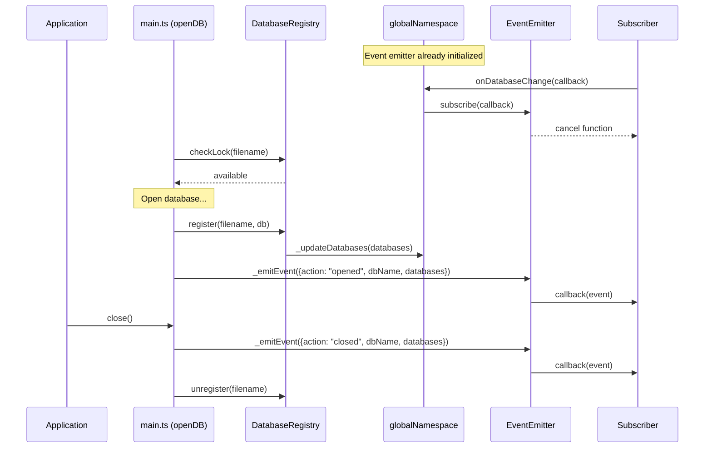

<!--
OUTPUT MAP
agent-docs/08-task/active/TASK-221.md

TEMPLATE SOURCE
.claude/templates/agent-docs/08-task/active/micro-spec.md
-->

# TASK-221: Database Events System

**Status**: In Progress
**Started**: 2026-01-11
**Priority**: P0 (Blocker)
**Dependencies**: TASK-220 (Application-Level Logging - Complete)

---

## Overview

Implement database change event emission for open/close events. The event emitter infrastructure is already in place in `src/global/namespace.ts`. This task integrates event emission with the database open/close flow.

**Key Finding**: The `DatabaseEventEmitter` class is already implemented with error isolation. The main work is wiring up event emission to `openDB()` and `close()`.

---

## Boundary

- **New Files**: None (event emitter already exists)
- **Modified Files**:
  - `src/main.ts` - Emit "opened" event after register
  - `src/release/release-manager.ts` - Emit "closed" event before unregister
- **Test Files**:
  - `src/events/event-emitter.unit.test.ts` - Unit tests for event emitter
  - `tests/e2e/database-events.e2e.test.ts` - E2E tests for event system

---

## Design

### Functional-First Implementation

**NOTE**: The event emitter uses a class (`DatabaseEventEmitter`) which is an **explicit exception** to the functional programming preference. The rationale is:

1. The namespace already uses classes for internal implementation
2. The event emitter is encapsulated within the namespace module
3. The public API (`onDatabaseChange()`) follows functional patterns (returns cancel function)

### Event Flow



### Event Payload

```typescript
type DatabaseChangeEvent = {
  action: "opened" | "closed";
  dbName: string; // Normalized database name (e.g., "myapp.sqlite3")
  databases: string[]; // All currently opened database names
};
```

---

## Implementation Steps

### Phase 1: Emit Open Event in main.ts

**File**: `src/main.ts`

After `DatabaseRegistry.register(filename, db)`:

1. Import `globalNamespace` from `./global/namespace`
2. Emit "opened" event with:
   - `action: "opened"`
   - `dbName`: normalized filename (use `DatabaseRegistry.register()` parameter)
   - `databases`: result of `DatabaseRegistry.list()`

```typescript
// After DatabaseRegistry.register(filename, db);
const normalizedDbName = filename.endsWith(".sqlite3")
  ? filename
  : `${filename}.sqlite3`;
globalNamespace._emitEvent({
  action: "opened",
  dbName: normalizedDbName,
  databases: DatabaseRegistry.list(),
});
```

### Phase 2: Emit Close Event in release-manager.ts

**File**: `src/release/release-manager.ts`

In `close()` method, before `DatabaseRegistry.unregister()`:

1. Import `globalNamespace` from `../global/namespace`
2. Emit "closed" event with current databases list (before unregister)
3. Then unregister

**Note**: Emit BEFORE unregister so `databases` array includes the database being closed.

```typescript
const close = async (): Promise<void> => {
  return runMutex(async () => {
    // Emit application log for database close
    logDispatcher.dispatch({
      level: "info",
      data: { action: "close", dbName: normalizedFilename },
    });

    // Emit database change event BEFORE unregister
    globalNamespace._emitEvent({
      action: "closed",
      dbName: normalizedFilename,
      databases: DatabaseRegistry.list(),
    });

    await sendMsg(SqliteEvent.CLOSE);
    // Unregister from registry after close
    DatabaseRegistry.unregister(normalizedFilename);
  });
};
```

### Phase 3: Unit Tests for Event Emitter

**File**: `src/events/event-emitter.unit.test.ts`

Since the event emitter is in `src/global/namespace.ts`, create tests in a new file or test via namespace:

Option: Create `src/events/` directory and export event emitter for testing, OR test through the namespace.

**Simpler approach**: Test via the namespace (integration-style unit test).

```typescript
describe("DatabaseEventEmitter (via namespace)", () => {
  beforeEach(() => {
    // Clear namespace state
    // Reset subscribers
  });

  it("should subscribe to events and receive cancel function", () => {
    const callback = vi.fn();
    const cancel = globalNamespace.onDatabaseChange(callback);
    expect(typeof cancel).toBe("function");
  });

  it("should emit event when database opened", () => {
    const callback = vi.fn();
    globalNamespace.onDatabaseChange(callback);

    globalNamespace._emitEvent({
      action: "opened",
      dbName: "test.sqlite3",
      databases: ["test.sqlite3"],
    });

    expect(callback).toHaveBeenCalledWith({
      action: "opened",
      dbName: "test.sqlite3",
      databases: ["test.sqlite3"],
    });
  });

  it("should support multiple subscribers", () => {
    const callback1 = vi.fn();
    const callback2 = vi.fn();
    globalNamespace.onDatabaseChange(callback1);
    globalNamespace.onDatabaseChange(callback2);

    globalNamespace._emitEvent({
      action: "opened",
      dbName: "test.sqlite3",
      databases: ["test.sqlite3"],
    });

    expect(callback1).toHaveBeenCalled();
    expect(callback2).toHaveBeenCalled();
  });

  it("should isolate subscriber errors", () => {
    const errorCallback = vi.fn(() => {
      throw new Error("Subscriber error");
    });
    const goodCallback = vi.fn();
    globalNamespace.onDatabaseChange(errorCallback);
    globalNamespace.onDatabaseChange(goodCallback);

    // Should not throw, good callback should still be called
    globalNamespace._emitEvent({
      action: "opened",
      dbName: "test.sqlite3",
      databases: ["test.sqlite3"],
    });

    expect(errorCallback).toHaveBeenCalled();
    expect(goodCallback).toHaveBeenCalled();
  });

  it("should cancel subscription", () => {
    const callback = vi.fn();
    const cancel = globalNamespace.onDatabaseChange(callback);

    cancel();

    globalNamespace._emitEvent({
      action: "opened",
      dbName: "test.sqlite3",
      databases: ["test.sqlite3"],
    });

    expect(callback).not.toHaveBeenCalled();
  });

  it("should handle idempotent cancel", () => {
    const callback = vi.fn();
    const cancel = globalNamespace.onDatabaseChange(callback);

    cancel();
    cancel(); // Second call should be safe
  });
});
```

### Phase 4: E2E Tests

**File**: `tests/e2e/database-events.e2e.test.ts`

```typescript
describe("Database Change Events", () => {
  it("should emit event when database is opened", async () => {
    const callback = vi.fn();
    const unsubscribe = window.__web_sqlite.onDatabaseChange(callback);

    const db = await openDB("test-events-open");

    expect(callback).toHaveBeenCalledWith({
      action: "opened",
      dbName: "test-events-open.sqlite3",
      databases: ["test-events-open.sqlite3"],
    });

    unsubscribe();
    await db.close();
  });

  it("should emit event when database is closed", async () => {
    const callback = vi.fn();
    const unsubscribe = window.__web_sqlite.onDatabaseChange(callback);

    const db = await openDB("test-events-close");
    callback.mockClear(); // Clear open event

    await db.close();

    expect(callback).toHaveBeenCalledWith({
      action: "closed",
      dbName: "test-events-close.sqlite3",
      databases: ["test-events-close.sqlite3"],
    });

    unsubscribe();
  });

  it("should show updated databases list after open", async () => {
    const callback = vi.fn();
    const unsubscribe = window.__web_sqlite.onDatabaseChange(callback);

    await openDB("db1");
    const db2 = await openDB("db2");

    const lastCall = callback.mock.calls[callback.mock.calls.length - 1];
    expect(lastCall[0].databases).toContain("db1.sqlite3");
    expect(lastCall[0].databases).toContain("db2.sqlite3");
    expect(lastCall[0].databases).toHaveLength(2);

    unsubscribe();
    await db2.close();
    await window.__web_sqlite.databases["db1.sqlite3"].close();
  });

  it("should show updated databases list after close", async () => {
    const db1 = await openDB("db1-close-test");
    await openDB("db2-close-test");

    const callback = vi.fn();
    const unsubscribe = window.__web_sqlite.onDatabaseChange(callback);

    await db1.close();

    const lastCall = callback.mock.calls[callback.mock.calls.length - 1];
    expect(lastCall[0].databases).not.toContain("db1-close-test.sqlite3");
    expect(lastCall[0].databases).toContain("db2-close-test.sqlite3");

    unsubscribe();
    await window.__web_sqlite.databases["db2-close-test.sqlite3"].close();
  });

  it("should support multiple subscribers", async () => {
    const callback1 = vi.fn();
    const callback2 = vi.fn();
    const unsubscribe1 = window.__web_sqlite.onDatabaseChange(callback1);
    const unsubscribe2 = window.__web_sqlite.onDatabaseChange(callback2);

    const db = await openDB("test-multi-sub");

    expect(callback1).toHaveBeenCalled();
    expect(callback2).toHaveBeenCalled();

    unsubscribe1();
    unsubscribe2();
    await db.close();
  });

  it("should cancel subscription", async () => {
    const callback = vi.fn();
    const unsubscribe = window.__web_sqlite.onDatabaseChange(callback);
    callback.mockClear(); // Clear initial state

    unsubscribe();

    await openDB("test-cancel");

    expect(callback).not.toHaveBeenCalled();
    await window.__web_sqlite.databases["test-cancel.sqlite3"].close();
  });
});
```

---

## Code Quality Checklist

- [ ] Max 30 lines per function
- [ ] Max 3 nesting levels
- [ ] Three-phase comments for functions > 5 lines
- [ ] TSDoc for exported/public functions
- [ ] Functional programming preference (class is exception)
- [ ] No AI watermarks in commits

---

## Definition of Done

- [ ] Event emission in `main.ts` after database open
- [ ] Event emission in `release-manager.ts` before database close
- [ ] Unit tests pass (event emitter behavior)
- [ ] E2E tests pass (open/close events, multiple subscribers, cancel)
- [ ] TypeScript compiles without errors
- [ ] All existing tests still pass
- [ ] Documentation updated (status board, spec)
- [ ] Git commit with conventional commit message

---

## Risk Notes

1. **Normalization**: Ensure `dbName` in event uses normalized name (with `.sqlite3` suffix)
2. **Timing**: Emit close event BEFORE unregister so databases list includes closing db
3. **Error Isolation**: Already implemented in emitter, verify in tests
4. **Memory Leaks**: Ensure cancel function properly removes subscribers

---

## Navigation

**Task**: [TASK-221] Database Events System
**Dependencies**: TASK-220 (Complete)
**Next**: TASK-222 (Testing & Documentation Suite)

**Up**: [Task Catalog](../../07-taskManager/02-task-catalog.md)
