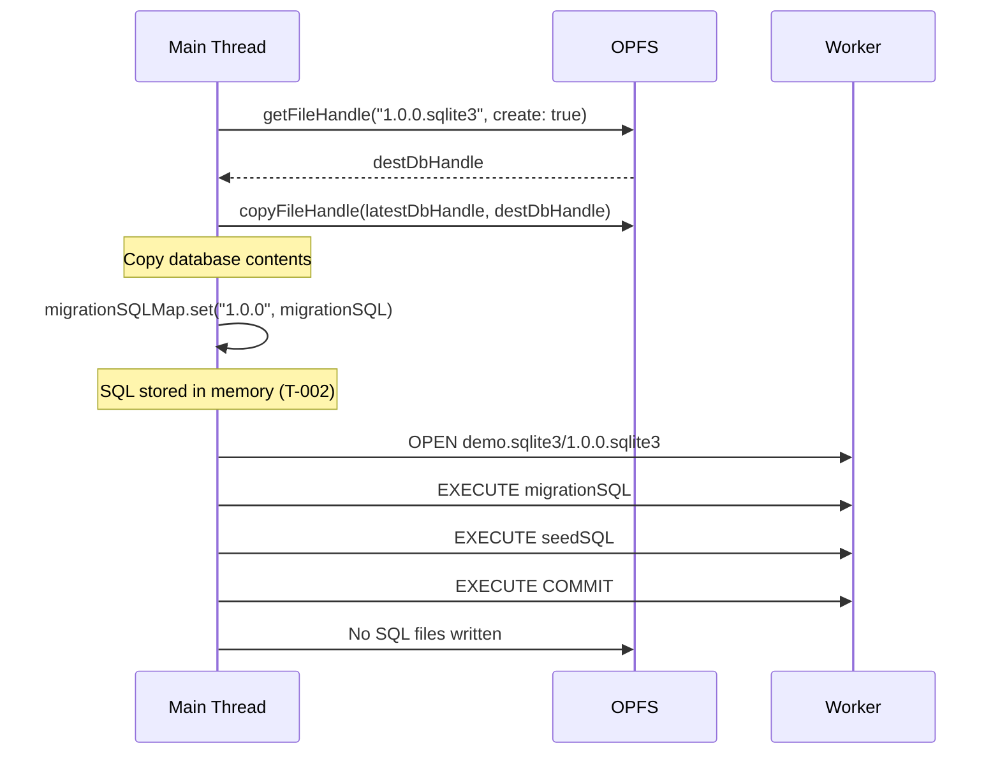

# TASK-301: T-001 - OPFS Structure & File Operations

> **Feature**: F-002 - v2.1.0 Flat OPFS Structure
> **Status**: 📋 Spec Created - Pending Approval
> **Created**: 2026-01-12
> **Dependencies**: None

---

## 1. Boundary

### Files to Modify

- `src/release/opfs-utils.ts` - Update flat file path resolution, add dev version helper
- `src/release/release-manager.ts` - Remove SQL file writing, update applyVersion()
- `src/release/version-utils.ts` - Add dev version suffix helpers

### Files to Read (Context)

- `src/release/constants.ts` - DEFAULT_VERSION, VERSION_RE
- `src/release/types.ts` - ReleaseConfigWithHash, ReleaseRow
- `src/release/hash-utils.ts` - validateAndHashReleases
- `src/release/lock-utils.ts` - isLockError

### Out of Scope

- In-memory SQL Maps (Task T-002)
- Auto-migration system (Task T-003)
- Global namespace type changes (Task T-002)

---

## 2. Acceptance Criteria

- [ ] OPFS files use flat naming: `0.0.1.sqlite3`, `0.0.2.sqlite3`
- [ ] Dev versions use `.dev.sqlite3` suffix: `0.0.3.dev.sqlite3`
- [ ] No `migration.sql` or `seed.sql` files written to OPFS
- [ ] No nested version directories created (e.g., `0.0.1/`)
- [ ] `applyVersion()` function updated to use flat structure
- [ ] All existing tests pass with new structure

---

## 3. Design

### 3.1 OPFS Structure Change (v2.0.0 → v2.1.0)

**v2.0.0 (Nested)**:

```
demo.sqlite3/
  release.sqlite3
  default.sqlite3
  0.0.1/
    db.sqlite3
    migration.sql
    seed.sql
  0.0.2/
    db.sqlite3
    migration.sql
    seed.sql
```

**v2.1.0 (Flat)**:

```
demo.sqlite3/
  release.sqlite3
  default.sqlite3
  0.0.1.sqlite3
  0.0.2.sqlite3
  0.0.3.dev.sqlite3
```

### 3.2 Functional Design

#### opfs-utils.ts Changes

**Update `getDbPathForVersion()`**:

```typescript
// Before (v2.0.0)
export const getDbPathForVersion = (
  dirName: string,
  version: string,
): string => {
  if (version === DEFAULT_VERSION) {
    return `${dirName}/default.sqlite3`;
  }
  return `${dirName}/${version}/db.sqlite3`;
};

// After (v2.1.0)
export const getDbPathForVersion = (
  dirName: string,
  version: string,
): string => {
  if (version === DEFAULT_VERSION) {
    return `${dirName}/default.sqlite3`;
  }
  return `${dirName}/${version}.sqlite3`;
};
```

**Update `getDbHandleForVersion()`**:

```typescript
// Before (v2.0.0)
export const getDbHandleForVersion = async (
  baseDir: FileSystemDirectoryHandle,
  version: string,
  create: boolean,
): Promise<FileSystemFileHandle> => {
  if (version === DEFAULT_VERSION) {
    return await baseDir.getFileHandle("default.sqlite3", { create });
  }
  const versionDir = await baseDir.getDirectoryHandle(version, { create });
  return await versionDir.getFileHandle("db.sqlite3", { create });
};

// After (v2.1.0)
export const getDbHandleForVersion = async (
  baseDir: FileSystemDirectoryHandle,
  version: string,
  create: boolean,
): Promise<FileSystemFileHandle> => {
  if (version === DEFAULT_VERSION) {
    return await baseDir.getFileHandle("default.sqlite3", { create });
  }
  const versionFilename = `${version}.sqlite3`;
  return await baseDir.getFileHandle(versionFilename, { create });
};
```

**Add `isDevVersion()` helper**:

```typescript
/**
 * Check if a version string is a dev version (has .dev.sqlite3 suffix).
 * @param version - Version string with or without .sqlite3 suffix
 * @returns true if version is a dev version
 */
export const isDevVersion = (version: string): boolean => {
  return version.endsWith(".dev.sqlite3");
};
```

#### version-utils.ts Changes

**Add dev version suffix helpers**:

```typescript
/**
 * Get the dev version suffix for a version.
 * @param version - Semver version string (e.g., "1.0.0")
 * @returns Dev version filename (e.g., "1.0.0.dev.sqlite3")
 */
export const getDevVersionFilename = (version: string): string => {
  return `${version}.dev.sqlite3`;
};

/**
 * Extract base version from a dev version filename.
 * @param devVersion - Dev version filename (e.g., "1.0.0.dev.sqlite3")
 * @returns Base version string (e.g., "1.0.0")
 */
export const extractBaseVersionFromDev = (devVersion: string): string => {
  if (!isDevVersion(devVersion)) {
    throw new Error(`Not a dev version: ${devVersion}`);
  }
  return devVersion.replace(".dev.sqlite3", "");
};
```

#### release-manager.ts Changes

**Update `applyVersion()` function**:

```typescript
// Before (v2.0.0)
const applyVersion = async (
  config: ReleaseConfigWithHash,
  mode: "release" | "dev",
): Promise<void> => {
  const versionDir = await baseDir.getDirectoryHandle(config.version, {
    create: true,
  });
  const destDbHandle = await versionDir.getFileHandle("db.sqlite3", {
    create: true,
  });

  await copyFileHandle(latestDbHandle, destDbHandle);
  await writeTextFile(versionDir, "migration.sql", config.migrationSQL);
  if (config.normalizedSeedSQL) {
    await writeTextFile(versionDir, "seed.sql", config.normalizedSeedSQL);
  }
  // ... rest of function
};

// After (v2.1.0)
const applyVersion = async (
  config: ReleaseConfigWithHash,
  mode: "release" | "dev",
): Promise<void> => {
  // v2.1.0: Use flat file naming {version}.sqlite3
  // For dev versions, use {version}.dev.sqlite3 suffix
  const versionFilename =
    mode === "dev"
      ? `${config.version}.dev.sqlite3`
      : `${config.version}.sqlite3`;
  const destDbHandle = await baseDir.getFileHandle(versionFilename, {
    create: true,
  });

  await copyFileHandle(latestDbHandle, destDbHandle);

  // v2.1.0: SQL stored in memory Maps (Task T-002), no file writing
  // Migration/seed SQL will be stored in Map<string, string> structures

  await openActiveDb(`${normalizedFilename}/${versionFilename}`, true);
  // ... rest of function
};
```

**Update error handling in `applyVersion()`**:

```typescript
// Before (v2.0.0)
catch (error) {
  await openActiveDb(
    getDbPathForVersion(normalizedFilename, latestVersion),
    true,
  );
  try {
    await removeDir(baseDir, config.version);
  } catch (removeError) {
    // ...
  }
  throw error;
}

// After (v2.1.0)
catch (error) {
  await openActiveDb(
    getDbPathForVersion(normalizedFilename, latestVersion),
    true,
  );
  try {
    // v2.1.0: Remove flat file instead of directory
    const versionFilename = mode === "dev"
      ? `${config.version}.dev.sqlite3`
      : `${config.version}.sqlite3`;
    await baseDir.removeEntry(versionFilename);
  } catch (removeError) {
    const name = (removeError as Error).name;
    if (name !== "NotFoundError") {
      throw removeError;
    }
  }
  throw error;
}
```

**Update `latestDbHandle` assignment**:

```typescript
// Before (v2.0.0)
latestDbHandle = destDbHandle; // versionDir.getFileHandle("db.sqlite3")

// After (v2.1.0)
latestDbHandle = destDbHandle; // baseDir.getFileHandle("{version}.sqlite3")
```

**Update `latestVersion` tracking**:

```typescript
// v2.1.0: For dev versions, store base version without suffix in metadata
// The filename has .dev.sqlite3 suffix, but metadata stores base version
const metadataVersion = mode === "dev" ? config.version : config.version;

await metaExec(
  "INSERT INTO release (version, migrationSQLHash, seedSQLHash, mode, createdAt) VALUES (?, ?, ?, ?, ?)",
  [
    metadataVersion, // Store base version in metadata
    config.migrationSQLHash,
    config.seedSQLHash,
    mode,
    new Date().toISOString(),
  ],
);

// Track the actual filename for OPFS operations
latestVersion =
  mode === "dev" ? `${config.version}.dev.sqlite3` : config.version;
```

**Update `devToolRollback` to handle dev version files**:

```typescript
// For removing dev version files (flat structure)
for (const row of devRowsToRemove) {
  // v2.1.0: Dev versions use .dev.sqlite3 suffix
  const devVersionFilename = `${row.version}.dev.sqlite3`;
  try {
    await baseDir.removeEntry(devVersionFilename);
  } catch (removeError) {
    const name = (removeError as Error).name;
    if (name !== "NotFoundError") {
      throw removeError;
    }
  }
  await metaExec("DELETE FROM release WHERE id = ?", [row.id]);
}
```

### 3.3 Data Flow Changes

**Version Application Flow (v2.1.0)**:



---

## 4. Implementation Steps

1. **Update `src/release/opfs-utils.ts`**
   - Modify `getDbPathForVersion()` to return `{version}.sqlite3` path
   - Modify `getDbHandleForVersion()` to use flat file structure
   - Add `isDevVersion()` helper function

2. **Update `src/release/version-utils.ts`**
   - Add `getDevVersionFilename()` helper
   - Add `extractBaseVersionFromDev()` helper

3. **Update `src/release/release-manager.ts`**
   - Modify `applyVersion()` to use flat file naming
   - Remove `writeTextFile()` calls for migration.sql and seed.sql
   - Update error handling to remove flat files instead of directories
   - Update `devToolRollback` to handle `.dev.sqlite3` files

4. **Run Tests**
   - Unit tests: `npm run test:unit`
   - E2E tests: `npm run test:e2e`
   - Type check: `npm run typecheck`
   - Lint: `npm run lint`

---

## 5. Testing Strategy

### Unit Tests (if any exist)

- Test `getDbPathForVersion()` with new flat format
- Test `getDbHandleForVersion()` creates flat files
- Test `isDevVersion()` correctly identifies dev versions

### E2E Tests to Verify

- Release application creates flat `{version}.sqlite3` files
- DevTool.release() creates `{version}.dev.sqlite3` files
- No `migration.sql` or `seed.sql` files in OPFS
- DevTool.rollback() removes `.dev.sqlite3` files
- All existing release E2E tests still pass

---

## 6. Risk Analysis

| Risk                           | Likelihood | Impact | Mitigation                        |
| ------------------------------ | ---------- | ------ | --------------------------------- |
| Breaking existing tests        | Medium     | High   | Run full test suite after changes |
| Incorrect file path resolution | Low        | High   | Verify path format in debug logs  |
| Dev version suffix confusion   | Low        | Medium | Clear naming in helper functions  |

---

## 7. Functional-First Design Check

**Status**: ✅ All functions use functional design patterns

- `getDbPathForVersion()` - Pure function, no side effects
- `getDbHandleForVersion()` - Async function, returns Promise
- `isDevVersion()` - Pure function, no side effects
- `getDevVersionFilename()` - Pure function, no side effects
- `extractBaseVersionFromDev()` - Pure function, no side effects

**No classes or OOP constructs** - All changes are functional.

---

## 8. Navigation

**Task Catalog**: [F-002 v2.1.0 Tasks](../../07-tasks/f-002-v2.1.0-tasks.md)

**Related Design Docs**:

- [ADR-0002: OPFS Storage](../../04-adr/0002-opfs-persistent-storage.md)
- [Database Schema](../../05-design/02-schema/01-database.md)
- [Migration Strategy](../../05-design/02-schema/02-migrations.md)
- [Release Management Module](../../05-design/03-modules/release-management.md)
