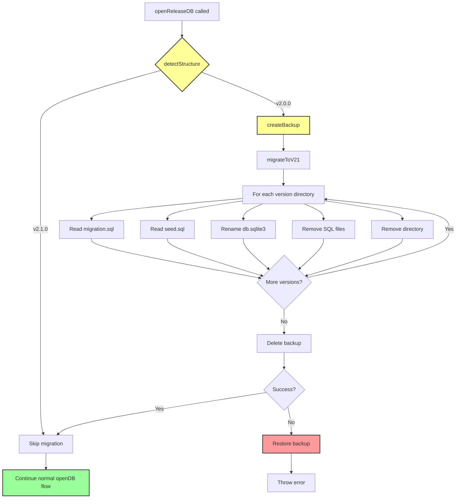

# TASK-303: T-003 - Auto-Migration System

> **Feature**: F-002 v2.1.0 - Flat OPFS Structure and In-Memory Release Configs
> **Task**: Auto-Migration System (v2.0.0 → v2.1.0)
> **Priority**: P0 (Critical Path)
> **Estimated Effort**: 6-8 hours
> **Status**: In Progress
> **Dependencies**: TASK-301 ✅, TASK-302 ✅
> **Created**: 2026-01-12

---

## 1. Task Boundary

**In Scope**:

- Detect v2.0.0 nested structure vs v2.1.0 flat structure
- Automatically migrate v2.0.0 to v2.1.0 on `openDB()` call
- Backup and rollback mechanism on migration failure
- Read SQL files before deletion and populate in-memory Maps
- E2E tests for all migration scenarios

**Out of Scope**:

- Manual migration tools (not needed with auto-migration)
- Migration from versions prior to v2.0.0 (not supported)
- Downgrade migration (v2.1.0 → v2.0.0)

---

## 2. Upstream References

**Feature Spec**: [F-002 v2.1.0](../../01-discovery/features/F-002-v2.1.0-flat-opfs-structure.md)

- FR-003: Automatic Migration from v2.0.0 Structure
- Story 4: Automatic Migration from v2.0.0

**ADR**: [ADR-0008 Auto-Migration Strategy](../../04-adr/0008-auto-migration-strategy.md)

- Complete migration architecture design
- Detection algorithm
- Backup/rollback strategy

**Module Docs**: [Release Management Module](../../05-design/03-modules/release-management.md)

- `openReleaseDB()` integration point
- OPFS operations utilities

**Completed Tasks**:

- [TASK-301](./TASK-301.md) - OPFS Structure & File Operations
- [TASK-302](./TASK-302.md) - In-Memory SQL & Global Namespace

---

## 3. Design

### 3.1 Architecture Overview



### 3.2 Module Structure

**New Files**:

```
src/migration/
  ├── migration-detector.ts    # Structure detection
  └── auto-migrator.ts          # Migration execution

tests/e2e/
  └── auto-migration.e2e.test.ts  # E2E tests
```

**Modified Files**:

- `src/release/release-manager.ts` - Integrate migration detection
- `src/main.ts` - Import migration modules (side effect)

### 3.3 Functional Design

#### `detectStructure(baseDir)`

**Purpose**: Detect whether OPFS structure is v2.0.0 or v2.1.0

**Signature**:

```typescript
export async function detectStructure(
  baseDir: FileSystemDirectoryHandle,
): Promise<{
  version: "2.0.0" | "2.1.0";
  hasNestedDirs: boolean;
}>;
```

**Algorithm**:

1. Iterate through all entries in `baseDir`
2. Check for nested version directories (pattern: `^\d+\.\d+\.\d+$`)
3. If any version directory found → v2.0.0
4. Otherwise → v2.1.0

**Example**:

```typescript
// v2.0.0 OPFS:
// demo.sqlite3/
//   0.0.1/        ← Nested version directory
//     db.sqlite3
//   0.0.2/
//     db.sqlite3

// Result: { version: "2.0.0", hasNestedDirs: true }

// v2.1.0 OPFS:
// demo.sqlite3/
//   0.0.1.sqlite3  ← Flat file
//   0.0.2.sqlite3

// Result: { version: "2.1.0", hasNestedDirs: false }
```

---

#### `migrateToV21(baseDir, migrationSQLMap, seedSQLMap)`

**Purpose**: Convert v2.0.0 structure to v2.1.0 structure

**Signature**:

```typescript
export async function migrateToV21(
  baseDir: FileSystemDirectoryHandle,
  migrationSQLMap: Map<string, string>,
  seedSQLMap: Map<string, string>,
): Promise<void>;
```

**Steps**:

1. Create backup of entire `baseDir`
2. For each version directory:
   - Read `migration.sql` if exists
   - Read `seed.sql` if exists
   - Rename `db.sqlite3` to `{version}.sqlite3`
   - Remove `migration.sql` and `seed.sql`
   - Remove version directory
3. Populate SQL Maps with read content
4. Delete backup

**Error Handling**: On any error, restore backup and rethrow

---

### 3.4 Integration Points

#### `openReleaseDB()` Integration

**Location**: `src/release/release-manager.ts`

**Integration Point**: After `baseDir` is created, before metadata operations

```typescript
// In openReleaseDB()
const root = await navigator.storage.getDirectory();
const baseDir = await ensureDir(root, normalizedFilename);

// v2.1.0: Auto-migrate v2.0.0 structure to v2.1.0
const structure = await detectStructure(baseDir);
if (structure.version === "2.0.0") {
  await migrateToV21(baseDir, migrationSQLMap, seedSQLMap);
}

// Continue with normal flow...
await ensureFile(baseDir, "default.sqlite3");
```

---

## 4. Implementation Plan

### 4.1 Files to Create

#### `src/migration/migration-detector.ts`

**Purpose**: Detect v2.0.0 vs v2.1.0 OPFS structure

**Exports**:

- `detectStructure(baseDir): Promise<{version: "2.0.0" | "2.1.0", hasNestedDirs: boolean}>`

**Code Structure**:

```typescript
/**
 * Migration detector for v2.0.0 → v2.1.0 structure detection
 * @module migration-detector
 */

/** Version directory pattern for v2.0.0 */
const VERSION_DIR_PATTERN = /^\d+\.\d+\.\d+$/;

/**
 * Detect whether the OPFS structure is v2.0.0 or v2.1.0
 * @param baseDir - Base OPFS directory handle
 * @returns Structure detection result
 */
export async function detectStructure(
  baseDir: FileSystemDirectoryHandle,
): Promise<{
  version: "2.0.0" | "2.1.0";
  hasNestedDirs: boolean;
}> {
  // Iterate through entries to find version directories
  for await (const entry of baseDir.values()) {
    if (entry.kind === "directory" && VERSION_DIR_PATTERN.test(entry.name)) {
      return { version: "2.0.0", hasNestedDirs: true };
    }
  }
  return { version: "2.1.0", hasNestedDirs: false };
}
```

---

#### `src/migration/auto-migrator.ts`

**Purpose**: Execute migration from v2.0.0 to v2.1.0

**Exports**:

- `migrateToV21(baseDir, migrationSQLMap, seedSQLMap): Promise<void>`

**Code Structure**:

```typescript
/**
 * Auto-migrator for v2.0.0 → v2.1.0 structure conversion
 * @module auto-migrator
 */

import { copyFileHandle } from "../release/opfs-utils.js";

/** Backup directory suffix */
const BACKUP_SUFFIX = ".backup";

/**
 * Create a backup of the OPFS directory
 * @internal
 */
async function createBackup(
  root: FileSystemDirectoryHandle,
  baseDirName: string,
): Promise<FileSystemDirectoryHandle> {
  const root = await navigator.storage.getDirectory();
  const baseDir = await root.getDirectoryHandle(baseDirName);
  const backupName = `${baseDirName}${BACKUP_SUFFIX}`;

  // Copy entire directory to backup
  // Note: OPFS doesn't have native directory copy, so we copy file by file
  const backupDir = await root.getDirectoryHandle(backupName, {
    create: true,
  });

  for await (const entry of baseDir.values()) {
    if (entry.kind === "file") {
      const srcFile = await baseDir.getFileHandle(entry.name);
      const destFile = await backupDir.getFileHandle(entry.name, {
        create: true,
      });
      await copyFileHandle(srcFile, destFile);
    } else if (entry.kind === "directory") {
      // Recursively copy subdirectories
      await copyDirectory(baseDir, backupDir, entry.name);
    }
  }

  return backupDir;
}

/**
 * Copy a directory recursively
 * @internal
 */
async function copyDirectory(
  srcDir: FileSystemDirectoryHandle,
  destParent: FileSystemDirectoryHandle,
  dirName: string,
): Promise<void> {
  const srcSubDir = await srcDir.getDirectoryHandle(dirName);
  const destSubDir = await destParent.getDirectoryHandle(dirName, {
    create: true,
  });

  for await (const entry of srcSubDir.values()) {
    if (entry.kind === "file") {
      const srcFile = await srcSubDir.getFileHandle(entry.name);
      const destFile = await destSubDir.getFileHandle(entry.name, {
        create: true,
      });
      await copyFileHandle(srcFile, destFile);
    } else if (entry.kind === "directory") {
      await copyDirectory(srcSubDir, destSubDir, entry.name);
    }
  }
}

/**
 * Restore backup on migration failure
 * @internal
 */
async function restoreBackup(
  root: FileSystemDirectoryHandle,
  baseDirName: string,
): Promise<void> {
  const backupName = `${baseDirName}${BACKUP_SUFFIX}`;

  // Remove original directory
  try {
    await root.removeEntry(baseDirName, { recursive: true });
  } catch (e) {
    const name = (e as Error).name;
    if (name !== "NotFoundError") {
      throw e;
    }
  }

  // Rename backup to original
  await root.getDirectoryHandle(backupName).then(async (backup) => {
    // Copy backup back to original name
    await copyDirectory(backup, root, baseDirName);
  });

  // Remove backup
  try {
    await root.removeEntry(backupName, { recursive: true });
  } catch (e) {
    // Ignore if backup already removed
  }
}

/**
 * Delete backup after successful migration
 * @internal
 */
async function deleteBackup(
  root: FileSystemDirectoryHandle,
  baseDirName: string,
): Promise<void> {
  const backupName = `${baseDirName}${BACKUP_SUFFIX}`;
  try {
    await root.removeEntry(backupName, { recursive: true });
  } catch (e) {
    // Ignore if backup doesn't exist
  }
}

/**
 * Read text file from directory
 * @internal
 */
async function readTextFile(
  dir: FileSystemDirectoryHandle,
  name: string,
): Promise<string> {
  const file = await dir.getFileHandle(name);
  const fileData = await file.getFile();
  return await fileData.text();
}

/**
 * Migrate v2.0.0 structure to v2.1.0 structure
 * @param baseDir - Base OPFS directory handle
 * @param migrationSQLMap - Map to populate with migration SQL
 * @param seedSQLMap - Map to populate with seed SQL
 * @throws Error if migration fails (with automatic rollback)
 */
export async function migrateToV21(
  baseDir: FileSystemDirectoryHandle,
  migrationSQLMap: Map<string, string>,
  seedSQLMap: Map<string, string>,
): Promise<void> {
  const root = await navigator.storage.getDirectory();

  // Phase 1: Create backup
  const baseDirName = baseDir.name;
  await createBackup(root, baseDirName);

  try {
    // Phase 2: Migrate each version directory
    const versionDirs: string[] = [];

    // Collect all version directories first
    for await (const entry of baseDir.values()) {
      if (entry.kind === "directory" && /^\d+\.\d+\.\d+$/.test(entry.name)) {
        versionDirs.push(entry.name);
      }
    }

    // Process each version directory
    for (const version of versionDirs) {
      const versionDir = await baseDir.getDirectoryHandle(version);

      // Read SQL files before deletion
      try {
        const migrationSQL = await readTextFile(versionDir, "migration.sql");
        migrationSQLMap.set(version, migrationSQL);
      } catch (e) {
        // migration.sql may not exist, skip
      }

      try {
        const seedSQL = await readTextFile(versionDir, "seed.sql");
        seedSQLMap.set(version, seedSQL);
      } catch (e) {
        // seed.sql may not exist, skip
      }

      // Rename db.sqlite3 to {version}.sqlite3
      const dbFile = await versionDir.getFileHandle("db.sqlite3");
      const newFileName = `${version}.sqlite3`;
      const newFile = await baseDir.getFileHandle(newFileName, {
        create: true,
      });
      await copyFileHandle(dbFile, newFile);

      // Remove SQL files
      try {
        await versionDir.removeEntry("migration.sql");
      } catch (e) {
        // Ignore if file doesn't exist
      }

      try {
        await versionDir.removeEntry("seed.sql");
      } catch (e) {
        // Ignore if file doesn't exist
      }

      // Remove version directory (now empty)
      await baseDir.removeEntry(version);
    }

    // Phase 3: Delete backup (success)
    await deleteBackup(root, baseDirName);
  } catch (error) {
    // Rollback: Restore backup on any error
    await restoreBackup(root, baseDirName);
    throw new Error(
      `Migration failed: ${error instanceof Error ? error.message : String(error)}. Original structure restored.`,
    );
  }
}
```

---

### 4.2 Files to Modify

#### `src/release/release-manager.ts`

**Changes**: Integrate migration detection after `baseDir` creation

**Code Change**:

```typescript
// Add imports at top of file
import { detectStructure } from "../migration/migration-detector.js";
import { migrateToV21 } from "../migration/auto-migrator.js";

// In openReleaseDB() function, after baseDir creation:
export const openReleaseDB = async ({
  filename,
  options,
  sendMsg,
  runMutex,
  logDispatcher,
}: ReleaseManagerDeps): Promise<DatabaseRecord> => {
  // ... validation code ...

  const root = await navigator.storage.getDirectory();
  const baseDir = await ensureDir(root, normalizedFilename);

  // v2.1.0: Auto-migrate v2.0.0 structure to v2.1.0
  const structure = await detectStructure(baseDir);
  if (structure.version === "2.0.0") {
    console.debug(`[openDB] v2.0.0 structure detected, migrating to v2.1.0`);
    await migrateToV21(baseDir, migrationSQLMap, seedSQLMap);
    console.debug(`[openDB] migration complete`);
  }

  // Continue with normal flow...
  await ensureFile(baseDir, "default.sqlite3");
  // ... rest of function unchanged ...
};
```

**Note**: `migrationSQLMap` and `seedSQLMap` must be declared before the migration call.

---

### 4.3 E2E Tests

#### `tests/e2e/auto-migration.e2e.test.ts`

**Test Cases**:

1. **Test v2.0.0 → v2.1.0 migration success**
   - Create v2.0.0 structure manually
   - Call `openDB()`
   - Verify flat structure created
   - Verify SQL Maps populated

2. **Test data preservation during migration**
   - Create v2.0.0 database with data
   - Migrate
   - Verify data intact

3. **Test SQL file reading and Map population**
   - Create v2.0.0 with migration.sql and seed.sql
   - Migrate
   - Verify Maps contain SQL content

4. **Test rollback on migration failure**
   - Create v2.0.0 structure
   - Simulate migration error
   - Verify original structure restored

5. **Test idempotent migration**
   - Migrate v2.0.0 → v2.1.0
   - Call `openDB()` again
   - Verify no errors (no-op)

6. **Test dev version migration**
   - Create v2.0.0 with dev versions
   - Migrate
   - Verify `.dev.sqlite3` suffix

7. **Test already-migrated databases**
   - Create v2.1.0 structure directly
   - Call `openDB()`
   - Verify no migration performed

**Test Helper**:

```typescript
/**
 * Create a v2.0.0-style OPFS structure for testing
 * @param filename - Database name
 * @param versions - Versions to create with SQL files
 */
async function createV200Structure(
  filename: string,
  versions: Array<{
    version: string;
    migrationSQL: string;
    seedSQL?: string;
  }>,
): Promise<void> {
  const root = await navigator.storage.getDirectory();
  const baseDir = await root.getDirectoryHandle(filename, {
    create: true,
  });

  // Create release.sqlite3
  const releaseDb = await baseDir.getFileHandle("release.sqlite3", {
    create: true,
  });

  // Create default.sqlite3
  await baseDir.getFileHandle("default.sqlite3", { create: true });

  // Create version directories with SQL files
  for (const { version, migrationSQL, seedSQL } of versions) {
    const versionDir = await baseDir.getDirectoryHandle(version, {
      create: true,
    });

    // Create db.sqlite3 (empty for testing)
    await versionDir.getFileHandle("db.sqlite3", { create: true });

    // Write migration.sql
    const migrationFile = await versionDir.getFileHandle("migration.sql", {
      create: true,
    });
    const migrationWritable = await migrationFile.createWritable();
    await migrationWritable.write(migrationSQL);
    await migrationWritable.close();

    // Write seed.sql if provided
    if (seedSQL) {
      const seedFile = await versionDir.getFileHandle("seed.sql", {
        create: true,
      });
      const seedWritable = await seedFile.createWritable();
      await seedWritable.write(seedSQL);
      await seedWritable.close();
    }
  }
}
```

---

## 5. Acceptance Criteria

### Functional

- [ ] `detectStructure()` correctly identifies v2.0.0 nested structure
- [ ] `detectStructure()` correctly identifies v2.1.0 flat structure
- [ ] `migrateToV21()` converts nested → flat structure
- [ ] SQL files are read before deletion
- [ ] SQL content is populated in Maps
- [ ] Backup is created before migration
- [ ] Backup is deleted on success
- [ ] Backup is restored on failure
- [ ] Migration is idempotent (safe to run twice)
- [ ] Integration in `openReleaseDB()` works correctly

### Technical

- [ ] All functions follow quality gates (max 30 lines/function)
- [ ] All functions use functional design (no classes)
- [ ] All functions have TSDoc comments
- [ ] All E2E tests pass (new tests + existing tests)
- [ ] TypeScript compilation passes
- [ ] Linting passes

### Error Handling

- [ ] Migration failure triggers rollback
- [ ] Rollback restores original structure
- [ ] Error message is descriptive
- [ ] No data loss on migration failure

---

## 6. Risk Mitigation

| Risk                       | Impact   | Mitigation                                      |
| -------------------------- | -------- | ----------------------------------------------- |
| Data loss during migration | Critical | Backup + rollback mechanism                     |
| Backup creation fails      | High     | Try/catch, clear error messages                 |
| Incomplete migration       | High     | Atomic operations, verify each step             |
| Performance regression     | Medium   | Benchmark migration time (< 500ms)              |
| Edge cases (missing files) | Medium   | Graceful handling, try/catch for optional files |

---

## 7. Success Metrics

- All E2E tests pass (7 test cases)
- Migration completes in < 500ms for typical databases
- No data loss in any migration scenario
- Existing v2.1.0 databases unaffected
- Idempotent migration (safe to run multiple times)

---

## 8. References

**Related Files**:

- `src/release/opfs-utils.ts` - OPFS utilities (copy, remove)
- `src/release/release-manager.ts` - Integration point
- `src/types/DB.ts` - DatabaseRecord type

**Documentation**:

- [ADR-0008](../../04-adr/0008-auto-migration-strategy.md) - Auto-migration strategy
- [F-002](../../01-discovery/features/F-002-v2.1.0-flat-opfs-structure.md) - Feature spec

**Navigation**:

- [Task Catalog](../../07-tasks/f-002-v2.1.0-tasks.md)
- [Active Tasks](../)
